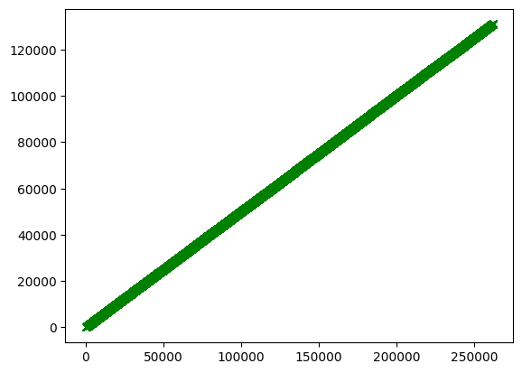

```python
# This Python 3 environment comes with many helpful analytics libraries installed
# It is defined by the kaggle/python Docker image: https://github.com/kaggle/docker-python
# For example, here's several helpful packages to load

import numpy as np # linear algebra
import pandas as pd # data processing, CSV file I/O (e.g. pd.read_csv)

# Input data files are available in the read-only "../input/" directory
# For example, running this (by clicking run or pressing Shift+Enter) will list all files under the input directory

import os
for dirname, _, filenames in os.walk('/kaggle/input'):
    for filename in filenames:
        print(os.path.join(dirname, filename))

# You can write up to 20GB to the current directory (/kaggle/working/) that gets preserved as output when you create a version using "Save & Run All" 
# You can also write temporary files to /kaggle/temp/, but they won't be saved outside of the current session
```

    /kaggle/input/instant-gratification/sample_submission.csv
    /kaggle/input/instant-gratification/train.csv
    /kaggle/input/instant-gratification/test.csv
    


```python
import pandas as pd
import numpy as np
import matplotlib.pyplot as plt
import seaborn as sns
import datetime

train=pd.read_csv("/kaggle/input/instant-gratification/train.csv")
test=pd.read_csv("/kaggle/input/instant-gratification/test.csv")
submission=pd.read_csv("/kaggle/input/instant-gratification/sample_submission.csv")

```


```python
print(test.shape)
```


```python
print(train["target"].value_counts())
```


```python
train["target"].cumsum().plot(color='green',linestyle='--',marker='x')
```


    <Axes: >


    

    


```python
train.select_dtypes(include=["object","int64"]).head()
```


<div>
<style scoped>
    .dataframe tbody tr th:only-of-type {
        vertical-align: middle;
    }

    .dataframe tbody tr th {
        vertical-align: top;
    }

    .dataframe thead th {
        text-align: right;
    }
</style>
<table border="1" class="dataframe">
  <thead>
    <tr style="text-align: right;">
      <th></th>
      <th>id</th>
      <th>wheezy-copper-turtle-magic</th>
      <th>target</th>
    </tr>
  </thead>
  <tbody>
    <tr>
      <th>0</th>
      <td>707b395ecdcbb4dc2eabea00e4d1b179</td>
      <td>99</td>
      <td>0</td>
    </tr>
    <tr>
      <th>1</th>
      <td>5880c03c6582a7b42248668e56b4bdec</td>
      <td>52</td>
      <td>0</td>
    </tr>
    <tr>
      <th>2</th>
      <td>4ccbcb3d13e5072ff1d9c61afe2c4f77</td>
      <td>230</td>
      <td>1</td>
    </tr>
    <tr>
      <th>3</th>
      <td>e350f17a357f12a1941f0837afb7eb8d</td>
      <td>78</td>
      <td>0</td>
    </tr>
    <tr>
      <th>4</th>
      <td>a8f910ea6075b6376af079055965ff68</td>
      <td>497</td>
      <td>0</td>
    </tr>
  </tbody>
</table>
</div>


```python
train_columns=[c for c in train.columns if c not in ["id","target"]]

```


```python
train[train_columns].nunique()
```


    muggy-smalt-axolotl-pembus              254322
    dorky-peach-sheepdog-ordinal            254588
    slimy-seashell-cassowary-goose          254356
    snazzy-harlequin-chicken-distraction    254576
    frumpy-smalt-mau-ordinal                254330
                                             ...  
    jumpy-thistle-discus-sorted             254261
    muggy-turquoise-donkey-important        254366
    blurry-buff-hyena-entropy               254345
    bluesy-chocolate-kudu-fepid             254329
    gamy-white-monster-expert               254192
    Length: 256, dtype: int64


```python
print(np.where(train[train_columns].nunique()<250000))
```

    (array([146]),)
    


```python
print(train_columns[146])
```

    wheezy-copper-turtle-magic
    


```python
train["wheezy-copper-turtle-magic"].nunique()
```


    512


```python
print(train["wheezy-copper-turtle-magic"].value_counts().mean())
```

    512.0
    


```python
train["wheezy-copper-turtle-magic"].value_counts().rename_axis("wheezy-copper-turtle-magic").reset_index(name="counts")
```


<div>
<style scoped>
    .dataframe tbody tr th:only-of-type {
        vertical-align: middle;
    }

    .dataframe tbody tr th {
        vertical-align: top;
    }

    .dataframe thead th {
        text-align: right;
    }
</style>
<table border="1" class="dataframe">
  <thead>
    <tr style="text-align: right;">
      <th></th>
      <th>wheezy-copper-turtle-magic</th>
      <th>counts</th>
    </tr>
  </thead>
  <tbody>
    <tr>
      <th>0</th>
      <td>51</td>
      <td>570</td>
    </tr>
    <tr>
      <th>1</th>
      <td>489</td>
      <td>556</td>
    </tr>
    <tr>
      <th>2</th>
      <td>298</td>
      <td>554</td>
    </tr>
    <tr>
      <th>3</th>
      <td>135</td>
      <td>554</td>
    </tr>
    <tr>
      <th>4</th>
      <td>245</td>
      <td>553</td>
    </tr>
    <tr>
      <th>...</th>
      <td>...</td>
      <td>...</td>
    </tr>
    <tr>
      <th>507</th>
      <td>277</td>
      <td>476</td>
    </tr>
    <tr>
      <th>508</th>
      <td>215</td>
      <td>475</td>
    </tr>
    <tr>
      <th>509</th>
      <td>108</td>
      <td>472</td>
    </tr>
    <tr>
      <th>510</th>
      <td>42</td>
      <td>471</td>
    </tr>
    <tr>
      <th>511</th>
      <td>185</td>
      <td>442</td>
    </tr>
  </tbody>
</table>
<p>512 rows × 2 columns</p>
</div>


```python
train_columns=[c for c in train.columns if c not in ["id","target","wheezy-copper-turtle-magic"]]
describe_train=train[train_columns].describe().T.drop("count",axis=1)
cmap=sns.diverging_palette(5,250,as_cmap=True)
describe_train.T.style.background_gradient(cmap,axis=1).format(precision=2)

```


<style type="text/css">
#T_e7670_row0_col0, #T_e7670_row0_col107, #T_e7670_row1_col197, #T_e7670_row1_col202, #T_e7670_row2_col200, #T_e7670_row3_col127, #T_e7670_row3_col211, #T_e7670_row3_col226 {
  background-color: #c1d0e3;
  color: #000000;
}
#T_e7670_row0_col1, #T_e7670_row1_col72, #T_e7670_row2_col104, #T_e7670_row2_col207, #T_e7670_row2_col215, #T_e7670_row3_col32, #T_e7670_row3_col52, #T_e7670_row3_col57, #T_e7670_row5_col100 {
  background-color: #edeef1;
  color: #000000;
}
#T_e7670_row0_col2, #T_e7670_row1_col123, #T_e7670_row6_col11, #T_e7670_row6_col119 {
  background-color: #e17d91;
  color: #f1f1f1;
}
#T_e7670_row0_col3, #T_e7670_row0_col128, #T_e7670_row0_col202, #T_e7670_row3_col8, #T_e7670_row3_col105, #T_e7670_row4_col25, #T_e7670_row4_col41, #T_e7670_row5_col21, #T_e7670_row5_col149, #T_e7670_row6_col4, #T_e7670_row6_col54 {
  background-color: #eabbc4;
  color: #000000;
}
#T_e7670_row0_col4, #T_e7670_row1_col30, #T_e7670_row1_col94, #T_e7670_row1_col236, #T_e7670_row2_col77, #T_e7670_row3_col217, #T_e7670_row4_col173, #T_e7670_row5_col41 {
  background-color: #e7eaef;
  color: #000000;
}
#T_e7670_row0_col5, #T_e7670_row0_col248, #T_e7670_row1_col235, #T_e7670_row2_col73, #T_e7670_row3_col152, #T_e7670_row3_col192, #T_e7670_row3_col249, #T_e7670_row5_col50, #T_e7670_row5_col124 {
  background-color: #b1c5de;
  color: #000000;
}
#T_e7670_row0_col6, #T_e7670_row0_col60, #T_e7670_row0_col75, #T_e7670_row0_col94, #T_e7670_row1_col69, #T_e7670_row1_col77, #T_e7670_row1_col91, #T_e7670_row4_col20, #T_e7670_row4_col196, #T_e7670_row5_col35, #T_e7670_row5_col222, #T_e7670_row5_col250, #T_e7670_row6_col106 {
  background-color: #edcfd5;
  color: #000000;
}
#T_e7670_row0_col7, #T_e7670_row0_col29, #T_e7670_row0_col168, #T_e7670_row0_col177, #T_e7670_row1_col137, #T_e7670_row1_col181, #T_e7670_row1_col183, #T_e7670_row1_col185, #T_e7670_row2_col226, #T_e7670_row4_col172, #T_e7670_row5_col10, #T_e7670_row5_col17, #T_e7670_row5_col80, #T_e7670_row5_col114 {
  background-color: #eab9c3;
  color: #000000;
}
#T_e7670_row0_col8, #T_e7670_row0_col160, #T_e7670_row0_col184, #T_e7670_row0_col205, #T_e7670_row1_col98, #T_e7670_row1_col174, #T_e7670_row2_col64, #T_e7670_row2_col90, #T_e7670_row2_col234, #T_e7670_row2_col251, #T_e7670_row3_col47, #T_e7670_row4_col33, #T_e7670_row5_col52, #T_e7670_row6_col36, #T_e7670_row6_col209 {
  background-color: #dee4ec;
  color: #000000;
}
#T_e7670_row0_col9, #T_e7670_row1_col138, #T_e7670_row2_col113, #T_e7670_row3_col11, #T_e7670_row4_col235, #T_e7670_row5_col138, #T_e7670_row6_col136 {
  background-color: #4479bb;
  color: #f1f1f1;
}
#T_e7670_row0_col10, #T_e7670_row0_col185, #T_e7670_row1_col101, #T_e7670_row2_col158, #T_e7670_row2_col244, #T_e7670_row3_col33, #T_e7670_row3_col45, #T_e7670_row3_col56, #T_e7670_row3_col166, #T_e7670_row4_col153, #T_e7670_row4_col232, #T_e7670_row5_col53, #T_e7670_row5_col107, #T_e7670_row6_col205 {
  background-color: #f0e0e3;
  color: #000000;
}
#T_e7670_row0_col11, #T_e7670_row1_col196, #T_e7670_row2_col129, #T_e7670_row2_col218, #T_e7670_row3_col51, #T_e7670_row3_col81, #T_e7670_row3_col82, #T_e7670_row3_col100, #T_e7670_row3_col154, #T_e7670_row3_col183, #T_e7670_row3_col185, #T_e7670_row3_col200, #T_e7670_row4_col75, #T_e7670_row5_col229, #T_e7670_row5_col248 {
  background-color: #aec3dd;
  color: #000000;
}
#T_e7670_row0_col12, #T_e7670_row0_col189, #T_e7670_row0_col241, #T_e7670_row1_col34, #T_e7670_row1_col135, #T_e7670_row2_col235, #T_e7670_row2_col247, #T_e7670_row3_col18, #T_e7670_row3_col198, #T_e7670_row4_col57, #T_e7670_row4_col135, #T_e7670_row5_col14, #T_e7670_row6_col88 {
  background-color: #f0e1e4;
  color: #000000;
}
#T_e7670_row0_col13, #T_e7670_row0_col145, #T_e7670_row0_col240, #T_e7670_row1_col122, #T_e7670_row2_col67, #T_e7670_row2_col84, #T_e7670_row2_col116, #T_e7670_row2_col138, #T_e7670_row2_col152, #T_e7670_row2_col213, #T_e7670_row3_col77, #T_e7670_row3_col251, #T_e7670_row4_col88, #T_e7670_row4_col198, #T_e7670_row5_col108 {
  background-color: #bdcde2;
  color: #000000;
}
#T_e7670_row0_col14, #T_e7670_row2_col78, #T_e7670_row2_col252, #T_e7670_row3_col110, #T_e7670_row3_col199 {
  background-color: #82a4cf;
  color: #f1f1f1;
}
#T_e7670_row0_col15, #T_e7670_row0_col61, #T_e7670_row6_col29, #T_e7670_row6_col38, #T_e7670_row6_col46 {
  background-color: #dc5973;
  color: #f1f1f1;
}
#T_e7670_row0_col16, #T_e7670_row2_col38, #T_e7670_row2_col206, #T_e7670_row3_col80, #T_e7670_row5_col111 {
  background-color: #779dcb;
  color: #f1f1f1;
}
#T_e7670_row0_col17, #T_e7670_row0_col194, #T_e7670_row1_col15, #T_e7670_row1_col170, #T_e7670_row1_col179, #T_e7670_row2_col65, #T_e7670_row2_col101, #T_e7670_row2_col178, #T_e7670_row3_col86, #T_e7670_row3_col174, #T_e7670_row3_col231, #T_e7670_row4_col10, #T_e7670_row4_col213, #T_e7670_row5_col32, #T_e7670_row5_col59, #T_e7670_row5_col90, #T_e7670_row5_col119 {
  background-color: #ebedf1;
  color: #000000;
}
#T_e7670_row0_col18, #T_e7670_row1_col99, #T_e7670_row2_col46, #T_e7670_row2_col214, #T_e7670_row2_col230, #T_e7670_row3_col111, #T_e7670_row3_col197, #T_e7670_row4_col46, #T_e7670_row5_col31, #T_e7670_row5_col61, #T_e7670_row5_col99, #T_e7670_row5_col190, #T_e7670_row6_col147, #T_e7670_row6_col207 {
  background-color: #ecc3cb;
  color: #000000;
}
#T_e7670_row0_col19, #T_e7670_row3_col73, #T_e7670_row4_col252, #T_e7670_row6_col16, #T_e7670_row6_col42 {
  background-color: #e48fa0;
  color: #f1f1f1;
}
#T_e7670_row0_col20, #T_e7670_row0_col212, #T_e7670_row2_col98, #T_e7670_row2_col99, #T_e7670_row2_col167, #T_e7670_row2_col238, #T_e7670_row3_col1, #T_e7670_row4_col55, #T_e7670_row4_col199, #T_e7670_row5_col232, #T_e7670_row6_col253 {
  background-color: #bccce1;
  color: #000000;
}
#T_e7670_row0_col21, #T_e7670_row0_col59, #T_e7670_row1_col114, #T_e7670_row2_col22, #T_e7670_row5_col169 {
  background-color: #e7a8b5;
  color: #000000;
}
#T_e7670_row0_col22, #T_e7670_row1_col84, #T_e7670_row2_col183, #T_e7670_row2_col205, #T_e7670_row3_col31, #T_e7670_row4_col89, #T_e7670_row4_col132, #T_e7670_row4_col159, #T_e7670_row5_col66 {
  background-color: #96b2d5;
  color: #000000;
}
#T_e7670_row0_col23, #T_e7670_row1_col103, #T_e7670_row6_col24, #T_e7670_row6_col197, #T_e7670_row6_col244 {
  background-color: #e28396;
  color: #f1f1f1;
}
#T_e7670_row0_col24, #T_e7670_row0_col73, #T_e7670_row1_col100, #T_e7670_row4_col116, #T_e7670_row4_col166, #T_e7670_row4_col229, #T_e7670_row5_col147, #T_e7670_row5_col157, #T_e7670_row5_col199, #T_e7670_row6_col93 {
  background-color: #ebbfc8;
  color: #000000;
}
#T_e7670_row0_col25, #T_e7670_row0_col106, #T_e7670_row1_col9, #T_e7670_row6_col52, #T_e7670_row6_col191 {
  background-color: #e17a8f;
  color: #f1f1f1;
}
#T_e7670_row0_col26, #T_e7670_row0_col149, #T_e7670_row0_col229, #T_e7670_row1_col5, #T_e7670_row1_col43, #T_e7670_row1_col131, #T_e7670_row1_col222, #T_e7670_row1_col245, #T_e7670_row2_col120, #T_e7670_row2_col141, #T_e7670_row2_col212, #T_e7670_row3_col23, #T_e7670_row3_col62, #T_e7670_row3_col167, #T_e7670_row4_col87, #T_e7670_row4_col113, #T_e7670_row4_col147, #T_e7670_row4_col246, #T_e7670_row5_col2, #T_e7670_row5_col12, #T_e7670_row5_col38, #T_e7670_row5_col137, #T_e7670_row5_col234, #T_e7670_row6_col22, #T_e7670_row6_col51, #T_e7670_row6_col82, #T_e7670_row6_col187 {
  background-color: #edcdd3;
  color: #000000;
}
#T_e7670_row0_col27, #T_e7670_row0_col84, #T_e7670_row0_col134, #T_e7670_row0_col141, #T_e7670_row0_col170, #T_e7670_row1_col49, #T_e7670_row1_col108, #T_e7670_row4_col40, #T_e7670_row4_col60, #T_e7670_row4_col93, #T_e7670_row5_col56, #T_e7670_row5_col70, #T_e7670_row5_col160, #T_e7670_row5_col211, #T_e7670_row5_col253, #T_e7670_row6_col62 {
  background-color: #eaecf0;
  color: #000000;
}
#T_e7670_row0_col28, #T_e7670_row0_col228, #T_e7670_row1_col209, #T_e7670_row2_col153, #T_e7670_row4_col74, #T_e7670_row4_col223, #T_e7670_row5_col98, #T_e7670_row5_col168, #T_e7670_row5_col179, #T_e7670_row5_col213, #T_e7670_row5_col231, #T_e7670_row6_col115 {
  background-color: #b0c4dd;
  color: #000000;
}
#T_e7670_row0_col30, #T_e7670_row0_col43, #T_e7670_row1_col47, #T_e7670_row1_col145, #T_e7670_row1_col184, #T_e7670_row1_col233, #T_e7670_row3_col65, #T_e7670_row3_col121, #T_e7670_row3_col194, #T_e7670_row3_col195, #T_e7670_row4_col70, #T_e7670_row4_col127, #T_e7670_row5_col77, #T_e7670_row5_col131, #T_e7670_row6_col73 {
  background-color: #f2ebec;
  color: #000000;
}
#T_e7670_row0_col31, #T_e7670_row1_col60, #T_e7670_row2_col39, #T_e7670_row2_col60, #T_e7670_row4_col52, #T_e7670_row4_col251, #T_e7670_row5_col13, #T_e7670_row5_col51, #T_e7670_row5_col152 {
  background-color: #f1eaeb;
  color: #000000;
}
#T_e7670_row0_col32, #T_e7670_row2_col10, #T_e7670_row4_col110, #T_e7670_row6_col132, #T_e7670_row6_col194 {
  background-color: #e0798d;
  color: #f1f1f1;
}
#T_e7670_row0_col33, #T_e7670_row0_col156, #T_e7670_row0_col163, #T_e7670_row0_col164, #T_e7670_row1_col32, #T_e7670_row1_col64, #T_e7670_row1_col175, #T_e7670_row2_col107, #T_e7670_row3_col24, #T_e7670_row3_col90, #T_e7670_row3_col98, #T_e7670_row3_col109, #T_e7670_row3_col170, #T_e7670_row4_col67, #T_e7670_row4_col164, #T_e7670_row4_col215, #T_e7670_row4_col250, #T_e7670_row5_col192 {
  background-color: #f2eeef;
  color: #000000;
}
#T_e7670_row0_col34, #T_e7670_row2_col42, #T_e7670_row2_col140, #T_e7670_row2_col242, #T_e7670_row2_col246, #T_e7670_row3_col158, #T_e7670_row3_col227, #T_e7670_row4_col38, #T_e7670_row4_col209, #T_e7670_row5_col78, #T_e7670_row5_col109, #T_e7670_row5_col201 {
  background-color: #d3dce9;
  color: #000000;
}
#T_e7670_row0_col35, #T_e7670_row0_col118, #T_e7670_row0_col172, #T_e7670_row3_col36, #T_e7670_row4_col99, #T_e7670_row5_col163, #T_e7670_row5_col252, #T_e7670_row6_col59, #T_e7670_row6_col158, #T_e7670_row6_col200, #T_e7670_row6_col229 {
  background-color: #e6a1af;
  color: #000000;
}
#T_e7670_row0_col36, #T_e7670_row4_col73, #T_e7670_row4_col106, #T_e7670_row5_col110, #T_e7670_row6_col25, #T_e7670_row6_col142, #T_e7670_row6_col184, #T_e7670_row6_col247 {
  background-color: #e59aa9;
  color: #000000;
}
#T_e7670_row0_col37, #T_e7670_row0_col100, #T_e7670_row1_col95, #T_e7670_row1_col208, #T_e7670_row2_col122, #T_e7670_row3_col148, #T_e7670_row3_col156, #T_e7670_row4_col124, #T_e7670_row4_col193, #T_e7670_row5_col173 {
  background-color: #b8c9e0;
  color: #000000;
}
#T_e7670_row0_col38, #T_e7670_row0_col193, #T_e7670_row1_col39, #T_e7670_row2_col190, #T_e7670_row3_col19, #T_e7670_row3_col155, #T_e7670_row4_col27, #T_e7670_row4_col239, #T_e7670_row5_col23, #T_e7670_row5_col34, #T_e7670_row5_col129, #T_e7670_row6_col170 {
  background-color: #d1dbe8;
  color: #000000;
}
#T_e7670_row0_col39, #T_e7670_row2_col40, #T_e7670_row2_col188, #T_e7670_row6_col79, #T_e7670_row6_col87, #T_e7670_row6_col113, #T_e7670_row6_col208 {
  background-color: #e28698;
  color: #f1f1f1;
}
#T_e7670_row0_col40, #T_e7670_row0_col66, #T_e7670_row0_col151, #T_e7670_row0_col236, #T_e7670_row2_col1, #T_e7670_row2_col21, #T_e7670_row2_col55, #T_e7670_row2_col103, #T_e7670_row2_col227, #T_e7670_row3_col112, #T_e7670_row3_col118, #T_e7670_row3_col224, #T_e7670_row4_col28, #T_e7670_row4_col123, #T_e7670_row6_col174 {
  background-color: #9eb8d8;
  color: #000000;
}
#T_e7670_row0_col41, #T_e7670_row6_col141, #T_e7670_row6_col217, #T_e7670_row6_col222 {
  background-color: #d83e5d;
  color: #f1f1f1;
}
#T_e7670_row0_col42, #T_e7670_row0_col67, #T_e7670_row1_col96, #T_e7670_row1_col97, #T_e7670_row2_col79, #T_e7670_row3_col168, #T_e7670_row4_col156, #T_e7670_row4_col174, #T_e7670_row4_col175, #T_e7670_row5_col217, #T_e7670_row5_col240, #T_e7670_row5_col242, #T_e7670_row6_col108, #T_e7670_row6_col156, #T_e7670_row6_col231 {
  background-color: #efdcdf;
  color: #000000;
}
#T_e7670_row0_col44, #T_e7670_row1_col35, #T_e7670_row1_col127, #T_e7670_row1_col148, #T_e7670_row2_col105, #T_e7670_row2_col159, #T_e7670_row3_col87, #T_e7670_row4_col26, #T_e7670_row4_col77, #T_e7670_row4_col162, #T_e7670_row4_col217, #T_e7670_row5_col181, #T_e7670_row6_col9, #T_e7670_row6_col34, #T_e7670_row6_col47, #T_e7670_row6_col236 {
  background-color: #edccd2;
  color: #000000;
}
#T_e7670_row0_col45, #T_e7670_row0_col242, #T_e7670_row1_col92, #T_e7670_row1_col154, #T_e7670_row2_col102, #T_e7670_row3_col220, #T_e7670_row4_col35, #T_e7670_row5_col188, #T_e7670_row6_col111, #T_e7670_row6_col140, #T_e7670_row6_col242 {
  background-color: #eab8c2;
  color: #000000;
}
#T_e7670_row0_col46, #T_e7670_row0_col110, #T_e7670_row1_col134, #T_e7670_row1_col136, #T_e7670_row1_col190, #T_e7670_row1_col223, #T_e7670_row4_col253, #T_e7670_row4_col254, #T_e7670_row6_col75, #T_e7670_row6_col243 {
  background-color: #e7a5b2;
  color: #000000;
}
#T_e7670_row0_col47, #T_e7670_row1_col4, #T_e7670_row1_col20, #T_e7670_row1_col82, #T_e7670_row1_col93, #T_e7670_row1_col217, #T_e7670_row2_col92, #T_e7670_row3_col130, #T_e7670_row4_col128, #T_e7670_row4_col171 {
  background-color: #ecc6ce;
  color: #000000;
}
#T_e7670_row0_col48, #T_e7670_row0_col93, #T_e7670_row0_col157, #T_e7670_row0_col223, #T_e7670_row1_col87, #T_e7670_row1_col214, #T_e7670_row1_col230, #T_e7670_row1_col243, #T_e7670_row2_col4, #T_e7670_row3_col216, #T_e7670_row3_col236, #T_e7670_row4_col148, #T_e7670_row4_col181, #T_e7670_row5_col94, #T_e7670_row5_col175, #T_e7670_row6_col81 {
  background-color: #d5deea;
  color: #000000;
}
#T_e7670_row0_col49, #T_e7670_row2_col219, #T_e7670_row4_col119 {
  background-color: #769ccb;
  color: #f1f1f1;
}
#T_e7670_row0_col50, #T_e7670_row0_col114, #T_e7670_row1_col51, #T_e7670_row1_col88, #T_e7670_row1_col119, #T_e7670_row1_col144, #T_e7670_row1_col158, #T_e7670_row4_col104 {
  background-color: #edcad1;
  color: #000000;
}
#T_e7670_row0_col51, #T_e7670_row0_col92, #T_e7670_row0_col211, #T_e7670_row0_col251, #T_e7670_row1_col159, #T_e7670_row1_col205, #T_e7670_row2_col8, #T_e7670_row3_col78, #T_e7670_row3_col142, #T_e7670_row3_col233, #T_e7670_row4_col4, #T_e7670_row5_col5, #T_e7670_row5_col67, #T_e7670_row5_col82, #T_e7670_row5_col85, #T_e7670_row5_col189 {
  background-color: #e0e6ed;
  color: #000000;
}
#T_e7670_row0_col52, #T_e7670_row0_col225, #T_e7670_row1_col254, #T_e7670_row6_col96, #T_e7670_row6_col185, #T_e7670_row6_col219, #T_e7670_row6_col224 {
  background-color: #e3889a;
  color: #f1f1f1;
}
#T_e7670_row0_col53, #T_e7670_row0_col190, #T_e7670_row0_col222, #T_e7670_row1_col149, #T_e7670_row4_col247, #T_e7670_row6_col15, #T_e7670_row6_col193 {
  background-color: #e7a4b1;
  color: #000000;
}
#T_e7670_row0_col54, #T_e7670_row0_col119, #T_e7670_row1_col244, #T_e7670_row2_col25, #T_e7670_row2_col58, #T_e7670_row2_col144, #T_e7670_row2_col169, #T_e7670_row2_col221, #T_e7670_row3_col12, #T_e7670_row3_col96, #T_e7670_row3_col218, #T_e7670_row4_col1, #T_e7670_row4_col13, #T_e7670_row5_col159, #T_e7670_row5_col238 {
  background-color: #b2c6de;
  color: #000000;
}
#T_e7670_row0_col55, #T_e7670_row0_col159, #T_e7670_row3_col67, #T_e7670_row3_col108, #T_e7670_row3_col151, #T_e7670_row3_col243, #T_e7670_row4_col249, #T_e7670_row5_col75, #T_e7670_row5_col210, #T_e7670_row5_col227, #T_e7670_row5_col247 {
  background-color: #e2e7ee;
  color: #000000;
}
#T_e7670_row0_col56, #T_e7670_row1_col153, #T_e7670_row3_col239, #T_e7670_row5_col81 {
  background-color: #eed3d8;
  color: #000000;
}
#T_e7670_row0_col57, #T_e7670_row0_col112, #T_e7670_row0_col127, #T_e7670_row0_col175, #T_e7670_row1_col218, #T_e7670_row1_col224, #T_e7670_row3_col139, #T_e7670_row3_col196, #T_e7670_row3_col207, #T_e7670_row4_col3, #T_e7670_row4_col79, #T_e7670_row4_col190, #T_e7670_row6_col41, #T_e7670_row6_col95, #T_e7670_row6_col128, #T_e7670_row6_col161, #T_e7670_row6_col239 {
  background-color: #eab7c1;
  color: #000000;
}
#T_e7670_row0_col58, #T_e7670_row1_col146, #T_e7670_row1_col167, #T_e7670_row2_col36, #T_e7670_row3_col68, #T_e7670_row3_col76, #T_e7670_row3_col144, #T_e7670_row4_col50, #T_e7670_row5_col18, #T_e7670_row6_col1, #T_e7670_row6_col44 {
  background-color: #c8d5e5;
  color: #000000;
}
#T_e7670_row0_col62, #T_e7670_row0_col231, #T_e7670_row1_col162, #T_e7670_row2_col110, #T_e7670_row2_col127, #T_e7670_row3_col0, #T_e7670_row4_col179, #T_e7670_row5_col27, #T_e7670_row5_col48, #T_e7670_row5_col204, #T_e7670_row5_col244 {
  background-color: #a9bfdb;
  color: #000000;
}
#T_e7670_row0_col63, #T_e7670_row0_col166, #T_e7670_row1_col58, #T_e7670_row4_col163, #T_e7670_row4_col188 {
  background-color: #eabcc5;
  color: #000000;
}
#T_e7670_row0_col64, #T_e7670_row0_col200, #T_e7670_row0_col252, #T_e7670_row1_col80, #T_e7670_row1_col169, #T_e7670_row6_col31, #T_e7670_row6_col143, #T_e7670_row6_col144, #T_e7670_row6_col190 {
  background-color: #e28497;
  color: #f1f1f1;
}
#T_e7670_row0_col65, #T_e7670_row0_col137, #T_e7670_row1_col16, #T_e7670_row1_col81, #T_e7670_row1_col212, #T_e7670_row1_col240, #T_e7670_row1_col249, #T_e7670_row2_col18, #T_e7670_row2_col168, #T_e7670_row2_col232, #T_e7670_row4_col39, #T_e7670_row4_col64, #T_e7670_row4_col137, #T_e7670_row5_col46, #T_e7670_row5_col143, #T_e7670_row6_col124, #T_e7670_row6_col201, #T_e7670_row6_col235 {
  background-color: #e9afbb;
  color: #000000;
}
#T_e7670_row0_col68, #T_e7670_row1_col62, #T_e7670_row1_col232, #T_e7670_row3_col93, #T_e7670_row3_col153, #T_e7670_row3_col184, #T_e7670_row3_col215, #T_e7670_row4_col192, #T_e7670_row5_col121, #T_e7670_row5_col166, #T_e7670_row5_col241, #T_e7670_row6_col204 {
  background-color: #c7d4e5;
  color: #000000;
}
#T_e7670_row0_col69, #T_e7670_row0_col85, #T_e7670_row0_col146, #T_e7670_row0_col254, #T_e7670_row1_col160, #T_e7670_row1_col192, #T_e7670_row2_col29, #T_e7670_row3_col208, #T_e7670_row4_col108, #T_e7670_row5_col223 {
  background-color: #ecc9d0;
  color: #000000;
}
#T_e7670_row0_col70, #T_e7670_row0_col226, #T_e7670_row1_col141, #T_e7670_row2_col41, #T_e7670_row2_col93, #T_e7670_row3_col159, #T_e7670_row3_col187, #T_e7670_row4_col98, #T_e7670_row4_col158, #T_e7670_row5_col233 {
  background-color: #e6eaef;
  color: #000000;
}
#T_e7670_row0_col71, #T_e7670_row2_col245 {
  background-color: #5887c1;
  color: #f1f1f1;
}
#T_e7670_row0_col72, #T_e7670_row0_col97, #T_e7670_row1_col166, #T_e7670_row2_col19, #T_e7670_row2_col94, #T_e7670_row2_col175, #T_e7670_row2_col229, #T_e7670_row3_col120, #T_e7670_row3_col126, #T_e7670_row4_col91, #T_e7670_row5_col45, #T_e7670_row5_col68, #T_e7670_row5_col184 {
  background-color: #d8e0eb;
  color: #000000;
}
#T_e7670_row0_col74, #T_e7670_row0_col136, #T_e7670_row2_col2, #T_e7670_row2_col76, #T_e7670_row3_col16, #T_e7670_row4_col130 {
  background-color: #8aaad1;
  color: #f1f1f1;
}
#T_e7670_row0_col76, #T_e7670_row2_col59, #T_e7670_row2_col63, #T_e7670_row3_col210, #T_e7670_row5_col33, #T_e7670_row5_col205 {
  background-color: #c4d2e4;
  color: #000000;
}
#T_e7670_row0_col77, #T_e7670_row0_col102, #T_e7670_row0_col219, #T_e7670_row1_col247, #T_e7670_row2_col96, #T_e7670_row2_col157, #T_e7670_row3_col22, #T_e7670_row3_col60, #T_e7670_row3_col116, #T_e7670_row3_col135, #T_e7670_row4_col109, #T_e7670_row5_col216, #T_e7670_row5_col221 {
  background-color: #e4e9ee;
  color: #000000;
}
#T_e7670_row0_col78, #T_e7670_row0_col153, #T_e7670_row1_col117, #T_e7670_row1_col126, #T_e7670_row1_col253, #T_e7670_row4_col160, #T_e7670_row5_col0, #T_e7670_row5_col249, #T_e7670_row6_col134 {
  background-color: #f0e4e6;
  color: #000000;
}
#T_e7670_row0_col79, #T_e7670_row0_col246, #T_e7670_row1_col120, #T_e7670_row1_col210, #T_e7670_row1_col242, #T_e7670_row2_col137, #T_e7670_row2_col146, #T_e7670_row3_col122, #T_e7670_row3_col229, #T_e7670_row5_col89, #T_e7670_row5_col92, #T_e7670_row5_col127, #T_e7670_row6_col214, #T_e7670_row6_col254 {
  background-color: #eed6db;
  color: #000000;
}
#T_e7670_row0_col80, #T_e7670_row0_col89, #T_e7670_row1_col23, #T_e7670_row1_col195, #T_e7670_row2_col192, #T_e7670_row2_col254, #T_e7670_row3_col91, #T_e7670_row3_col221, #T_e7670_row4_col122, #T_e7670_row4_col221, #T_e7670_row5_col28, #T_e7670_row5_col44, #T_e7670_row5_col76, #T_e7670_row5_col191, #T_e7670_row6_col238 {
  background-color: #d7dfea;
  color: #000000;
}
#T_e7670_row0_col81, #T_e7670_row0_col154, #T_e7670_row0_col221, #T_e7670_row1_col53, #T_e7670_row2_col50, #T_e7670_row3_col29, #T_e7670_row3_col94, #T_e7670_row3_col204, #T_e7670_row4_col243, #T_e7670_row4_col248, #T_e7670_row5_col43, #T_e7670_row5_col158, #T_e7670_row5_col215 {
  background-color: #f1e8ea;
  color: #000000;
}
#T_e7670_row0_col82, #T_e7670_row0_col243, #T_e7670_row2_col70, #T_e7670_row3_col10, #T_e7670_row4_col58, #T_e7670_row5_col122 {
  background-color: #95b1d5;
  color: #000000;
}
#T_e7670_row0_col83, #T_e7670_row6_col97, #T_e7670_row6_col120, #T_e7670_row6_col148 {
  background-color: #dc5e77;
  color: #f1f1f1;
}
#T_e7670_row0_col86, #T_e7670_row0_col169, #T_e7670_row0_col171, #T_e7670_row0_col216, #T_e7670_row1_col150, #T_e7670_row1_col219, #T_e7670_row1_col226, #T_e7670_row4_col114, #T_e7670_row5_col183, #T_e7670_row6_col104, #T_e7670_row6_col175 {
  background-color: #efd9dd;
  color: #000000;
}
#T_e7670_row0_col87, #T_e7670_row1_col231, #T_e7670_row2_col72, #T_e7670_row3_col30, #T_e7670_row3_col141, #T_e7670_row3_col150, #T_e7670_row3_col193, #T_e7670_row3_col222, #T_e7670_row3_col242, #T_e7670_row4_col6, #T_e7670_row5_col39, #T_e7670_row5_col54, #T_e7670_row5_col206, #T_e7670_row5_col237, #T_e7670_row6_col129 {
  background-color: #dae1eb;
  color: #000000;
}
#T_e7670_row0_col88, #T_e7670_row0_col120, #T_e7670_row0_col206, #T_e7670_row1_col28, #T_e7670_row1_col215, #T_e7670_row3_col27, #T_e7670_row3_col214, #T_e7670_row3_col232, #T_e7670_row4_col44, #T_e7670_row4_col118, #T_e7670_row5_col112, #T_e7670_row6_col27, #T_e7670_row6_col107, #T_e7670_row6_col173 {
  background-color: #ecc5cc;
  color: #000000;
}
#T_e7670_row0_col90, #T_e7670_row0_col116, #T_e7670_row0_col150, #T_e7670_row6_col26, #T_e7670_row6_col122, #T_e7670_row6_col199 {
  background-color: #e38a9c;
  color: #f1f1f1;
}
#T_e7670_row0_col91, #T_e7670_row1_col246, #T_e7670_row2_col161, #T_e7670_row3_col245, #T_e7670_row4_col47, #T_e7670_row4_col170, #T_e7670_row5_col57, #T_e7670_row6_col127 {
  background-color: #dce3ec;
  color: #000000;
}
#T_e7670_row0_col95, #T_e7670_row0_col213, #T_e7670_row1_col191, #T_e7670_row1_col211, #T_e7670_row1_col227, #T_e7670_row2_col24, #T_e7670_row2_col151, #T_e7670_row3_col50, #T_e7670_row3_col64, #T_e7670_row3_col165, #T_e7670_row4_col194, #T_e7670_row5_col218, #T_e7670_row6_col78 {
  background-color: #f0e3e5;
  color: #000000;
}
#T_e7670_row0_col96, #T_e7670_row0_col98, #T_e7670_row1_col83, #T_e7670_row1_col165, #T_e7670_row3_col88, #T_e7670_row3_col104, #T_e7670_row4_col76, #T_e7670_row5_col65, #T_e7670_row5_col79, #T_e7670_row5_col83, #T_e7670_row5_col170, #T_e7670_row5_col194 {
  background-color: #c5d3e4;
  color: #000000;
}
#T_e7670_row0_col99, #T_e7670_row0_col245, #T_e7670_row1_col234, #T_e7670_row4_col155, #T_e7670_row5_col132, #T_e7670_row6_col61, #T_e7670_row6_col83, #T_e7670_row6_col92, #T_e7670_row6_col172 {
  background-color: #e8aab6;
  color: #000000;
}
#T_e7670_row0_col101, #T_e7670_row2_col32, #T_e7670_row2_col150, #T_e7670_row2_col173, #T_e7670_row2_col236 {
  background-color: #91afd4;
  color: #000000;
}
#T_e7670_row0_col103, #T_e7670_row1_col45, #T_e7670_row1_col168, #T_e7670_row2_col237, #T_e7670_row3_col35, #T_e7670_row3_col43, #T_e7670_row3_col102, #T_e7670_row4_col212, #T_e7670_row4_col240, #T_e7670_row6_col232 {
  background-color: #d0dae8;
  color: #000000;
}
#T_e7670_row0_col104, #T_e7670_row0_col121, #T_e7670_row0_col174, #T_e7670_row1_col52, #T_e7670_row1_col56, #T_e7670_row1_col57, #T_e7670_row1_col68, #T_e7670_row1_col75, #T_e7670_row1_col121, #T_e7670_row1_col248, #T_e7670_row2_col11, #T_e7670_row2_col164, #T_e7670_row2_col203, #T_e7670_row3_col246, #T_e7670_row5_col20, #T_e7670_row5_col97, #T_e7670_row5_col135, #T_e7670_row5_col153, #T_e7670_row5_col203, #T_e7670_row6_col65 {
  background-color: #f1f1f2;
  color: #000000;
}
#T_e7670_row0_col105, #T_e7670_row0_col124, #T_e7670_row0_col218, #T_e7670_row1_col33, #T_e7670_row1_col40, #T_e7670_row1_col48, #T_e7670_row1_col50, #T_e7670_row1_col238, #T_e7670_row2_col20, #T_e7670_row2_col61, #T_e7670_row2_col74, #T_e7670_row2_col80, #T_e7670_row2_col156, #T_e7670_row2_col193, #T_e7670_row3_col34, #T_e7670_row3_col69, #T_e7670_row3_col97, #T_e7670_row3_col145, #T_e7670_row4_col0, #T_e7670_row4_col218, #T_e7670_row5_col142, #T_e7670_row5_col236 {
  background-color: #c9d6e6;
  color: #000000;
}
#T_e7670_row0_col108, #T_e7670_row1_col18, #T_e7670_row2_col100, #T_e7670_row2_col117, #T_e7670_row2_col160, #T_e7670_row3_col2, #T_e7670_row3_col49, #T_e7670_row3_col72, #T_e7670_row3_col189, #T_e7670_row4_col51, #T_e7670_row4_col102, #T_e7670_row4_col134, #T_e7670_row4_col226, #T_e7670_row4_col241, #T_e7670_row5_col24, #T_e7670_row5_col161, #T_e7670_row6_col202 {
  background-color: #dbe2eb;
  color: #000000;
}
#T_e7670_row0_col109, #T_e7670_row0_col209, #T_e7670_row0_col232, #T_e7670_row1_col102, #T_e7670_row3_col79, #T_e7670_row3_col238, #T_e7670_row3_col247, #T_e7670_row5_col185, #T_e7670_row6_col5 {
  background-color: #efdade;
  color: #000000;
}
#T_e7670_row0_col111, #T_e7670_row6_col149 {
  background-color: #6892c6;
  color: #f1f1f1;
}
#T_e7670_row0_col113, #T_e7670_row0_col186, #T_e7670_row1_col8, #T_e7670_row2_col0, #T_e7670_row2_col6, #T_e7670_row2_col37, #T_e7670_row2_col149, #T_e7670_row2_col209, #T_e7670_row3_col164, #T_e7670_row3_col234, #T_e7670_row4_col8 {
  background-color: #9bb6d7;
  color: #000000;
}
#T_e7670_row0_col115, #T_e7670_row0_col165, #T_e7670_row2_col109, #T_e7670_row2_col114, #T_e7670_row2_col186, #T_e7670_row2_col204, #T_e7670_row3_col4, #T_e7670_row3_col6, #T_e7670_row3_col125, #T_e7670_row4_col5, #T_e7670_row4_col145, #T_e7670_row6_col203 {
  background-color: #becee2;
  color: #000000;
}
#T_e7670_row0_col117, #T_e7670_row0_col195, #T_e7670_row0_col203, #T_e7670_row2_col49, #T_e7670_row2_col145, #T_e7670_row2_col197, #T_e7670_row2_col253, #T_e7670_row3_col160, #T_e7670_row3_col190, #T_e7670_row3_col252, #T_e7670_row4_col97 {
  background-color: #b6c9e0;
  color: #000000;
}
#T_e7670_row0_col122, #T_e7670_row2_col7, #T_e7670_row2_col171, #T_e7670_row2_col216, #T_e7670_row2_col248, #T_e7670_row3_col58, #T_e7670_row3_col74, #T_e7670_row5_col195, #T_e7670_row5_col209 {
  background-color: #a1b9d9;
  color: #000000;
}
#T_e7670_row0_col123, #T_e7670_row2_col125, #T_e7670_row2_col195, #T_e7670_row2_col210, #T_e7670_row3_col223, #T_e7670_row5_col3 {
  background-color: #88a8d0;
  color: #f1f1f1;
}
#T_e7670_row0_col125, #T_e7670_row2_col66, #T_e7670_row6_col233 {
  background-color: #8dacd2;
  color: #f1f1f1;
}
#T_e7670_row0_col126, #T_e7670_row0_col173, #T_e7670_row1_col164, #T_e7670_row2_col199, #T_e7670_row4_col21, #T_e7670_row4_col150, #T_e7670_row5_col42, #T_e7670_row6_col3, #T_e7670_row6_col186 {
  background-color: #e8adb8;
  color: #000000;
}
#T_e7670_row0_col129, #T_e7670_row1_col46, #T_e7670_row1_col128, #T_e7670_row1_col200, #T_e7670_row6_col48 {
  background-color: #e492a3;
  color: #f1f1f1;
}
#T_e7670_row0_col130, #T_e7670_row2_col155, #T_e7670_row2_col249, #T_e7670_row3_col7, #T_e7670_row3_col128, #T_e7670_row4_col9, #T_e7670_row4_col42, #T_e7670_row4_col105, #T_e7670_row5_col172 {
  background-color: #a5bcda;
  color: #000000;
}
#T_e7670_row0_col131, #T_e7670_row0_col180, #T_e7670_row2_col3, #T_e7670_row2_col12, #T_e7670_row2_col184, #T_e7670_row3_col181, #T_e7670_row4_col220 {
  background-color: #9fb8d8;
  color: #000000;
}
#T_e7670_row0_col132, #T_e7670_row0_col152, #T_e7670_row2_col57, #T_e7670_row2_col75, #T_e7670_row2_col123, #T_e7670_row2_col143, #T_e7670_row3_col101, #T_e7670_row3_col143, #T_e7670_row4_col154, #T_e7670_row4_col228, #T_e7670_row5_col141 {
  background-color: #c0cfe3;
  color: #000000;
}
#T_e7670_row0_col133, #T_e7670_row0_col167, #T_e7670_row1_col0, #T_e7670_row1_col61, #T_e7670_row1_col186, #T_e7670_row4_col7, #T_e7670_row4_col126, #T_e7670_row4_col146, #T_e7670_row5_col19, #T_e7670_row5_col254, #T_e7670_row6_col112 {
  background-color: #e9b4be;
  color: #000000;
}
#T_e7670_row0_col135, #T_e7670_row0_col162, #T_e7670_row1_col31, #T_e7670_row1_col38, #T_e7670_row2_col69, #T_e7670_row4_col36, #T_e7670_row6_col220, #T_e7670_row6_col248 {
  background-color: #e7a3b0;
  color: #000000;
}
#T_e7670_row0_col138, #T_e7670_row1_col104, #T_e7670_row1_col189, #T_e7670_row1_col251, #T_e7670_row3_col39, #T_e7670_row5_col134, #T_e7670_row5_col150, #T_e7670_row5_col164 {
  background-color: #eed4d9;
  color: #000000;
}
#T_e7670_row0_col139, #T_e7670_row6_col135, #T_e7670_row6_col176 {
  background-color: #df6f85;
  color: #f1f1f1;
}
#T_e7670_row0_col140, #T_e7670_row6_col131, #T_e7670_row6_col183 {
  background-color: #df6d84;
  color: #f1f1f1;
}
#T_e7670_row0_col142, #T_e7670_row0_col191, #T_e7670_row1_col29, #T_e7670_row1_col54, #T_e7670_row1_col59, #T_e7670_row1_col85, #T_e7670_row1_col125, #T_e7670_row1_col177, #T_e7670_row2_col119, #T_e7670_row3_col26, #T_e7670_row3_col37, #T_e7670_row3_col41, #T_e7670_row4_col43, #T_e7670_row5_col15, #T_e7670_row5_col16, #T_e7670_row5_col176, #T_e7670_row5_col177, #T_e7670_row5_col186, #T_e7670_row6_col100 {
  background-color: #f2eff0;
  color: #000000;
}
#T_e7670_row0_col143, #T_e7670_row6_col20, #T_e7670_row6_col90, #T_e7670_row6_col195 {
  background-color: #df7288;
  color: #f1f1f1;
}
#T_e7670_row0_col144, #T_e7670_row2_col54, #T_e7670_row2_col147, #T_e7670_row3_col83, #T_e7670_row4_col63, #T_e7670_row5_col55, #T_e7670_row6_col76, #T_e7670_row6_col139 {
  background-color: #ebbec6;
  color: #000000;
}
#T_e7670_row0_col147, #T_e7670_row0_col215, #T_e7670_row1_col176, #T_e7670_row1_col237, #T_e7670_row2_col53, #T_e7670_row2_col191, #T_e7670_row4_col65, #T_e7670_row4_col85, #T_e7670_row4_col202, #T_e7670_row5_col171, #T_e7670_row6_col17, #T_e7670_row6_col121 {
  background-color: #ecc8cf;
  color: #000000;
}
#T_e7670_row0_col148, #T_e7670_row0_col192, #T_e7670_row1_col67, #T_e7670_row2_col30, #T_e7670_row3_col206, #T_e7670_row3_col230, #T_e7670_row4_col165, #T_e7670_row4_col180, #T_e7670_row4_col206, #T_e7670_row5_col4, #T_e7670_row5_col6, #T_e7670_row5_col69, #T_e7670_row5_col245 {
  background-color: #f1e7e9;
  color: #000000;
}
#T_e7670_row0_col155, #T_e7670_row6_col221 {
  background-color: #de6c83;
  color: #f1f1f1;
}
#T_e7670_row0_col158, #T_e7670_row4_col29, #T_e7670_row4_col169, #T_e7670_row5_col9, #T_e7670_row5_col116, #T_e7670_row5_col123, #T_e7670_row6_col23, #T_e7670_row6_col45 {
  background-color: #eed2d7;
  color: #000000;
}
#T_e7670_row0_col161, #T_e7670_row1_col22, #T_e7670_row1_col65, #T_e7670_row1_col109, #T_e7670_row1_col229, #T_e7670_row3_col75, #T_e7670_row3_col191, #T_e7670_row4_col68, #T_e7670_row4_col117, #T_e7670_row4_col120, #T_e7670_row4_col167, #T_e7670_row5_col47 {
  background-color: #d4dde9;
  color: #000000;
}
#T_e7670_row0_col176, #T_e7670_row1_col86, #T_e7670_row1_col194, #T_e7670_row2_col202, #T_e7670_row3_col44, #T_e7670_row4_col219, #T_e7670_row5_col60, #T_e7670_row5_col71, #T_e7670_row5_col88, #T_e7670_row5_col106, #T_e7670_row6_col154, #T_e7670_row6_col210 {
  background-color: #e8ebf0;
  color: #000000;
}
#T_e7670_row0_col178, #T_e7670_row4_col139 {
  background-color: #d8415f;
  color: #f1f1f1;
}
#T_e7670_row0_col179, #T_e7670_row1_col124, #T_e7670_row4_col82, #T_e7670_row4_col92, #T_e7670_row4_col141, #T_e7670_row4_col191, #T_e7670_row4_col238, #T_e7670_row5_col117 {
  background-color: #cbd7e6;
  color: #000000;
}
#T_e7670_row0_col181, #T_e7670_row1_col19, #T_e7670_row2_col52, #T_e7670_row4_col94, #T_e7670_row4_col133, #T_e7670_row5_col155 {
  background-color: #ebc2ca;
  color: #000000;
}
#T_e7670_row0_col182, #T_e7670_row2_col89, #T_e7670_row2_col223, #T_e7670_row3_col136, #T_e7670_row4_col14, #T_e7670_row5_col130 {
  background-color: #7b9fcd;
  color: #f1f1f1;
}
#T_e7670_row0_col183, #T_e7670_row0_col196, #T_e7670_row0_col234, #T_e7670_row1_col116, #T_e7670_row1_col193, #T_e7670_row3_col66, #T_e7670_row3_col235, #T_e7670_row4_col12, #T_e7670_row4_col18, #T_e7670_row4_col24, #T_e7670_row4_col95, #T_e7670_row4_col205, #T_e7670_row4_col244, #T_e7670_row5_col212, #T_e7670_row6_col157 {
  background-color: #efdde0;
  color: #000000;
}
#T_e7670_row0_col187, #T_e7670_row2_col97, #T_e7670_row2_col132, #T_e7670_row2_col196, #T_e7670_row2_col231, #T_e7670_row3_col28, #T_e7670_row4_col16, #T_e7670_row4_col151, #T_e7670_row4_col152, #T_e7670_row4_col236, #T_e7670_row5_col202, #T_e7670_row6_col182 {
  background-color: #aac0dc;
  color: #000000;
}
#T_e7670_row0_col188, #T_e7670_row4_col53, #T_e7670_row6_col70, #T_e7670_row6_col85, #T_e7670_row6_col89 {
  background-color: #e0748a;
  color: #f1f1f1;
}
#T_e7670_row0_col197, #T_e7670_row1_col21, #T_e7670_row1_col118, #T_e7670_row4_col143, #T_e7670_row5_col118, #T_e7670_row6_col53, #T_e7670_row6_col251 {
  background-color: #e599a8;
  color: #000000;
}
#T_e7670_row0_col198, #T_e7670_row1_col27, #T_e7670_row1_col204, #T_e7670_row2_col86, #T_e7670_row2_col179, #T_e7670_row2_col233, #T_e7670_row3_col5, #T_e7670_row3_col201, #T_e7670_row4_col86, #T_e7670_row4_col184, #T_e7670_row5_col87, #T_e7670_row5_col174, #T_e7670_row6_col40 {
  background-color: #c3d1e4;
  color: #000000;
}
#T_e7670_row0_col199, #T_e7670_row1_col133, #T_e7670_row1_col198, #T_e7670_row2_col88, #T_e7670_row3_col54, #T_e7670_row3_col61, #T_e7670_row4_col54, #T_e7670_row4_col96, #T_e7670_row5_col72, #T_e7670_row5_col86, #T_e7670_row5_col139 {
  background-color: #cdd9e7;
  color: #000000;
}
#T_e7670_row0_col201, #T_e7670_row0_col210, #T_e7670_row2_col26, #T_e7670_row2_col34, #T_e7670_row2_col48, #T_e7670_row3_col99, #T_e7670_row4_col100, #T_e7670_row4_col125, #T_e7670_row5_col146, #T_e7670_row5_col243, #T_e7670_row5_col246, #T_e7670_row6_col252 {
  background-color: #b9cae0;
  color: #000000;
}
#T_e7670_row0_col204, #T_e7670_row1_col37, #T_e7670_row1_col151, #T_e7670_row1_col173, #T_e7670_row2_col17, #T_e7670_row4_col30, #T_e7670_row4_col203, #T_e7670_row4_col210, #T_e7670_row5_col101, #T_e7670_row5_col145, #T_e7670_row6_col32, #T_e7670_row6_col37 {
  background-color: #cfdae7;
  color: #000000;
}
#T_e7670_row0_col207, #T_e7670_row0_col238, #T_e7670_row1_col26, #T_e7670_row1_col41, #T_e7670_row1_col44, #T_e7670_row1_col161, #T_e7670_row2_col71, #T_e7670_row2_col128, #T_e7670_row3_col175, #T_e7670_row3_col177, #T_e7670_row3_col241, #T_e7670_row3_col248, #T_e7670_row4_col48, #T_e7670_row4_col72, #T_e7670_row4_col121, #T_e7670_row4_col157, #T_e7670_row4_col189, #T_e7670_row4_col216, #T_e7670_row4_col230, #T_e7670_row5_col96, #T_e7670_row5_col102, #T_e7670_row5_col193 {
  background-color: #dfe5ed;
  color: #000000;
}
#T_e7670_row0_col208, #T_e7670_row0_col220, #T_e7670_row2_col95, #T_e7670_row3_col38, #T_e7670_row3_col169, #T_e7670_row4_col231 {
  background-color: #92b0d4;
  color: #000000;
}
#T_e7670_row0_col214, #T_e7670_row1_col178, #T_e7670_row2_col16, #T_e7670_row3_col138, #T_e7670_row4_col61, #T_e7670_row5_col178, #T_e7670_row6_col57, #T_e7670_row6_col179 {
  background-color: #d73c5b;
  color: #f1f1f1;
}
#T_e7670_row0_col217, #T_e7670_row4_col45, #T_e7670_row4_col225 {
  background-color: #e38b9d;
  color: #f1f1f1;
}
#T_e7670_row0_col224, #T_e7670_row1_col36, #T_e7670_row2_col31, #T_e7670_row2_col68, #T_e7670_row3_col107, #T_e7670_row3_col203, #T_e7670_row4_col22, #T_e7670_row5_col198, #T_e7670_row5_col228, #T_e7670_row5_col239, #T_e7670_row6_col118 {
  background-color: #90aed3;
  color: #f1f1f1;
}
#T_e7670_row0_col227, #T_e7670_row0_col249, #T_e7670_row2_col14, #T_e7670_row2_col82, #T_e7670_row2_col85, #T_e7670_row2_col243, #T_e7670_row3_col53, #T_e7670_row3_col106, #T_e7670_row4_col62, #T_e7670_row4_col69, #T_e7670_row5_col74, #T_e7670_row5_col120, #T_e7670_row5_col219, #T_e7670_row5_col251, #T_e7670_row6_col169 {
  background-color: #eff0f2;
  color: #000000;
}
#T_e7670_row0_col230, #T_e7670_row2_col163, #T_e7670_row2_col222 {
  background-color: #98b3d6;
  color: #000000;
}
#T_e7670_row0_col233, #T_e7670_row1_col90, #T_e7670_row1_col129, #T_e7670_row1_col221, #T_e7670_row1_col241, #T_e7670_row2_col23, #T_e7670_row3_col59, #T_e7670_row4_col17, #T_e7670_row4_col49, #T_e7670_row4_col112, #T_e7670_row4_col207, #T_e7670_row4_col233, #T_e7670_row5_col156 {
  background-color: #f2eded;
  color: #000000;
}
#T_e7670_row0_col235, #T_e7670_row1_col73, #T_e7670_row2_col115, #T_e7670_row2_col208, #T_e7670_row2_col240, #T_e7670_row3_col71 {
  background-color: #89a9d1;
  color: #f1f1f1;
}
#T_e7670_row0_col237 {
  background-color: #487cbc;
  color: #f1f1f1;
}
#T_e7670_row0_col239, #T_e7670_row1_col239, #T_e7670_row2_col35, #T_e7670_row2_col194, #T_e7670_row4_col78, #T_e7670_row4_col187, #T_e7670_row5_col140 {
  background-color: #b5c8df;
  color: #000000;
}
#T_e7670_row0_col244, #T_e7670_row1_col76, #T_e7670_row2_col27, #T_e7670_row2_col28, #T_e7670_row2_col91, #T_e7670_row3_col40, #T_e7670_row3_col213, #T_e7670_row3_col253, #T_e7670_row4_col81, #T_e7670_row5_col136 {
  background-color: #f1e5e7;
  color: #000000;
}
#T_e7670_row0_col247, #T_e7670_row1_col25, #T_e7670_row6_col21, #T_e7670_row6_col58 {
  background-color: #e28799;
  color: #f1f1f1;
}
#T_e7670_row0_col250, #T_e7670_row3_col146, #T_e7670_row3_col202, #T_e7670_row4_col31, #T_e7670_row5_col144, #T_e7670_row6_col146, #T_e7670_row6_col162, #T_e7670_row6_col198 {
  background-color: #efd7dc;
  color: #000000;
}
#T_e7670_row0_col253, #T_e7670_row1_col188, #T_e7670_row2_col44, #T_e7670_row6_col12, #T_e7670_row6_col19 {
  background-color: #e8aeba;
  color: #000000;
}
#T_e7670_row1_col1, #T_e7670_row1_col6, #T_e7670_row1_col12, #T_e7670_row1_col70, #T_e7670_row1_col182, #T_e7670_row2_col181, #T_e7670_row3_col95, #T_e7670_row3_col133, #T_e7670_row3_col209, #T_e7670_row4_col90, #T_e7670_row5_col115, #T_e7670_row6_col71, #T_e7670_row6_col74 {
  background-color: #ebc1c9;
  color: #000000;
}
#T_e7670_row1_col2, #T_e7670_row1_col89, #T_e7670_row1_col252, #T_e7670_row2_col111, #T_e7670_row3_col84, #T_e7670_row3_col244, #T_e7670_row6_col56, #T_e7670_row6_col91, #T_e7670_row6_col152 {
  background-color: #e8abb7;
  color: #000000;
}
#T_e7670_row1_col3, #T_e7670_row1_col220, #T_e7670_row2_col56, #T_e7670_row2_col124, #T_e7670_row2_col170, #T_e7670_row2_col217, #T_e7670_row3_col186, #T_e7670_row5_col162 {
  background-color: #99b4d6;
  color: #000000;
}
#T_e7670_row1_col7, #T_e7670_row1_col71, #T_e7670_row1_col203, #T_e7670_row1_col250, #T_e7670_row4_col144, #T_e7670_row6_col49, #T_e7670_row6_col155, #T_e7670_row6_col159, #T_e7670_row6_col228 {
  background-color: #e7a7b4;
  color: #000000;
}
#T_e7670_row1_col10, #T_e7670_row1_col14, #T_e7670_row6_col18, #T_e7670_row6_col138, #T_e7670_row6_col150, #T_e7670_row6_col181 {
  background-color: #e69dab;
  color: #000000;
}
#T_e7670_row1_col11 {
  background-color: #db5872;
  color: #f1f1f1;
}
#T_e7670_row1_col13, #T_e7670_row3_col162, #T_e7670_row4_col138, #T_e7670_row4_col242, #T_e7670_row5_col128, #T_e7670_row6_col30, #T_e7670_row6_col39 {
  background-color: #e9b2bd;
  color: #000000;
}
#T_e7670_row1_col17, #T_e7670_row1_col55, #T_e7670_row1_col225, #T_e7670_row2_col45, #T_e7670_row4_col140 {
  background-color: #e18093;
  color: #f1f1f1;
}
#T_e7670_row1_col24, #T_e7670_row1_col106, #T_e7670_row2_col51, #T_e7670_row2_col162, #T_e7670_row3_col15, #T_e7670_row3_col85, #T_e7670_row3_col161, #T_e7670_row4_col185, #T_e7670_row4_col195, #T_e7670_row4_col234, #T_e7670_row5_col1, #T_e7670_row5_col93, #T_e7670_row5_col226 {
  background-color: #eeeff2;
  color: #000000;
}
#T_e7670_row1_col42, #T_e7670_row4_col19, #T_e7670_row6_col123, #T_e7670_row6_col160 {
  background-color: #e48e9f;
  color: #f1f1f1;
}
#T_e7670_row1_col63, #T_e7670_row2_col5 {
  background-color: #759bca;
  color: #f1f1f1;
}
#T_e7670_row1_col66, #T_e7670_row1_col79, #T_e7670_row1_col213, #T_e7670_row3_col117, #T_e7670_row3_col219, #T_e7670_row4_col183, #T_e7670_row5_col26, #T_e7670_row5_col30, #T_e7670_row6_col226 {
  background-color: #ccd8e7;
  color: #000000;
}
#T_e7670_row1_col74, #T_e7670_row1_col107, #T_e7670_row1_col155, #T_e7670_row3_col172, #T_e7670_row4_col15, #T_e7670_row6_col101, #T_e7670_row6_col206, #T_e7670_row6_col245 {
  background-color: #e9b5bf;
  color: #000000;
}
#T_e7670_row1_col78, #T_e7670_row1_col142, #T_e7670_row1_col201, #T_e7670_row1_col206, #T_e7670_row1_col216, #T_e7670_row3_col124, #T_e7670_row3_col205, #T_e7670_row4_col34, #T_e7670_row5_col58, #T_e7670_row5_col64, #T_e7670_row5_col91, #T_e7670_row5_col224 {
  background-color: #f2f1f1;
  color: #000000;
}
#T_e7670_row1_col105, #T_e7670_row1_col172, #T_e7670_row2_col83, #T_e7670_row3_col46, #T_e7670_row3_col250, #T_e7670_row5_col62 {
  background-color: #a3bbd9;
  color: #000000;
}
#T_e7670_row1_col110, #T_e7670_row6_col241 {
  background-color: #e0768b;
  color: #f1f1f1;
}
#T_e7670_row1_col111, #T_e7670_row1_col140, #T_e7670_row2_col47, #T_e7670_row2_col177, #T_e7670_row3_col171, #T_e7670_row3_col182, #T_e7670_row3_col254, #T_e7670_row4_col11, #T_e7670_row4_col84, #T_e7670_row4_col142, #T_e7670_row5_col40, #T_e7670_row5_col165 {
  background-color: #adc2dd;
  color: #000000;
}
#T_e7670_row1_col112, #T_e7670_row4_col56, #T_e7670_row4_col149, #T_e7670_row4_col177, #T_e7670_row4_col200, #T_e7670_row5_col7, #T_e7670_row6_col130, #T_e7670_row6_col165 {
  background-color: #e69ead;
  color: #000000;
}
#T_e7670_row1_col113, #T_e7670_row4_col222, #T_e7670_row6_col126 {
  background-color: #da516c;
  color: #f1f1f1;
}
#T_e7670_row1_col115, #T_e7670_row1_col157, #T_e7670_row1_col199, #T_e7670_row4_col59, #T_e7670_row4_col214, #T_e7670_row6_col33, #T_e7670_row6_col63, #T_e7670_row6_col117, #T_e7670_row6_col163 {
  background-color: #e597a7;
  color: #000000;
}
#T_e7670_row1_col130, #T_e7670_row2_col13, #T_e7670_row2_col62, #T_e7670_row2_col239, #T_e7670_row3_col114, #T_e7670_row3_col134, #T_e7670_row3_col225, #T_e7670_row4_col107, #T_e7670_row5_col95, #T_e7670_row5_col196, #T_e7670_row5_col207 {
  background-color: #94b0d4;
  color: #000000;
}
#T_e7670_row1_col132, #T_e7670_row6_col114 {
  background-color: #dc5b75;
  color: #f1f1f1;
}
#T_e7670_row1_col139, #T_e7670_row2_col33, #T_e7670_row2_col43, #T_e7670_row2_col108, #T_e7670_row2_col185, #T_e7670_row2_col198, #T_e7670_row3_col137, #T_e7670_row4_col80, #T_e7670_row4_col101, #T_e7670_row5_col133 {
  background-color: #bacbe1;
  color: #000000;
}
#T_e7670_row1_col143, #T_e7670_row1_col180, #T_e7670_row4_col227, #T_e7670_row6_col43 {
  background-color: #e6a0ae;
  color: #000000;
}
#T_e7670_row1_col147, #T_e7670_row3_col3, #T_e7670_row3_col140, #T_e7670_row5_col225, #T_e7670_row6_col28, #T_e7670_row6_col249 {
  background-color: #e69caa;
  color: #000000;
}
#T_e7670_row1_col152, #T_e7670_row1_col156, #T_e7670_row2_col139, #T_e7670_row3_col173, #T_e7670_row4_col129, #T_e7670_row4_col168, #T_e7670_row4_col197, #T_e7670_row5_col180, #T_e7670_row6_col2, #T_e7670_row6_col35, #T_e7670_row6_col240 {
  background-color: #edd0d6;
  color: #000000;
}
#T_e7670_row1_col163, #T_e7670_row6_col125, #T_e7670_row6_col196 {
  background-color: #de687f;
  color: #f1f1f1;
}
#T_e7670_row1_col171, #T_e7670_row4_col32, #T_e7670_row4_col103, #T_e7670_row5_col103, #T_e7670_row6_col7, #T_e7670_row6_col94, #T_e7670_row6_col188, #T_e7670_row6_col213 {
  background-color: #e9b1bc;
  color: #000000;
}
#T_e7670_row1_col187, #T_e7670_row2_col118, #T_e7670_row2_col134, #T_e7670_row2_col135, #T_e7670_row2_col228, #T_e7670_row3_col179, #T_e7670_row4_col204, #T_e7670_row4_col211, #T_e7670_row5_col29, #T_e7670_row5_col126, #T_e7670_row5_col182, #T_e7670_row5_col214 {
  background-color: #e3e8ee;
  color: #000000;
}
#T_e7670_row1_col207, #T_e7670_row2_col131, #T_e7670_row2_col154, #T_e7670_row2_col180, #T_e7670_row3_col21, #T_e7670_row3_col92, #T_e7670_row3_col176, #T_e7670_row3_col240, #T_e7670_row4_col111, #T_e7670_row4_col115, #T_e7670_row5_col49, #T_e7670_row5_col197 {
  background-color: #a7bedb;
  color: #000000;
}
#T_e7670_row1_col228, #T_e7670_row2_col136, #T_e7670_row3_col20, #T_e7670_row5_col167, #T_e7670_row5_col187, #T_e7670_row6_col137, #T_e7670_row6_col171 {
  background-color: #b4c7df;
  color: #000000;
}
#T_e7670_row2_col9, #T_e7670_row2_col112, #T_e7670_row2_col182 {
  background-color: #6f97c9;
  color: #f1f1f1;
}
#T_e7670_row2_col15, #T_e7670_row2_col174, #T_e7670_row2_col187, #T_e7670_row3_col25, #T_e7670_row5_col22, #T_e7670_row5_col151, #T_e7670_row5_col230 {
  background-color: #a2bad9;
  color: #000000;
}
#T_e7670_row2_col81, #T_e7670_row3_col14, #T_e7670_row3_col55, #T_e7670_row4_col131, #T_e7670_row5_col73 {
  background-color: #81a3ce;
  color: #f1f1f1;
}
#T_e7670_row2_col87, #T_e7670_row6_col0, #T_e7670_row6_col237 {
  background-color: #e28194;
  color: #f1f1f1;
}
#T_e7670_row2_col106, #T_e7670_row2_col220, #T_e7670_row4_col23, #T_e7670_row5_col11, #T_e7670_row5_col25, #T_e7670_row5_col200, #T_e7670_row6_col216 {
  background-color: #e595a5;
  color: #000000;
}
#T_e7670_row2_col121, #T_e7670_row2_col224, #T_e7670_row4_col237, #T_e7670_row5_col84 {
  background-color: #7299c9;
  color: #f1f1f1;
}
#T_e7670_row2_col126, #T_e7670_row2_col166, #T_e7670_row2_col241, #T_e7670_row2_col250, #T_e7670_row3_col147, #T_e7670_row5_col37, #T_e7670_row6_col8 {
  background-color: #9db7d7;
  color: #000000;
}
#T_e7670_row2_col130, #T_e7670_row2_col225, #T_e7670_row3_col13, #T_e7670_row3_col89, #T_e7670_row4_col201 {
  background-color: #8eadd3;
  color: #f1f1f1;
}
#T_e7670_row2_col133, #T_e7670_row3_col123, #T_e7670_row3_col178 {
  background-color: #6a93c7;
  color: #f1f1f1;
}
#T_e7670_row2_col142, #T_e7670_row3_col163, #T_e7670_row5_col235 {
  background-color: #85a6d0;
  color: #f1f1f1;
}
#T_e7670_row2_col148, #T_e7670_row3_col149, #T_e7670_row3_col212 {
  background-color: #a6bdda;
  color: #000000;
}
#T_e7670_row2_col165, #T_e7670_row2_col211 {
  background-color: #6d95c8;
  color: #f1f1f1;
}
#T_e7670_row2_col172, #T_e7670_row2_col176, #T_e7670_row2_col189, #T_e7670_row3_col70, #T_e7670_row3_col119, #T_e7670_row3_col131, #T_e7670_row3_col188, #T_e7670_row5_col125 {
  background-color: #abc1dc;
  color: #000000;
}
#T_e7670_row2_col201 {
  background-color: #799ecc;
  color: #f1f1f1;
}
#T_e7670_row3_col9, #T_e7670_row3_col157, #T_e7670_row4_col71, #T_e7670_row4_col186 {
  background-color: #84a5cf;
  color: #f1f1f1;
}
#T_e7670_row3_col17, #T_e7670_row3_col115, #T_e7670_row5_col8 {
  background-color: #7fa2ce;
  color: #f1f1f1;
}
#T_e7670_row3_col42, #T_e7670_row5_col36 {
  background-color: #86a7d0;
  color: #f1f1f1;
}
#T_e7670_row3_col48, #T_e7670_row3_col129, #T_e7670_row3_col228, #T_e7670_row4_col161, #T_e7670_row4_col176, #T_e7670_row5_col104, #T_e7670_row5_col148, #T_e7670_row5_col154 {
  background-color: #f0dee2;
  color: #000000;
}
#T_e7670_row3_col63, #T_e7670_row6_col6, #T_e7670_row6_col116, #T_e7670_row6_col225 {
  background-color: #dd5f78;
  color: #f1f1f1;
}
#T_e7670_row3_col103, #T_e7670_row3_col180, #T_e7670_row3_col237, #T_e7670_row5_col105 {
  background-color: #7a9fcc;
  color: #f1f1f1;
}
#T_e7670_row3_col113, #T_e7670_row5_col63 {
  background-color: #5c8ac2;
  color: #f1f1f1;
}
#T_e7670_row3_col132 {
  background-color: #5b89c2;
  color: #f1f1f1;
}
#T_e7670_row4_col2 {
  background-color: #e38d9e;
  color: #f1f1f1;
}
#T_e7670_row4_col37, #T_e7670_row4_col224 {
  background-color: #7da0cd;
  color: #f1f1f1;
}
#T_e7670_row4_col66, #T_e7670_row6_col50 {
  background-color: #6b94c7;
  color: #f1f1f1;
}
#T_e7670_row4_col83 {
  background-color: #e0778c;
  color: #f1f1f1;
}
#T_e7670_row4_col136 {
  background-color: #6690c6;
  color: #f1f1f1;
}
#T_e7670_row4_col178, #T_e7670_row6_col84, #T_e7670_row6_col223 {
  background-color: #db5570;
  color: #f1f1f1;
}
#T_e7670_row4_col182, #T_e7670_row5_col220 {
  background-color: #6791c6;
  color: #f1f1f1;
}
#T_e7670_row4_col208 {
  background-color: #6e96c8;
  color: #f1f1f1;
}
#T_e7670_row4_col245, #T_e7670_row6_col145, #T_e7670_row6_col227, #T_e7670_row6_col246 {
  background-color: #df7086;
  color: #f1f1f1;
}
#T_e7670_row5_col113, #T_e7670_row6_col153 {
  background-color: #e494a4;
  color: #f1f1f1;
}
#T_e7670_row5_col208 {
  background-color: #8cabd2;
  color: #f1f1f1;
}
#T_e7670_row6_col10, #T_e7670_row6_col234 {
  background-color: #e07389;
  color: #f1f1f1;
}
#T_e7670_row6_col13, #T_e7670_row6_col69, #T_e7670_row6_col72, #T_e7670_row6_col86, #T_e7670_row6_col151 {
  background-color: #e491a1;
  color: #f1f1f1;
}
#T_e7670_row6_col14, #T_e7670_row6_col66, #T_e7670_row6_col211 {
  background-color: #e17e92;
  color: #f1f1f1;
}
#T_e7670_row6_col55, #T_e7670_row6_col64, #T_e7670_row6_col105, #T_e7670_row6_col109, #T_e7670_row6_col215 {
  background-color: #e17c90;
  color: #f1f1f1;
}
#T_e7670_row6_col60 {
  background-color: #dd627b;
  color: #f1f1f1;
}
#T_e7670_row6_col67, #T_e7670_row6_col167 {
  background-color: #de6b82;
  color: #f1f1f1;
}
#T_e7670_row6_col68, #T_e7670_row6_col166, #T_e7670_row6_col212 {
  background-color: #dc5c76;
  color: #f1f1f1;
}
#T_e7670_row6_col77 {
  background-color: #d94764;
  color: #f1f1f1;
}
#T_e7670_row6_col80, #T_e7670_row6_col218 {
  background-color: #dd637c;
  color: #f1f1f1;
}
#T_e7670_row6_col98 {
  background-color: #d73d5c;
  color: #f1f1f1;
}
#T_e7670_row6_col99, #T_e7670_row6_col180 {
  background-color: #da506b;
  color: #f1f1f1;
}
#T_e7670_row6_col102 {
  background-color: #de667e;
  color: #f1f1f1;
}
#T_e7670_row6_col103 {
  background-color: #db526e;
  color: #f1f1f1;
}
#T_e7670_row6_col110, #T_e7670_row6_col133 {
  background-color: #dd6179;
  color: #f1f1f1;
}
#T_e7670_row6_col164, #T_e7670_row6_col178 {
  background-color: #d94a67;
  color: #f1f1f1;
}
#T_e7670_row6_col168 {
  background-color: #da4d69;
  color: #f1f1f1;
}
#T_e7670_row6_col177 {
  background-color: #d8405e;
  color: #f1f1f1;
}
#T_e7670_row6_col189 {
  background-color: #da4e6a;
  color: #f1f1f1;
}
#T_e7670_row6_col192 {
  background-color: #dd657d;
  color: #f1f1f1;
}
#T_e7670_row6_col230 {
  background-color: #db5771;
  color: #f1f1f1;
}
#T_e7670_row6_col250 {
  background-color: #d94663;
  color: #f1f1f1;
}
</style>
<table id="T_e7670">
  <thead>
    <tr>
      <th class="blank level0" >&nbsp;</th>
      <th id="T_e7670_level0_col0" class="col_heading level0 col0" >muggy-smalt-axolotl-pembus</th>
      <th id="T_e7670_level0_col1" class="col_heading level0 col1" >dorky-peach-sheepdog-ordinal</th>
      <th id="T_e7670_level0_col2" class="col_heading level0 col2" >slimy-seashell-cassowary-goose</th>
      <th id="T_e7670_level0_col3" class="col_heading level0 col3" >snazzy-harlequin-chicken-distraction</th>
      <th id="T_e7670_level0_col4" class="col_heading level0 col4" >frumpy-smalt-mau-ordinal</th>
      <th id="T_e7670_level0_col5" class="col_heading level0 col5" >stealthy-beige-pinscher-golden</th>
      <th id="T_e7670_level0_col6" class="col_heading level0 col6" >chummy-cream-tarantula-entropy</th>
      <th id="T_e7670_level0_col7" class="col_heading level0 col7" >hazy-emerald-cuttlefish-unsorted</th>
      <th id="T_e7670_level0_col8" class="col_heading level0 col8" >nerdy-indigo-wolfhound-sorted</th>
      <th id="T_e7670_level0_col9" class="col_heading level0 col9" >leaky-amaranth-lizard-sorted</th>
      <th id="T_e7670_level0_col10" class="col_heading level0 col10" >ugly-tangerine-chihuahua-important</th>
      <th id="T_e7670_level0_col11" class="col_heading level0 col11" >shaggy-silver-indri-fimbus</th>
      <th id="T_e7670_level0_col12" class="col_heading level0 col12" >flaky-chocolate-beetle-grandmaster</th>
      <th id="T_e7670_level0_col13" class="col_heading level0 col13" >squirrely-harlequin-sheep-sumble</th>
      <th id="T_e7670_level0_col14" class="col_heading level0 col14" >freaky-tan-angelfish-noise</th>
      <th id="T_e7670_level0_col15" class="col_heading level0 col15" >lousy-plum-penguin-sumble</th>
      <th id="T_e7670_level0_col16" class="col_heading level0 col16" >bluesy-rose-wallaby-discard</th>
      <th id="T_e7670_level0_col17" class="col_heading level0 col17" >baggy-copper-oriole-dummy</th>
      <th id="T_e7670_level0_col18" class="col_heading level0 col18" >stealthy-scarlet-hound-fepid</th>
      <th id="T_e7670_level0_col19" class="col_heading level0 col19" >greasy-cinnamon-bonobo-contributor</th>
      <th id="T_e7670_level0_col20" class="col_heading level0 col20" >cranky-cardinal-dogfish-ordinal</th>
      <th id="T_e7670_level0_col21" class="col_heading level0 col21" >snippy-auburn-vole-learn</th>
      <th id="T_e7670_level0_col22" class="col_heading level0 col22" >greasy-sepia-coral-dataset</th>
      <th id="T_e7670_level0_col23" class="col_heading level0 col23" >flabby-tangerine-fowl-entropy</th>
      <th id="T_e7670_level0_col24" class="col_heading level0 col24" >lousy-smalt-pinscher-dummy</th>
      <th id="T_e7670_level0_col25" class="col_heading level0 col25" >bluesy-brass-chihuahua-distraction</th>
      <th id="T_e7670_level0_col26" class="col_heading level0 col26" >goopy-eggplant-indri-entropy</th>
      <th id="T_e7670_level0_col27" class="col_heading level0 col27" >homey-sepia-bombay-sorted</th>
      <th id="T_e7670_level0_col28" class="col_heading level0 col28" >homely-ruby-bulldog-entropy</th>
      <th id="T_e7670_level0_col29" class="col_heading level0 col29" >hasty-blue-sheep-contributor</th>
      <th id="T_e7670_level0_col30" class="col_heading level0 col30" >blurry-wisteria-oyster-master</th>
      <th id="T_e7670_level0_col31" class="col_heading level0 col31" >snoopy-auburn-dogfish-expert</th>
      <th id="T_e7670_level0_col32" class="col_heading level0 col32" >stinky-maroon-blue-kernel</th>
      <th id="T_e7670_level0_col33" class="col_heading level0 col33" >bumpy-amaranth-armadillo-important</th>
      <th id="T_e7670_level0_col34" class="col_heading level0 col34" >slaphappy-peach-oyster-master</th>
      <th id="T_e7670_level0_col35" class="col_heading level0 col35" >dorky-tomato-ragdoll-dataset</th>
      <th id="T_e7670_level0_col36" class="col_heading level0 col36" >messy-mauve-wolverine-ordinal</th>
      <th id="T_e7670_level0_col37" class="col_heading level0 col37" >geeky-pumpkin-moorhen-important</th>
      <th id="T_e7670_level0_col38" class="col_heading level0 col38" >crabby-teal-otter-unsorted</th>
      <th id="T_e7670_level0_col39" class="col_heading level0 col39" >flaky-goldenrod-bat-noise</th>
      <th id="T_e7670_level0_col40" class="col_heading level0 col40" >beady-aquamarine-affenpinscher-grandmaster</th>
      <th id="T_e7670_level0_col41" class="col_heading level0 col41" >pasty-auburn-rat-entropy</th>
      <th id="T_e7670_level0_col42" class="col_heading level0 col42" >snappy-gamboge-caterpillar-dummy</th>
      <th id="T_e7670_level0_col43" class="col_heading level0 col43" >breezy-persimmon-newt-noise</th>
      <th id="T_e7670_level0_col44" class="col_heading level0 col44" >baggy-mustard-collie-hint</th>
      <th id="T_e7670_level0_col45" class="col_heading level0 col45" >sunny-red-weasel-hint</th>
      <th id="T_e7670_level0_col46" class="col_heading level0 col46" >cheeky-red-armadillo-unsorted</th>
      <th id="T_e7670_level0_col47" class="col_heading level0 col47" >wiggy-magnolia-wolfhound-sorted</th>
      <th id="T_e7670_level0_col48" class="col_heading level0 col48" >flimsy-chestnut-guppy-important</th>
      <th id="T_e7670_level0_col49" class="col_heading level0 col49" >beady-champagne-bullfrog-grandmaster</th>
      <th id="T_e7670_level0_col50" class="col_heading level0 col50" >lanky-emerald-alligator-kernel</th>
      <th id="T_e7670_level0_col51" class="col_heading level0 col51" >blurry-flax-sloth-fepid</th>
      <th id="T_e7670_level0_col52" class="col_heading level0 col52" >scanty-viridian-guppy-grandmaster</th>
      <th id="T_e7670_level0_col53" class="col_heading level0 col53" >blurry-amber-moth-dataset</th>
      <th id="T_e7670_level0_col54" class="col_heading level0 col54" >grumpy-zucchini-kudu-kernel</th>
      <th id="T_e7670_level0_col55" class="col_heading level0 col55" >chewy-myrtle-wasp-important</th>
      <th id="T_e7670_level0_col56" class="col_heading level0 col56" >snappy-lemon-okapi-ordinal</th>
      <th id="T_e7670_level0_col57" class="col_heading level0 col57" >cranky-eggplant-oyster-sumble</th>
      <th id="T_e7670_level0_col58" class="col_heading level0 col58" >snappy-pear-quoll-unsorted</th>
      <th id="T_e7670_level0_col59" class="col_heading level0 col59" >crappy-cream-shrew-unsorted</th>
      <th id="T_e7670_level0_col60" class="col_heading level0 col60" >bluesy-amber-walrus-fepid</th>
      <th id="T_e7670_level0_col61" class="col_heading level0 col61" >clammy-xanthic-affenpinscher-golden</th>
      <th id="T_e7670_level0_col62" class="col_heading level0 col62" >slimy-blue-alligator-master</th>
      <th id="T_e7670_level0_col63" class="col_heading level0 col63" >hazy-tan-schnauzer-hint</th>
      <th id="T_e7670_level0_col64" class="col_heading level0 col64" >breezy-aquamarine-sloth-sorted</th>
      <th id="T_e7670_level0_col65" class="col_heading level0 col65" >tasty-indigo-termite-ordinal</th>
      <th id="T_e7670_level0_col66" class="col_heading level0 col66" >thirsty-gamboge-dragonfly-kernel</th>
      <th id="T_e7670_level0_col67" class="col_heading level0 col67" >gloppy-turquoise-quoll-goose</th>
      <th id="T_e7670_level0_col68" class="col_heading level0 col68" >gamy-lilac-kakapo-expert</th>
      <th id="T_e7670_level0_col69" class="col_heading level0 col69" >geeky-amethyst-quetzal-unsorted</th>
      <th id="T_e7670_level0_col70" class="col_heading level0 col70" >hilly-lime-vole-novice</th>
      <th id="T_e7670_level0_col71" class="col_heading level0 col71" >baggy-champagne-capuchin-discard</th>
      <th id="T_e7670_level0_col72" class="col_heading level0 col72" >dorky-amaranth-eel-grandmaster</th>
      <th id="T_e7670_level0_col73" class="col_heading level0 col73" >hasty-pink-iguana-noise</th>
      <th id="T_e7670_level0_col74" class="col_heading level0 col74" >snoopy-red-zonkey-unsorted</th>
      <th id="T_e7670_level0_col75" class="col_heading level0 col75" >tasty-periwinkle-fousek-unsorted</th>
      <th id="T_e7670_level0_col76" class="col_heading level0 col76" >homey-scarlet-javanese-novice</th>
      <th id="T_e7670_level0_col77" class="col_heading level0 col77" >woozy-crimson-beetle-contributor</th>
      <th id="T_e7670_level0_col78" class="col_heading level0 col78" >snippy-burgundy-leopard-expert</th>
      <th id="T_e7670_level0_col79" class="col_heading level0 col79" >slimy-purple-gorilla-goose</th>
      <th id="T_e7670_level0_col80" class="col_heading level0 col80" >snappy-brass-malamute-entropy</th>
      <th id="T_e7670_level0_col81" class="col_heading level0 col81" >greasy-rust-birman-kernel</th>
      <th id="T_e7670_level0_col82" class="col_heading level0 col82" >goopy-copper-fousek-distraction</th>
      <th id="T_e7670_level0_col83" class="col_heading level0 col83" >snazzy-cerise-donkey-distraction</th>
      <th id="T_e7670_level0_col84" class="col_heading level0 col84" >squeaky-khaki-lionfish-distraction</th>
      <th id="T_e7670_level0_col85" class="col_heading level0 col85" >snazzy-malachite-llama-unsorted</th>
      <th id="T_e7670_level0_col86" class="col_heading level0 col86" >nerdy-violet-rat-pembus</th>
      <th id="T_e7670_level0_col87" class="col_heading level0 col87" >clammy-scarlet-emu-important</th>
      <th id="T_e7670_level0_col88" class="col_heading level0 col88" >lovely-sangria-koala-contributor</th>
      <th id="T_e7670_level0_col89" class="col_heading level0 col89" >blurry-sangria-saola-gaussian</th>
      <th id="T_e7670_level0_col90" class="col_heading level0 col90" >paltry-seashell-neanderthal-master</th>
      <th id="T_e7670_level0_col91" class="col_heading level0 col91" >crappy-pumpkin-saola-grandmaster</th>
      <th id="T_e7670_level0_col92" class="col_heading level0 col92" >smelly-tangerine-horse-gaussian</th>
      <th id="T_e7670_level0_col93" class="col_heading level0 col93" >cranky-magenta-mammoth-distraction</th>
      <th id="T_e7670_level0_col94" class="col_heading level0 col94" >hazy-champagne-duck-entropy</th>
      <th id="T_e7670_level0_col95" class="col_heading level0 col95" >flaky-cream-peccary-sorted</th>
      <th id="T_e7670_level0_col96" class="col_heading level0 col96" >pokey-russet-hippopotamus-master</th>
      <th id="T_e7670_level0_col97" class="col_heading level0 col97" >leaky-apricot-mammoth-unsorted</th>
      <th id="T_e7670_level0_col98" class="col_heading level0 col98" >flaky-brass-grasshopper-sorted</th>
      <th id="T_e7670_level0_col99" class="col_heading level0 col99" >skanky-cobalt-dolphin-sorted</th>
      <th id="T_e7670_level0_col100" class="col_heading level0 col100" >zippy-platinum-gharial-kernel</th>
      <th id="T_e7670_level0_col101" class="col_heading level0 col101" >sleazy-cinnamon-frog-grandmaster</th>
      <th id="T_e7670_level0_col102" class="col_heading level0 col102" >gloppy-denim-ostrich-gaussian</th>
      <th id="T_e7670_level0_col103" class="col_heading level0 col103" >smelly-yellow-akbash-important</th>
      <th id="T_e7670_level0_col104" class="col_heading level0 col104" >shaggy-sapphire-eel-unsorted</th>
      <th id="T_e7670_level0_col105" class="col_heading level0 col105" >queasy-peach-bison-sumble</th>
      <th id="T_e7670_level0_col106" class="col_heading level0 col106" >foggy-denim-hyrax-important</th>
      <th id="T_e7670_level0_col107" class="col_heading level0 col107" >grumpy-bronze-capybara-sumble</th>
      <th id="T_e7670_level0_col108" class="col_heading level0 col108" >ugly-green-earwig-noise</th>
      <th id="T_e7670_level0_col109" class="col_heading level0 col109" >slimy-thistle-cuscus-hint</th>
      <th id="T_e7670_level0_col110" class="col_heading level0 col110" >chummy-ruby-chinook-dataset</th>
      <th id="T_e7670_level0_col111" class="col_heading level0 col111" >cranky-champagne-jackal-gaussian</th>
      <th id="T_e7670_level0_col112" class="col_heading level0 col112" >lousy-wisteria-hornet-entropy</th>
      <th id="T_e7670_level0_col113" class="col_heading level0 col113" >wheezy-harlequin-earwig-gaussian</th>
      <th id="T_e7670_level0_col114" class="col_heading level0 col114" >tasty-buff-monkey-learn</th>
      <th id="T_e7670_level0_col115" class="col_heading level0 col115" >droopy-razzmatazz-bordeaux-dummy</th>
      <th id="T_e7670_level0_col116" class="col_heading level0 col116" >cozy-khaki-reindeer-golden</th>
      <th id="T_e7670_level0_col117" class="col_heading level0 col117" >greasy-crimson-squid-grandmaster</th>
      <th id="T_e7670_level0_col118" class="col_heading level0 col118" >dorky-turquoise-maltese-important</th>
      <th id="T_e7670_level0_col119" class="col_heading level0 col119" >lousy-blue-buffalo-entropy</th>
      <th id="T_e7670_level0_col120" class="col_heading level0 col120" >skinny-yellow-hedgehog-sumble</th>
      <th id="T_e7670_level0_col121" class="col_heading level0 col121" >pasty-flax-octopus-dataset</th>
      <th id="T_e7670_level0_col122" class="col_heading level0 col122" >pasty-sepia-eel-noise</th>
      <th id="T_e7670_level0_col123" class="col_heading level0 col123" >seedy-charcoal-capybara-ordinal</th>
      <th id="T_e7670_level0_col124" class="col_heading level0 col124" >cranky-ultramarine-swan-pembus</th>
      <th id="T_e7670_level0_col125" class="col_heading level0 col125" >hasty-puce-fowl-fepid</th>
      <th id="T_e7670_level0_col126" class="col_heading level0 col126" >sunny-purple-husky-noise</th>
      <th id="T_e7670_level0_col127" class="col_heading level0 col127" >stuffy-periwinkle-zebu-discard</th>
      <th id="T_e7670_level0_col128" class="col_heading level0 col128" >nerdy-teal-olm-fepid</th>
      <th id="T_e7670_level0_col129" class="col_heading level0 col129" >jumpy-blue-bison-sorted</th>
      <th id="T_e7670_level0_col130" class="col_heading level0 col130" >wiggy-denim-retriever-distraction</th>
      <th id="T_e7670_level0_col131" class="col_heading level0 col131" >messy-cardinal-lemur-distraction</th>
      <th id="T_e7670_level0_col132" class="col_heading level0 col132" >scanty-periwinkle-dhole-dataset</th>
      <th id="T_e7670_level0_col133" class="col_heading level0 col133" >snazzy-purple-donkey-discard</th>
      <th id="T_e7670_level0_col134" class="col_heading level0 col134" >skanky-carmine-rabbit-contributor</th>
      <th id="T_e7670_level0_col135" class="col_heading level0 col135" >wheezy-red-iguana-entropy</th>
      <th id="T_e7670_level0_col136" class="col_heading level0 col136" >gloppy-mauve-bonobo-important</th>
      <th id="T_e7670_level0_col137" class="col_heading level0 col137" >breezy-magenta-loon-hint</th>
      <th id="T_e7670_level0_col138" class="col_heading level0 col138" >skinny-ultramarine-cat-fimbus</th>
      <th id="T_e7670_level0_col139" class="col_heading level0 col139" >trippy-harlequin-maltese-expert</th>
      <th id="T_e7670_level0_col140" class="col_heading level0 col140" >breezy-myrtle-loon-discard</th>
      <th id="T_e7670_level0_col141" class="col_heading level0 col141" >woolly-gold-millipede-fimbus</th>
      <th id="T_e7670_level0_col142" class="col_heading level0 col142" >beady-lilac-hornet-expert</th>
      <th id="T_e7670_level0_col143" class="col_heading level0 col143" >bluesy-amethyst-octopus-gaussian</th>
      <th id="T_e7670_level0_col144" class="col_heading level0 col144" >dorky-cream-flamingo-novice</th>
      <th id="T_e7670_level0_col145" class="col_heading level0 col145" >lanky-puce-opossum-dummy</th>
      <th id="T_e7670_level0_col146" class="col_heading level0 col146" >gimpy-asparagus-eagle-novice</th>
      <th id="T_e7670_level0_col147" class="col_heading level0 col147" >randy-ivory-eleuth-discard</th>
      <th id="T_e7670_level0_col148" class="col_heading level0 col148" >beady-orange-binturong-golden</th>
      <th id="T_e7670_level0_col149" class="col_heading level0 col149" >zippy-harlequin-otter-grandmaster</th>
      <th id="T_e7670_level0_col150" class="col_heading level0 col150" >cozy-vermilion-uguisu-grandmaster</th>
      <th id="T_e7670_level0_col151" class="col_heading level0 col151" >slimy-plum-cassowary-master</th>
      <th id="T_e7670_level0_col152" class="col_heading level0 col152" >seedy-chartreuse-whippet-hint</th>
      <th id="T_e7670_level0_col153" class="col_heading level0 col153" >messy-zucchini-tiger-contributor</th>
      <th id="T_e7670_level0_col154" class="col_heading level0 col154" >stealthy-yellow-lobster-goose</th>
      <th id="T_e7670_level0_col155" class="col_heading level0 col155" >snazzy-cream-macaque-novice</th>
      <th id="T_e7670_level0_col156" class="col_heading level0 col156" >muggy-pumpkin-scorpion-grandmaster</th>
      <th id="T_e7670_level0_col157" class="col_heading level0 col157" >lovely-plum-goat-novice</th>
      <th id="T_e7670_level0_col158" class="col_heading level0 col158" >ugly-tangerine-llama-goose</th>
      <th id="T_e7670_level0_col159" class="col_heading level0 col159" >silly-tan-tapir-pembus</th>
      <th id="T_e7670_level0_col160" class="col_heading level0 col160" >stuffy-aquamarine-audemer-fimbus</th>
      <th id="T_e7670_level0_col161" class="col_heading level0 col161" >cheeky-plum-fox-noise</th>
      <th id="T_e7670_level0_col162" class="col_heading level0 col162" >snoopy-heliotrope-squid-dataset</th>
      <th id="T_e7670_level0_col163" class="col_heading level0 col163" >slimy-azure-molly-sumble</th>
      <th id="T_e7670_level0_col164" class="col_heading level0 col164" >skanky-puce-discus-contributor</th>
      <th id="T_e7670_level0_col165" class="col_heading level0 col165" >flimsy-magnolia-gopher-learn</th>
      <th id="T_e7670_level0_col166" class="col_heading level0 col166" >paltry-sangria-lemur-fepid</th>
      <th id="T_e7670_level0_col167" class="col_heading level0 col167" >leaky-grey-gerbil-sorted</th>
      <th id="T_e7670_level0_col168" class="col_heading level0 col168" >craggy-maroon-civet-grandmaster</th>
      <th id="T_e7670_level0_col169" class="col_heading level0 col169" >wiggy-cinnamon-gecko-important</th>
      <th id="T_e7670_level0_col170" class="col_heading level0 col170" >skimpy-chocolate-dog-learn</th>
      <th id="T_e7670_level0_col171" class="col_heading level0 col171" >nippy-jade-squirt-important</th>
      <th id="T_e7670_level0_col172" class="col_heading level0 col172" >whiny-flax-sloth-learn</th>
      <th id="T_e7670_level0_col173" class="col_heading level0 col173" >freaky-olive-insect-ordinal</th>
      <th id="T_e7670_level0_col174" class="col_heading level0 col174" >boozy-amethyst-tarsier-dataset</th>
      <th id="T_e7670_level0_col175" class="col_heading level0 col175" >dorky-rose-whale-novice</th>
      <th id="T_e7670_level0_col176" class="col_heading level0 col176" >bumpy-amaranth-bonobo-gaussian</th>
      <th id="T_e7670_level0_col177" class="col_heading level0 col177" >squirrely-apricot-goat-hint</th>
      <th id="T_e7670_level0_col178" class="col_heading level0 col178" >lanky-coral-moorhen-expert</th>
      <th id="T_e7670_level0_col179" class="col_heading level0 col179" >greasy-scarlet-paradise-goose</th>
      <th id="T_e7670_level0_col180" class="col_heading level0 col180" >lousy-asparagus-tiger-discard</th>
      <th id="T_e7670_level0_col181" class="col_heading level0 col181" >smelly-brown-deer-entropy</th>
      <th id="T_e7670_level0_col182" class="col_heading level0 col182" >stealthy-chocolate-urchin-kernel</th>
      <th id="T_e7670_level0_col183" class="col_heading level0 col183" >flabby-beige-serval-noise</th>
      <th id="T_e7670_level0_col184" class="col_heading level0 col184" >skinny-indigo-tarantula-expert</th>
      <th id="T_e7670_level0_col185" class="col_heading level0 col185" >zippy-cerise-weasel-contributor</th>
      <th id="T_e7670_level0_col186" class="col_heading level0 col186" >nippy-pumpkin-rhinoceros-entropy</th>
      <th id="T_e7670_level0_col187" class="col_heading level0 col187" >pretty-copper-insect-discard</th>
      <th id="T_e7670_level0_col188" class="col_heading level0 col188" >grumpy-sapphire-akbash-fimbus</th>
      <th id="T_e7670_level0_col189" class="col_heading level0 col189" >pasty-aquamarine-numbat-pembus</th>
      <th id="T_e7670_level0_col190" class="col_heading level0 col190" >woolly-cinnabar-schnauzer-important</th>
      <th id="T_e7670_level0_col191" class="col_heading level0 col191" >gloppy-buff-frigatebird-dataset</th>
      <th id="T_e7670_level0_col192" class="col_heading level0 col192" >wheezy-lavender-catfish-master</th>
      <th id="T_e7670_level0_col193" class="col_heading level0 col193" >gamy-plum-tarsier-kernel</th>
      <th id="T_e7670_level0_col194" class="col_heading level0 col194" >flaky-crimson-wallaby-distraction</th>
      <th id="T_e7670_level0_col195" class="col_heading level0 col195" >cheeky-pear-horse-fimbus</th>
      <th id="T_e7670_level0_col196" class="col_heading level0 col196" >trippy-asparagus-bison-expert</th>
      <th id="T_e7670_level0_col197" class="col_heading level0 col197" >lanky-aqua-bullfrog-important</th>
      <th id="T_e7670_level0_col198" class="col_heading level0 col198" >stinky-olive-kiwi-golden</th>
      <th id="T_e7670_level0_col199" class="col_heading level0 col199" >sickly-denim-oriole-important</th>
      <th id="T_e7670_level0_col200" class="col_heading level0 col200" >gloppy-persimmon-bee-unsorted</th>
      <th id="T_e7670_level0_col201" class="col_heading level0 col201" >stealthy-azure-gopher-hint</th>
      <th id="T_e7670_level0_col202" class="col_heading level0 col202" >hasty-ivory-dragonfly-goose</th>
      <th id="T_e7670_level0_col203" class="col_heading level0 col203" >flimsy-turquoise-fox-kernel</th>
      <th id="T_e7670_level0_col204" class="col_heading level0 col204" >lousy-zucchini-seahorse-dummy</th>
      <th id="T_e7670_level0_col205" class="col_heading level0 col205" >shabby-magenta-whippet-novice</th>
      <th id="T_e7670_level0_col206" class="col_heading level0 col206" >chewy-lime-peccary-fimbus</th>
      <th id="T_e7670_level0_col207" class="col_heading level0 col207" >nippy-burgundy-beagle-novice</th>
      <th id="T_e7670_level0_col208" class="col_heading level0 col208" >gloppy-firebrick-moth-dataset</th>
      <th id="T_e7670_level0_col209" class="col_heading level0 col209" >sleazy-russet-iguana-unsorted</th>
      <th id="T_e7670_level0_col210" class="col_heading level0 col210" >surly-corn-tzu-kernel</th>
      <th id="T_e7670_level0_col211" class="col_heading level0 col211" >skinny-myrtle-whippet-fepid</th>
      <th id="T_e7670_level0_col212" class="col_heading level0 col212" >homey-tangerine-sloth-discard</th>
      <th id="T_e7670_level0_col213" class="col_heading level0 col213" >blurry-green-dodo-important</th>
      <th id="T_e7670_level0_col214" class="col_heading level0 col214" >skinny-champagne-mayfly-sorted</th>
      <th id="T_e7670_level0_col215" class="col_heading level0 col215" >dorky-purple-kiwi-hint</th>
      <th id="T_e7670_level0_col216" class="col_heading level0 col216" >beady-mauve-frog-distraction</th>
      <th id="T_e7670_level0_col217" class="col_heading level0 col217" >surly-brass-maltese-ordinal</th>
      <th id="T_e7670_level0_col218" class="col_heading level0 col218" >beady-asparagus-opossum-expert</th>
      <th id="T_e7670_level0_col219" class="col_heading level0 col219" >beady-rust-impala-dummy</th>
      <th id="T_e7670_level0_col220" class="col_heading level0 col220" >droopy-amethyst-dachshund-hint</th>
      <th id="T_e7670_level0_col221" class="col_heading level0 col221" >homey-crimson-budgerigar-grandmaster</th>
      <th id="T_e7670_level0_col222" class="col_heading level0 col222" >droopy-cardinal-impala-important</th>
      <th id="T_e7670_level0_col223" class="col_heading level0 col223" >woozy-apricot-moose-hint</th>
      <th id="T_e7670_level0_col224" class="col_heading level0 col224" >paltry-sapphire-labradoodle-dummy</th>
      <th id="T_e7670_level0_col225" class="col_heading level0 col225" >crappy-carmine-eagle-entropy</th>
      <th id="T_e7670_level0_col226" class="col_heading level0 col226" >greasy-magnolia-spider-grandmaster</th>
      <th id="T_e7670_level0_col227" class="col_heading level0 col227" >crabby-carmine-flounder-sorted</th>
      <th id="T_e7670_level0_col228" class="col_heading level0 col228" >skimpy-copper-fowl-grandmaster</th>
      <th id="T_e7670_level0_col229" class="col_heading level0 col229" >hasty-seashell-woodpecker-hint</th>
      <th id="T_e7670_level0_col230" class="col_heading level0 col230" >snappy-purple-bobcat-important</th>
      <th id="T_e7670_level0_col231" class="col_heading level0 col231" >thirsty-carmine-corgi-ordinal</th>
      <th id="T_e7670_level0_col232" class="col_heading level0 col232" >homely-auburn-reindeer-unsorted</th>
      <th id="T_e7670_level0_col233" class="col_heading level0 col233" >crappy-beige-tiger-fepid</th>
      <th id="T_e7670_level0_col234" class="col_heading level0 col234" >cranky-auburn-swan-novice</th>
      <th id="T_e7670_level0_col235" class="col_heading level0 col235" >chewy-bistre-buzzard-expert</th>
      <th id="T_e7670_level0_col236" class="col_heading level0 col236" >skinny-cyan-macaque-pembus</th>
      <th id="T_e7670_level0_col237" class="col_heading level0 col237" >slimy-periwinkle-otter-expert</th>
      <th id="T_e7670_level0_col238" class="col_heading level0 col238" >snazzy-burgundy-clam-novice</th>
      <th id="T_e7670_level0_col239" class="col_heading level0 col239" >cozy-ochre-gorilla-gaussian</th>
      <th id="T_e7670_level0_col240" class="col_heading level0 col240" >homey-sangria-wolfhound-dummy</th>
      <th id="T_e7670_level0_col241" class="col_heading level0 col241" >snazzy-asparagus-hippopotamus-contributor</th>
      <th id="T_e7670_level0_col242" class="col_heading level0 col242" >paltry-red-hamster-sorted</th>
      <th id="T_e7670_level0_col243" class="col_heading level0 col243" >zippy-dandelion-insect-golden</th>
      <th id="T_e7670_level0_col244" class="col_heading level0 col244" >baggy-coral-bandicoot-unsorted</th>
      <th id="T_e7670_level0_col245" class="col_heading level0 col245" >goopy-lavender-wolverine-fimbus</th>
      <th id="T_e7670_level0_col246" class="col_heading level0 col246" >wheezy-myrtle-mandrill-entropy</th>
      <th id="T_e7670_level0_col247" class="col_heading level0 col247" >wiggy-lilac-lemming-sorted</th>
      <th id="T_e7670_level0_col248" class="col_heading level0 col248" >gloppy-cerise-snail-contributor</th>
      <th id="T_e7670_level0_col249" class="col_heading level0 col249" >woozy-silver-havanese-gaussian</th>
      <th id="T_e7670_level0_col250" class="col_heading level0 col250" >jumpy-thistle-discus-sorted</th>
      <th id="T_e7670_level0_col251" class="col_heading level0 col251" >muggy-turquoise-donkey-important</th>
      <th id="T_e7670_level0_col252" class="col_heading level0 col252" >blurry-buff-hyena-entropy</th>
      <th id="T_e7670_level0_col253" class="col_heading level0 col253" >bluesy-chocolate-kudu-fepid</th>
      <th id="T_e7670_level0_col254" class="col_heading level0 col254" >gamy-white-monster-expert</th>
    </tr>
  </thead>
  <tbody>
    <tr>
      <th id="T_e7670_level0_row0" class="row_heading level0 row0" >mean</th>
      <td id="T_e7670_row0_col0" class="data row0 col0" >0.01</td>
      <td id="T_e7670_row0_col1" class="data row0 col1" >0.00</td>
      <td id="T_e7670_row0_col2" class="data row0 col2" >-0.01</td>
      <td id="T_e7670_row0_col3" class="data row0 col3" >-0.01</td>
      <td id="T_e7670_row0_col4" class="data row0 col4" >0.00</td>
      <td id="T_e7670_row0_col5" class="data row0 col5" >0.01</td>
      <td id="T_e7670_row0_col6" class="data row0 col6" >-0.00</td>
      <td id="T_e7670_row0_col7" class="data row0 col7" >-0.01</td>
      <td id="T_e7670_row0_col8" class="data row0 col8" >0.00</td>
      <td id="T_e7670_row0_col9" class="data row0 col9" >0.02</td>
      <td id="T_e7670_row0_col10" class="data row0 col10" >-0.00</td>
      <td id="T_e7670_row0_col11" class="data row0 col11" >0.01</td>
      <td id="T_e7670_row0_col12" class="data row0 col12" >-0.00</td>
      <td id="T_e7670_row0_col13" class="data row0 col13" >0.01</td>
      <td id="T_e7670_row0_col14" class="data row0 col14" >0.01</td>
      <td id="T_e7670_row0_col15" class="data row0 col15" >-0.02</td>
      <td id="T_e7670_row0_col16" class="data row0 col16" >0.01</td>
      <td id="T_e7670_row0_col17" class="data row0 col17" >0.00</td>
      <td id="T_e7670_row0_col18" class="data row0 col18" >-0.00</td>
      <td id="T_e7670_row0_col19" class="data row0 col19" >-0.01</td>
      <td id="T_e7670_row0_col20" class="data row0 col20" >0.01</td>
      <td id="T_e7670_row0_col21" class="data row0 col21" >-0.01</td>
      <td id="T_e7670_row0_col22" class="data row0 col22" >0.01</td>
      <td id="T_e7670_row0_col23" class="data row0 col23" >-0.01</td>
      <td id="T_e7670_row0_col24" class="data row0 col24" >-0.01</td>
      <td id="T_e7670_row0_col25" class="data row0 col25" >-0.01</td>
      <td id="T_e7670_row0_col26" class="data row0 col26" >-0.00</td>
      <td id="T_e7670_row0_col27" class="data row0 col27" >0.00</td>
      <td id="T_e7670_row0_col28" class="data row0 col28" >0.01</td>
      <td id="T_e7670_row0_col29" class="data row0 col29" >-0.01</td>
      <td id="T_e7670_row0_col30" class="data row0 col30" >-0.00</td>
      <td id="T_e7670_row0_col31" class="data row0 col31" >-0.00</td>
      <td id="T_e7670_row0_col32" class="data row0 col32" >-0.01</td>
      <td id="T_e7670_row0_col33" class="data row0 col33" >-0.00</td>
      <td id="T_e7670_row0_col34" class="data row0 col34" >0.00</td>
      <td id="T_e7670_row0_col35" class="data row0 col35" >-0.01</td>
      <td id="T_e7670_row0_col36" class="data row0 col36" >-0.01</td>
      <td id="T_e7670_row0_col37" class="data row0 col37" >0.01</td>
      <td id="T_e7670_row0_col38" class="data row0 col38" >0.00</td>
      <td id="T_e7670_row0_col39" class="data row0 col39" >-0.01</td>
      <td id="T_e7670_row0_col40" class="data row0 col40" >0.01</td>
      <td id="T_e7670_row0_col41" class="data row0 col41" >-0.02</td>
      <td id="T_e7670_row0_col42" class="data row0 col42" >-0.00</td>
      <td id="T_e7670_row0_col43" class="data row0 col43" >-0.00</td>
      <td id="T_e7670_row0_col44" class="data row0 col44" >-0.00</td>
      <td id="T_e7670_row0_col45" class="data row0 col45" >-0.01</td>
      <td id="T_e7670_row0_col46" class="data row0 col46" >-0.01</td>
      <td id="T_e7670_row0_col47" class="data row0 col47" >-0.00</td>
      <td id="T_e7670_row0_col48" class="data row0 col48" >0.00</td>
      <td id="T_e7670_row0_col49" class="data row0 col49" >0.01</td>
      <td id="T_e7670_row0_col50" class="data row0 col50" >-0.00</td>
      <td id="T_e7670_row0_col51" class="data row0 col51" >0.00</td>
      <td id="T_e7670_row0_col52" class="data row0 col52" >-0.01</td>
      <td id="T_e7670_row0_col53" class="data row0 col53" >-0.01</td>
      <td id="T_e7670_row0_col54" class="data row0 col54" >0.01</td>
      <td id="T_e7670_row0_col55" class="data row0 col55" >0.00</td>
      <td id="T_e7670_row0_col56" class="data row0 col56" >-0.00</td>
      <td id="T_e7670_row0_col57" class="data row0 col57" >-0.01</td>
      <td id="T_e7670_row0_col58" class="data row0 col58" >0.01</td>
      <td id="T_e7670_row0_col59" class="data row0 col59" >-0.01</td>
      <td id="T_e7670_row0_col60" class="data row0 col60" >-0.00</td>
      <td id="T_e7670_row0_col61" class="data row0 col61" >-0.02</td>
      <td id="T_e7670_row0_col62" class="data row0 col62" >0.01</td>
      <td id="T_e7670_row0_col63" class="data row0 col63" >-0.01</td>
      <td id="T_e7670_row0_col64" class="data row0 col64" >-0.01</td>
      <td id="T_e7670_row0_col65" class="data row0 col65" >-0.01</td>
      <td id="T_e7670_row0_col66" class="data row0 col66" >0.01</td>
      <td id="T_e7670_row0_col67" class="data row0 col67" >-0.00</td>
      <td id="T_e7670_row0_col68" class="data row0 col68" >0.01</td>
      <td id="T_e7670_row0_col69" class="data row0 col69" >-0.00</td>
      <td id="T_e7670_row0_col70" class="data row0 col70" >0.00</td>
      <td id="T_e7670_row0_col71" class="data row0 col71" >0.02</td>
      <td id="T_e7670_row0_col72" class="data row0 col72" >0.00</td>
      <td id="T_e7670_row0_col73" class="data row0 col73" >-0.01</td>
      <td id="T_e7670_row0_col74" class="data row0 col74" >0.01</td>
      <td id="T_e7670_row0_col75" class="data row0 col75" >-0.00</td>
      <td id="T_e7670_row0_col76" class="data row0 col76" >0.01</td>
      <td id="T_e7670_row0_col77" class="data row0 col77" >0.00</td>
      <td id="T_e7670_row0_col78" class="data row0 col78" >-0.00</td>
      <td id="T_e7670_row0_col79" class="data row0 col79" >-0.00</td>
      <td id="T_e7670_row0_col80" class="data row0 col80" >0.00</td>
      <td id="T_e7670_row0_col81" class="data row0 col81" >-0.00</td>
      <td id="T_e7670_row0_col82" class="data row0 col82" >0.01</td>
      <td id="T_e7670_row0_col83" class="data row0 col83" >-0.02</td>
      <td id="T_e7670_row0_col84" class="data row0 col84" >0.00</td>
      <td id="T_e7670_row0_col85" class="data row0 col85" >-0.00</td>
      <td id="T_e7670_row0_col86" class="data row0 col86" >-0.00</td>
      <td id="T_e7670_row0_col87" class="data row0 col87" >0.00</td>
      <td id="T_e7670_row0_col88" class="data row0 col88" >-0.00</td>
      <td id="T_e7670_row0_col89" class="data row0 col89" >0.00</td>
      <td id="T_e7670_row0_col90" class="data row0 col90" >-0.01</td>
      <td id="T_e7670_row0_col91" class="data row0 col91" >0.00</td>
      <td id="T_e7670_row0_col92" class="data row0 col92" >0.00</td>
      <td id="T_e7670_row0_col93" class="data row0 col93" >0.00</td>
      <td id="T_e7670_row0_col94" class="data row0 col94" >-0.00</td>
      <td id="T_e7670_row0_col95" class="data row0 col95" >-0.00</td>
      <td id="T_e7670_row0_col96" class="data row0 col96" >0.01</td>
      <td id="T_e7670_row0_col97" class="data row0 col97" >0.00</td>
      <td id="T_e7670_row0_col98" class="data row0 col98" >0.01</td>
      <td id="T_e7670_row0_col99" class="data row0 col99" >-0.01</td>
      <td id="T_e7670_row0_col100" class="data row0 col100" >0.01</td>
      <td id="T_e7670_row0_col101" class="data row0 col101" >0.01</td>
      <td id="T_e7670_row0_col102" class="data row0 col102" >0.00</td>
      <td id="T_e7670_row0_col103" class="data row0 col103" >0.00</td>
      <td id="T_e7670_row0_col104" class="data row0 col104" >0.00</td>
      <td id="T_e7670_row0_col105" class="data row0 col105" >0.01</td>
      <td id="T_e7670_row0_col106" class="data row0 col106" >-0.01</td>
      <td id="T_e7670_row0_col107" class="data row0 col107" >0.01</td>
      <td id="T_e7670_row0_col108" class="data row0 col108" >0.00</td>
      <td id="T_e7670_row0_col109" class="data row0 col109" >-0.00</td>
      <td id="T_e7670_row0_col110" class="data row0 col110" >-0.01</td>
      <td id="T_e7670_row0_col111" class="data row0 col111" >0.02</td>
      <td id="T_e7670_row0_col112" class="data row0 col112" >-0.01</td>
      <td id="T_e7670_row0_col113" class="data row0 col113" >0.01</td>
      <td id="T_e7670_row0_col114" class="data row0 col114" >-0.00</td>
      <td id="T_e7670_row0_col115" class="data row0 col115" >0.01</td>
      <td id="T_e7670_row0_col116" class="data row0 col116" >-0.01</td>
      <td id="T_e7670_row0_col117" class="data row0 col117" >0.01</td>
      <td id="T_e7670_row0_col118" class="data row0 col118" >-0.01</td>
      <td id="T_e7670_row0_col119" class="data row0 col119" >0.01</td>
      <td id="T_e7670_row0_col120" class="data row0 col120" >-0.00</td>
      <td id="T_e7670_row0_col121" class="data row0 col121" >0.00</td>
      <td id="T_e7670_row0_col122" class="data row0 col122" >0.01</td>
      <td id="T_e7670_row0_col123" class="data row0 col123" >0.01</td>
      <td id="T_e7670_row0_col124" class="data row0 col124" >0.01</td>
      <td id="T_e7670_row0_col125" class="data row0 col125" >0.01</td>
      <td id="T_e7670_row0_col126" class="data row0 col126" >-0.01</td>
      <td id="T_e7670_row0_col127" class="data row0 col127" >-0.01</td>
      <td id="T_e7670_row0_col128" class="data row0 col128" >-0.01</td>
      <td id="T_e7670_row0_col129" class="data row0 col129" >-0.01</td>
      <td id="T_e7670_row0_col130" class="data row0 col130" >0.01</td>
      <td id="T_e7670_row0_col131" class="data row0 col131" >0.01</td>
      <td id="T_e7670_row0_col132" class="data row0 col132" >0.01</td>
      <td id="T_e7670_row0_col133" class="data row0 col133" >-0.01</td>
      <td id="T_e7670_row0_col134" class="data row0 col134" >0.00</td>
      <td id="T_e7670_row0_col135" class="data row0 col135" >-0.01</td>
      <td id="T_e7670_row0_col136" class="data row0 col136" >0.01</td>
      <td id="T_e7670_row0_col137" class="data row0 col137" >-0.01</td>
      <td id="T_e7670_row0_col138" class="data row0 col138" >-0.00</td>
      <td id="T_e7670_row0_col139" class="data row0 col139" >-0.01</td>
      <td id="T_e7670_row0_col140" class="data row0 col140" >-0.01</td>
      <td id="T_e7670_row0_col141" class="data row0 col141" >0.00</td>
      <td id="T_e7670_row0_col142" class="data row0 col142" >0.00</td>
      <td id="T_e7670_row0_col143" class="data row0 col143" >-0.01</td>
      <td id="T_e7670_row0_col144" class="data row0 col144" >-0.01</td>
      <td id="T_e7670_row0_col145" class="data row0 col145" >0.01</td>
      <td id="T_e7670_row0_col146" class="data row0 col146" >-0.00</td>
      <td id="T_e7670_row0_col147" class="data row0 col147" >-0.00</td>
      <td id="T_e7670_row0_col148" class="data row0 col148" >-0.00</td>
      <td id="T_e7670_row0_col149" class="data row0 col149" >-0.00</td>
      <td id="T_e7670_row0_col150" class="data row0 col150" >-0.01</td>
      <td id="T_e7670_row0_col151" class="data row0 col151" >0.01</td>
      <td id="T_e7670_row0_col152" class="data row0 col152" >0.01</td>
      <td id="T_e7670_row0_col153" class="data row0 col153" >-0.00</td>
      <td id="T_e7670_row0_col154" class="data row0 col154" >-0.00</td>
      <td id="T_e7670_row0_col155" class="data row0 col155" >-0.01</td>
      <td id="T_e7670_row0_col156" class="data row0 col156" >-0.00</td>
      <td id="T_e7670_row0_col157" class="data row0 col157" >0.00</td>
      <td id="T_e7670_row0_col158" class="data row0 col158" >-0.00</td>
      <td id="T_e7670_row0_col159" class="data row0 col159" >0.00</td>
      <td id="T_e7670_row0_col160" class="data row0 col160" >0.00</td>
      <td id="T_e7670_row0_col161" class="data row0 col161" >0.00</td>
      <td id="T_e7670_row0_col162" class="data row0 col162" >-0.01</td>
      <td id="T_e7670_row0_col163" class="data row0 col163" >-0.00</td>
      <td id="T_e7670_row0_col164" class="data row0 col164" >-0.00</td>
      <td id="T_e7670_row0_col165" class="data row0 col165" >0.01</td>
      <td id="T_e7670_row0_col166" class="data row0 col166" >-0.01</td>
      <td id="T_e7670_row0_col167" class="data row0 col167" >-0.01</td>
      <td id="T_e7670_row0_col168" class="data row0 col168" >-0.01</td>
      <td id="T_e7670_row0_col169" class="data row0 col169" >-0.00</td>
      <td id="T_e7670_row0_col170" class="data row0 col170" >0.00</td>
      <td id="T_e7670_row0_col171" class="data row0 col171" >-0.00</td>
      <td id="T_e7670_row0_col172" class="data row0 col172" >-0.01</td>
      <td id="T_e7670_row0_col173" class="data row0 col173" >-0.01</td>
      <td id="T_e7670_row0_col174" class="data row0 col174" >0.00</td>
      <td id="T_e7670_row0_col175" class="data row0 col175" >-0.01</td>
      <td id="T_e7670_row0_col176" class="data row0 col176" >0.00</td>
      <td id="T_e7670_row0_col177" class="data row0 col177" >-0.01</td>
      <td id="T_e7670_row0_col178" class="data row0 col178" >-0.02</td>
      <td id="T_e7670_row0_col179" class="data row0 col179" >0.00</td>
      <td id="T_e7670_row0_col180" class="data row0 col180" >0.01</td>
      <td id="T_e7670_row0_col181" class="data row0 col181" >-0.00</td>
      <td id="T_e7670_row0_col182" class="data row0 col182" >0.01</td>
      <td id="T_e7670_row0_col183" class="data row0 col183" >-0.00</td>
      <td id="T_e7670_row0_col184" class="data row0 col184" >0.00</td>
      <td id="T_e7670_row0_col185" class="data row0 col185" >-0.00</td>
      <td id="T_e7670_row0_col186" class="data row0 col186" >0.01</td>
      <td id="T_e7670_row0_col187" class="data row0 col187" >0.01</td>
      <td id="T_e7670_row0_col188" class="data row0 col188" >-0.01</td>
      <td id="T_e7670_row0_col189" class="data row0 col189" >-0.00</td>
      <td id="T_e7670_row0_col190" class="data row0 col190" >-0.01</td>
      <td id="T_e7670_row0_col191" class="data row0 col191" >0.00</td>
      <td id="T_e7670_row0_col192" class="data row0 col192" >-0.00</td>
      <td id="T_e7670_row0_col193" class="data row0 col193" >0.00</td>
      <td id="T_e7670_row0_col194" class="data row0 col194" >0.00</td>
      <td id="T_e7670_row0_col195" class="data row0 col195" >0.01</td>
      <td id="T_e7670_row0_col196" class="data row0 col196" >-0.00</td>
      <td id="T_e7670_row0_col197" class="data row0 col197" >-0.01</td>
      <td id="T_e7670_row0_col198" class="data row0 col198" >0.01</td>
      <td id="T_e7670_row0_col199" class="data row0 col199" >0.00</td>
      <td id="T_e7670_row0_col200" class="data row0 col200" >-0.01</td>
      <td id="T_e7670_row0_col201" class="data row0 col201" >0.01</td>
      <td id="T_e7670_row0_col202" class="data row0 col202" >-0.01</td>
      <td id="T_e7670_row0_col203" class="data row0 col203" >0.01</td>
      <td id="T_e7670_row0_col204" class="data row0 col204" >0.00</td>
      <td id="T_e7670_row0_col205" class="data row0 col205" >0.00</td>
      <td id="T_e7670_row0_col206" class="data row0 col206" >-0.00</td>
      <td id="T_e7670_row0_col207" class="data row0 col207" >0.00</td>
      <td id="T_e7670_row0_col208" class="data row0 col208" >0.01</td>
      <td id="T_e7670_row0_col209" class="data row0 col209" >-0.00</td>
      <td id="T_e7670_row0_col210" class="data row0 col210" >0.01</td>
      <td id="T_e7670_row0_col211" class="data row0 col211" >0.00</td>
      <td id="T_e7670_row0_col212" class="data row0 col212" >0.01</td>
      <td id="T_e7670_row0_col213" class="data row0 col213" >-0.00</td>
      <td id="T_e7670_row0_col214" class="data row0 col214" >-0.02</td>
      <td id="T_e7670_row0_col215" class="data row0 col215" >-0.00</td>
      <td id="T_e7670_row0_col216" class="data row0 col216" >-0.00</td>
      <td id="T_e7670_row0_col217" class="data row0 col217" >-0.01</td>
      <td id="T_e7670_row0_col218" class="data row0 col218" >0.01</td>
      <td id="T_e7670_row0_col219" class="data row0 col219" >0.00</td>
      <td id="T_e7670_row0_col220" class="data row0 col220" >0.01</td>
      <td id="T_e7670_row0_col221" class="data row0 col221" >-0.00</td>
      <td id="T_e7670_row0_col222" class="data row0 col222" >-0.01</td>
      <td id="T_e7670_row0_col223" class="data row0 col223" >0.00</td>
      <td id="T_e7670_row0_col224" class="data row0 col224" >0.01</td>
      <td id="T_e7670_row0_col225" class="data row0 col225" >-0.01</td>
      <td id="T_e7670_row0_col226" class="data row0 col226" >0.00</td>
      <td id="T_e7670_row0_col227" class="data row0 col227" >0.00</td>
      <td id="T_e7670_row0_col228" class="data row0 col228" >0.01</td>
      <td id="T_e7670_row0_col229" class="data row0 col229" >-0.00</td>
      <td id="T_e7670_row0_col230" class="data row0 col230" >0.01</td>
      <td id="T_e7670_row0_col231" class="data row0 col231" >0.01</td>
      <td id="T_e7670_row0_col232" class="data row0 col232" >-0.00</td>
      <td id="T_e7670_row0_col233" class="data row0 col233" >-0.00</td>
      <td id="T_e7670_row0_col234" class="data row0 col234" >-0.00</td>
      <td id="T_e7670_row0_col235" class="data row0 col235" >0.01</td>
      <td id="T_e7670_row0_col236" class="data row0 col236" >0.01</td>
      <td id="T_e7670_row0_col237" class="data row0 col237" >0.02</td>
      <td id="T_e7670_row0_col238" class="data row0 col238" >0.00</td>
      <td id="T_e7670_row0_col239" class="data row0 col239" >0.01</td>
      <td id="T_e7670_row0_col240" class="data row0 col240" >0.01</td>
      <td id="T_e7670_row0_col241" class="data row0 col241" >-0.00</td>
      <td id="T_e7670_row0_col242" class="data row0 col242" >-0.01</td>
      <td id="T_e7670_row0_col243" class="data row0 col243" >0.01</td>
      <td id="T_e7670_row0_col244" class="data row0 col244" >-0.00</td>
      <td id="T_e7670_row0_col245" class="data row0 col245" >-0.01</td>
      <td id="T_e7670_row0_col246" class="data row0 col246" >-0.00</td>
      <td id="T_e7670_row0_col247" class="data row0 col247" >-0.01</td>
      <td id="T_e7670_row0_col248" class="data row0 col248" >0.01</td>
      <td id="T_e7670_row0_col249" class="data row0 col249" >0.00</td>
      <td id="T_e7670_row0_col250" class="data row0 col250" >-0.00</td>
      <td id="T_e7670_row0_col251" class="data row0 col251" >0.00</td>
      <td id="T_e7670_row0_col252" class="data row0 col252" >-0.01</td>
      <td id="T_e7670_row0_col253" class="data row0 col253" >-0.01</td>
      <td id="T_e7670_row0_col254" class="data row0 col254" >-0.00</td>
    </tr>
    <tr>
      <th id="T_e7670_level0_row1" class="row_heading level0 row1" >std</th>
      <td id="T_e7670_row1_col0" class="data row1 col0" >1.71</td>
      <td id="T_e7670_row1_col1" class="data row1 col1" >1.72</td>
      <td id="T_e7670_row1_col2" class="data row1 col2" >1.70</td>
      <td id="T_e7670_row1_col3" class="data row1 col3" >1.87</td>
      <td id="T_e7670_row1_col4" class="data row1 col4" >1.73</td>
      <td id="T_e7670_row1_col5" class="data row1 col5" >1.73</td>
      <td id="T_e7670_row1_col6" class="data row1 col6" >1.72</td>
      <td id="T_e7670_row1_col7" class="data row1 col7" >1.69</td>
      <td id="T_e7670_row1_col8" class="data row1 col8" >1.87</td>
      <td id="T_e7670_row1_col9" class="data row1 col9" >1.65</td>
      <td id="T_e7670_row1_col10" class="data row1 col10" >1.68</td>
      <td id="T_e7670_row1_col11" class="data row1 col11" >1.61</td>
      <td id="T_e7670_row1_col12" class="data row1 col12" >1.72</td>
      <td id="T_e7670_row1_col13" class="data row1 col13" >1.71</td>
      <td id="T_e7670_row1_col14" class="data row1 col14" >1.68</td>
      <td id="T_e7670_row1_col15" class="data row1 col15" >1.78</td>
      <td id="T_e7670_row1_col16" class="data row1 col16" >1.70</td>
      <td id="T_e7670_row1_col17" class="data row1 col17" >1.65</td>
      <td id="T_e7670_row1_col18" class="data row1 col18" >1.80</td>
      <td id="T_e7670_row1_col19" class="data row1 col19" >1.72</td>
      <td id="T_e7670_row1_col20" class="data row1 col20" >1.73</td>
      <td id="T_e7670_row1_col21" class="data row1 col21" >1.68</td>
      <td id="T_e7670_row1_col22" class="data row1 col22" >1.81</td>
      <td id="T_e7670_row1_col23" class="data row1 col23" >1.81</td>
      <td id="T_e7670_row1_col24" class="data row1 col24" >1.78</td>
      <td id="T_e7670_row1_col25" class="data row1 col25" >1.66</td>
      <td id="T_e7670_row1_col26" class="data row1 col26" >1.80</td>
      <td id="T_e7670_row1_col27" class="data row1 col27" >1.83</td>
      <td id="T_e7670_row1_col28" class="data row1 col28" >1.73</td>
      <td id="T_e7670_row1_col29" class="data row1 col29" >1.77</td>
      <td id="T_e7670_row1_col30" class="data row1 col30" >1.79</td>
      <td id="T_e7670_row1_col31" class="data row1 col31" >1.69</td>
      <td id="T_e7670_row1_col32" class="data row1 col32" >1.77</td>
      <td id="T_e7670_row1_col33" class="data row1 col33" >1.82</td>
      <td id="T_e7670_row1_col34" class="data row1 col34" >1.76</td>
      <td id="T_e7670_row1_col35" class="data row1 col35" >1.73</td>
      <td id="T_e7670_row1_col36" class="data row1 col36" >1.89</td>
      <td id="T_e7670_row1_col37" class="data row1 col37" >1.81</td>
      <td id="T_e7670_row1_col38" class="data row1 col38" >1.69</td>
      <td id="T_e7670_row1_col39" class="data row1 col39" >1.81</td>
      <td id="T_e7670_row1_col40" class="data row1 col40" >1.82</td>
      <td id="T_e7670_row1_col41" class="data row1 col41" >1.79</td>
      <td id="T_e7670_row1_col42" class="data row1 col42" >1.67</td>
      <td id="T_e7670_row1_col43" class="data row1 col43" >1.74</td>
      <td id="T_e7670_row1_col44" class="data row1 col44" >1.80</td>
      <td id="T_e7670_row1_col45" class="data row1 col45" >1.81</td>
      <td id="T_e7670_row1_col46" class="data row1 col46" >1.67</td>
      <td id="T_e7670_row1_col47" class="data row1 col47" >1.77</td>
      <td id="T_e7670_row1_col48" class="data row1 col48" >1.82</td>
      <td id="T_e7670_row1_col49" class="data row1 col49" >1.78</td>
      <td id="T_e7670_row1_col50" class="data row1 col50" >1.82</td>
      <td id="T_e7670_row1_col51" class="data row1 col51" >1.73</td>
      <td id="T_e7670_row1_col52" class="data row1 col52" >1.78</td>
      <td id="T_e7670_row1_col53" class="data row1 col53" >1.76</td>
      <td id="T_e7670_row1_col54" class="data row1 col54" >1.77</td>
      <td id="T_e7670_row1_col55" class="data row1 col55" >1.65</td>
      <td id="T_e7670_row1_col56" class="data row1 col56" >1.78</td>
      <td id="T_e7670_row1_col57" class="data row1 col57" >1.78</td>
      <td id="T_e7670_row1_col58" class="data row1 col58" >1.72</td>
      <td id="T_e7670_row1_col59" class="data row1 col59" >1.77</td>
      <td id="T_e7670_row1_col60" class="data row1 col60" >1.77</td>
      <td id="T_e7670_row1_col61" class="data row1 col61" >1.71</td>
      <td id="T_e7670_row1_col62" class="data row1 col62" >1.82</td>
      <td id="T_e7670_row1_col63" class="data row1 col63" >1.92</td>
      <td id="T_e7670_row1_col64" class="data row1 col64" >1.77</td>
      <td id="T_e7670_row1_col65" class="data row1 col65" >1.81</td>
      <td id="T_e7670_row1_col66" class="data row1 col66" >1.82</td>
      <td id="T_e7670_row1_col67" class="data row1 col67" >1.76</td>
      <td id="T_e7670_row1_col68" class="data row1 col68" >1.78</td>
      <td id="T_e7670_row1_col69" class="data row1 col69" >1.74</td>
      <td id="T_e7670_row1_col70" class="data row1 col70" >1.72</td>
      <td id="T_e7670_row1_col71" class="data row1 col71" >1.69</td>
      <td id="T_e7670_row1_col72" class="data row1 col72" >1.78</td>
      <td id="T_e7670_row1_col73" class="data row1 col73" >1.89</td>
      <td id="T_e7670_row1_col74" class="data row1 col74" >1.71</td>
      <td id="T_e7670_row1_col75" class="data row1 col75" >1.78</td>
      <td id="T_e7670_row1_col76" class="data row1 col76" >1.76</td>
      <td id="T_e7670_row1_col77" class="data row1 col77" >1.74</td>
      <td id="T_e7670_row1_col78" class="data row1 col78" >1.77</td>
      <td id="T_e7670_row1_col79" class="data row1 col79" >1.82</td>
      <td id="T_e7670_row1_col80" class="data row1 col80" >1.66</td>
      <td id="T_e7670_row1_col81" class="data row1 col81" >1.70</td>
      <td id="T_e7670_row1_col82" class="data row1 col82" >1.73</td>
      <td id="T_e7670_row1_col83" class="data row1 col83" >1.83</td>
      <td id="T_e7670_row1_col84" class="data row1 col84" >1.88</td>
      <td id="T_e7670_row1_col85" class="data row1 col85" >1.77</td>
      <td id="T_e7670_row1_col86" class="data row1 col86" >1.78</td>
      <td id="T_e7670_row1_col87" class="data row1 col87" >1.81</td>
      <td id="T_e7670_row1_col88" class="data row1 col88" >1.73</td>
      <td id="T_e7670_row1_col89" class="data row1 col89" >1.70</td>
      <td id="T_e7670_row1_col90" class="data row1 col90" >1.77</td>
      <td id="T_e7670_row1_col91" class="data row1 col91" >1.74</td>
      <td id="T_e7670_row1_col92" class="data row1 col92" >1.71</td>
      <td id="T_e7670_row1_col93" class="data row1 col93" >1.73</td>
      <td id="T_e7670_row1_col94" class="data row1 col94" >1.79</td>
      <td id="T_e7670_row1_col95" class="data row1 col95" >1.84</td>
      <td id="T_e7670_row1_col96" class="data row1 col96" >1.75</td>
      <td id="T_e7670_row1_col97" class="data row1 col97" >1.75</td>
      <td id="T_e7670_row1_col98" class="data row1 col98" >1.80</td>
      <td id="T_e7670_row1_col99" class="data row1 col99" >1.72</td>
      <td id="T_e7670_row1_col100" class="data row1 col100" >1.72</td>
      <td id="T_e7670_row1_col101" class="data row1 col101" >1.75</td>
      <td id="T_e7670_row1_col102" class="data row1 col102" >1.75</td>
      <td id="T_e7670_row1_col103" class="data row1 col103" >1.65</td>
      <td id="T_e7670_row1_col104" class="data row1 col104" >1.74</td>
      <td id="T_e7670_row1_col105" class="data row1 col105" >1.86</td>
      <td id="T_e7670_row1_col106" class="data row1 col106" >1.78</td>
      <td id="T_e7670_row1_col107" class="data row1 col107" >1.71</td>
      <td id="T_e7670_row1_col108" class="data row1 col108" >1.78</td>
      <td id="T_e7670_row1_col109" class="data row1 col109" >1.81</td>
      <td id="T_e7670_row1_col110" class="data row1 col110" >1.64</td>
      <td id="T_e7670_row1_col111" class="data row1 col111" >1.85</td>
      <td id="T_e7670_row1_col112" class="data row1 col112" >1.68</td>
      <td id="T_e7670_row1_col113" class="data row1 col113" >1.60</td>
      <td id="T_e7670_row1_col114" class="data row1 col114" >1.70</td>
      <td id="T_e7670_row1_col115" class="data row1 col115" >1.68</td>
      <td id="T_e7670_row1_col116" class="data row1 col116" >1.75</td>
      <td id="T_e7670_row1_col117" class="data row1 col117" >1.76</td>
      <td id="T_e7670_row1_col118" class="data row1 col118" >1.68</td>
      <td id="T_e7670_row1_col119" class="data row1 col119" >1.73</td>
      <td id="T_e7670_row1_col120" class="data row1 col120" >1.75</td>
      <td id="T_e7670_row1_col121" class="data row1 col121" >1.78</td>
      <td id="T_e7670_row1_col122" class="data row1 col122" >1.83</td>
      <td id="T_e7670_row1_col123" class="data row1 col123" >1.65</td>
      <td id="T_e7670_row1_col124" class="data row1 col124" >1.82</td>
      <td id="T_e7670_row1_col125" class="data row1 col125" >1.77</td>
      <td id="T_e7670_row1_col126" class="data row1 col126" >1.76</td>
      <td id="T_e7670_row1_col127" class="data row1 col127" >1.73</td>
      <td id="T_e7670_row1_col128" class="data row1 col128" >1.67</td>
      <td id="T_e7670_row1_col129" class="data row1 col129" >1.77</td>
      <td id="T_e7670_row1_col130" class="data row1 col130" >1.88</td>
      <td id="T_e7670_row1_col131" class="data row1 col131" >1.74</td>
      <td id="T_e7670_row1_col132" class="data row1 col132" >1.61</td>
      <td id="T_e7670_row1_col133" class="data row1 col133" >1.82</td>
      <td id="T_e7670_row1_col134" class="data row1 col134" >1.69</td>
      <td id="T_e7670_row1_col135" class="data row1 col135" >1.76</td>
      <td id="T_e7670_row1_col136" class="data row1 col136" >1.69</td>
      <td id="T_e7670_row1_col137" class="data row1 col137" >1.71</td>
      <td id="T_e7670_row1_col138" class="data row1 col138" >1.97</td>
      <td id="T_e7670_row1_col139" class="data row1 col139" >1.84</td>
      <td id="T_e7670_row1_col140" class="data row1 col140" >1.85</td>
      <td id="T_e7670_row1_col141" class="data row1 col141" >1.79</td>
      <td id="T_e7670_row1_col142" class="data row1 col142" >1.77</td>
      <td id="T_e7670_row1_col143" class="data row1 col143" >1.69</td>
      <td id="T_e7670_row1_col144" class="data row1 col144" >1.73</td>
      <td id="T_e7670_row1_col145" class="data row1 col145" >1.77</td>
      <td id="T_e7670_row1_col146" class="data row1 col146" >1.82</td>
      <td id="T_e7670_row1_col147" class="data row1 col147" >1.68</td>
      <td id="T_e7670_row1_col148" class="data row1 col148" >1.73</td>
      <td id="T_e7670_row1_col149" class="data row1 col149" >1.69</td>
      <td id="T_e7670_row1_col150" class="data row1 col150" >1.75</td>
      <td id="T_e7670_row1_col151" class="data row1 col151" >1.81</td>
      <td id="T_e7670_row1_col152" class="data row1 col152" >1.74</td>
      <td id="T_e7670_row1_col153" class="data row1 col153" >1.74</td>
      <td id="T_e7670_row1_col154" class="data row1 col154" >1.71</td>
      <td id="T_e7670_row1_col155" class="data row1 col155" >1.71</td>
      <td id="T_e7670_row1_col156" class="data row1 col156" >1.74</td>
      <td id="T_e7670_row1_col157" class="data row1 col157" >1.68</td>
      <td id="T_e7670_row1_col158" class="data row1 col158" >1.73</td>
      <td id="T_e7670_row1_col159" class="data row1 col159" >1.79</td>
      <td id="T_e7670_row1_col160" class="data row1 col160" >1.73</td>
      <td id="T_e7670_row1_col161" class="data row1 col161" >1.80</td>
      <td id="T_e7670_row1_col162" class="data row1 col162" >1.86</td>
      <td id="T_e7670_row1_col163" class="data row1 col163" >1.63</td>
      <td id="T_e7670_row1_col164" class="data row1 col164" >1.70</td>
      <td id="T_e7670_row1_col165" class="data row1 col165" >1.83</td>
      <td id="T_e7670_row1_col166" class="data row1 col166" >1.80</td>
      <td id="T_e7670_row1_col167" class="data row1 col167" >1.82</td>
      <td id="T_e7670_row1_col168" class="data row1 col168" >1.81</td>
      <td id="T_e7670_row1_col169" class="data row1 col169" >1.66</td>
      <td id="T_e7670_row1_col170" class="data row1 col170" >1.78</td>
      <td id="T_e7670_row1_col171" class="data row1 col171" >1.70</td>
      <td id="T_e7670_row1_col172" class="data row1 col172" >1.86</td>
      <td id="T_e7670_row1_col173" class="data row1 col173" >1.81</td>
      <td id="T_e7670_row1_col174" class="data row1 col174" >1.80</td>
      <td id="T_e7670_row1_col175" class="data row1 col175" >1.77</td>
      <td id="T_e7670_row1_col176" class="data row1 col176" >1.73</td>
      <td id="T_e7670_row1_col177" class="data row1 col177" >1.77</td>
      <td id="T_e7670_row1_col178" class="data row1 col178" >1.58</td>
      <td id="T_e7670_row1_col179" class="data row1 col179" >1.78</td>
      <td id="T_e7670_row1_col180" class="data row1 col180" >1.68</td>
      <td id="T_e7670_row1_col181" class="data row1 col181" >1.71</td>
      <td id="T_e7670_row1_col182" class="data row1 col182" >1.72</td>
      <td id="T_e7670_row1_col183" class="data row1 col183" >1.71</td>
      <td id="T_e7670_row1_col184" class="data row1 col184" >1.77</td>
      <td id="T_e7670_row1_col185" class="data row1 col185" >1.71</td>
      <td id="T_e7670_row1_col186" class="data row1 col186" >1.71</td>
      <td id="T_e7670_row1_col187" class="data row1 col187" >1.79</td>
      <td id="T_e7670_row1_col188" class="data row1 col188" >1.70</td>
      <td id="T_e7670_row1_col189" class="data row1 col189" >1.74</td>
      <td id="T_e7670_row1_col190" class="data row1 col190" >1.69</td>
      <td id="T_e7670_row1_col191" class="data row1 col191" >1.76</td>
      <td id="T_e7670_row1_col192" class="data row1 col192" >1.73</td>
      <td id="T_e7670_row1_col193" class="data row1 col193" >1.75</td>
      <td id="T_e7670_row1_col194" class="data row1 col194" >1.78</td>
      <td id="T_e7670_row1_col195" class="data row1 col195" >1.80</td>
      <td id="T_e7670_row1_col196" class="data row1 col196" >1.85</td>
      <td id="T_e7670_row1_col197" class="data row1 col197" >1.83</td>
      <td id="T_e7670_row1_col198" class="data row1 col198" >1.82</td>
      <td id="T_e7670_row1_col199" class="data row1 col199" >1.68</td>
      <td id="T_e7670_row1_col200" class="data row1 col200" >1.67</td>
      <td id="T_e7670_row1_col201" class="data row1 col201" >1.77</td>
      <td id="T_e7670_row1_col202" class="data row1 col202" >1.83</td>
      <td id="T_e7670_row1_col203" class="data row1 col203" >1.69</td>
      <td id="T_e7670_row1_col204" class="data row1 col204" >1.83</td>
      <td id="T_e7670_row1_col205" class="data row1 col205" >1.79</td>
      <td id="T_e7670_row1_col206" class="data row1 col206" >1.77</td>
      <td id="T_e7670_row1_col207" class="data row1 col207" >1.86</td>
      <td id="T_e7670_row1_col208" class="data row1 col208" >1.84</td>
      <td id="T_e7670_row1_col209" class="data row1 col209" >1.85</td>
      <td id="T_e7670_row1_col210" class="data row1 col210" >1.74</td>
      <td id="T_e7670_row1_col211" class="data row1 col211" >1.76</td>
      <td id="T_e7670_row1_col212" class="data row1 col212" >1.70</td>
      <td id="T_e7670_row1_col213" class="data row1 col213" >1.82</td>
      <td id="T_e7670_row1_col214" class="data row1 col214" >1.81</td>
      <td id="T_e7670_row1_col215" class="data row1 col215" >1.73</td>
      <td id="T_e7670_row1_col216" class="data row1 col216" >1.77</td>
      <td id="T_e7670_row1_col217" class="data row1 col217" >1.73</td>
      <td id="T_e7670_row1_col218" class="data row1 col218" >1.71</td>
      <td id="T_e7670_row1_col219" class="data row1 col219" >1.75</td>
      <td id="T_e7670_row1_col220" class="data row1 col220" >1.87</td>
      <td id="T_e7670_row1_col221" class="data row1 col221" >1.77</td>
      <td id="T_e7670_row1_col222" class="data row1 col222" >1.73</td>
      <td id="T_e7670_row1_col223" class="data row1 col223" >1.69</td>
      <td id="T_e7670_row1_col224" class="data row1 col224" >1.71</td>
      <td id="T_e7670_row1_col225" class="data row1 col225" >1.65</td>
      <td id="T_e7670_row1_col226" class="data row1 col226" >1.75</td>
      <td id="T_e7670_row1_col227" class="data row1 col227" >1.76</td>
      <td id="T_e7670_row1_col228" class="data row1 col228" >1.85</td>
      <td id="T_e7670_row1_col229" class="data row1 col229" >1.81</td>
      <td id="T_e7670_row1_col230" class="data row1 col230" >1.81</td>
      <td id="T_e7670_row1_col231" class="data row1 col231" >1.80</td>
      <td id="T_e7670_row1_col232" class="data row1 col232" >1.82</td>
      <td id="T_e7670_row1_col233" class="data row1 col233" >1.77</td>
      <td id="T_e7670_row1_col234" class="data row1 col234" >1.70</td>
      <td id="T_e7670_row1_col235" class="data row1 col235" >1.85</td>
      <td id="T_e7670_row1_col236" class="data row1 col236" >1.79</td>
      <td id="T_e7670_row1_col237" class="data row1 col237" >1.73</td>
      <td id="T_e7670_row1_col238" class="data row1 col238" >1.82</td>
      <td id="T_e7670_row1_col239" class="data row1 col239" >1.84</td>
      <td id="T_e7670_row1_col240" class="data row1 col240" >1.70</td>
      <td id="T_e7670_row1_col241" class="data row1 col241" >1.77</td>
      <td id="T_e7670_row1_col242" class="data row1 col242" >1.74</td>
      <td id="T_e7670_row1_col243" class="data row1 col243" >1.81</td>
      <td id="T_e7670_row1_col244" class="data row1 col244" >1.85</td>
      <td id="T_e7670_row1_col245" class="data row1 col245" >1.73</td>
      <td id="T_e7670_row1_col246" class="data row1 col246" >1.80</td>
      <td id="T_e7670_row1_col247" class="data row1 col247" >1.79</td>
      <td id="T_e7670_row1_col248" class="data row1 col248" >1.78</td>
      <td id="T_e7670_row1_col249" class="data row1 col249" >1.70</td>
      <td id="T_e7670_row1_col250" class="data row1 col250" >1.69</td>
      <td id="T_e7670_row1_col251" class="data row1 col251" >1.74</td>
      <td id="T_e7670_row1_col252" class="data row1 col252" >1.70</td>
      <td id="T_e7670_row1_col253" class="data row1 col253" >1.76</td>
      <td id="T_e7670_row1_col254" class="data row1 col254" >1.66</td>
    </tr>
    <tr>
      <th id="T_e7670_level0_row2" class="row_heading level0 row2" >min</th>
      <td id="T_e7670_row2_col0" class="data row2 col0" >-15.59</td>
      <td id="T_e7670_row2_col1" class="data row2 col1" >-15.64</td>
      <td id="T_e7670_row2_col2" class="data row2 col2" >-15.24</td>
      <td id="T_e7670_row2_col3" class="data row2 col3" >-15.67</td>
      <td id="T_e7670_row2_col4" class="data row2 col4" >-16.80</td>
      <td id="T_e7670_row2_col5" class="data row2 col5" >-14.79</td>
      <td id="T_e7670_row2_col6" class="data row2 col6" >-15.59</td>
      <td id="T_e7670_row2_col7" class="data row2 col7" >-15.70</td>
      <td id="T_e7670_row2_col8" class="data row2 col8" >-17.01</td>
      <td id="T_e7670_row2_col9" class="data row2 col9" >-14.69</td>
      <td id="T_e7670_row2_col10" class="data row2 col10" >-19.73</td>
      <td id="T_e7670_row2_col11" class="data row2 col11" >-17.34</td>
      <td id="T_e7670_row2_col12" class="data row2 col12" >-15.66</td>
      <td id="T_e7670_row2_col13" class="data row2 col13" >-15.45</td>
      <td id="T_e7670_row2_col14" class="data row2 col14" >-17.33</td>
      <td id="T_e7670_row2_col15" class="data row2 col15" >-15.72</td>
      <td id="T_e7670_row2_col16" class="data row2 col16" >-20.96</td>
      <td id="T_e7670_row2_col17" class="data row2 col17" >-16.66</td>
      <td id="T_e7670_row2_col18" class="data row2 col18" >-18.66</td>
      <td id="T_e7670_row2_col19" class="data row2 col19" >-16.84</td>
      <td id="T_e7670_row2_col20" class="data row2 col20" >-16.53</td>
      <td id="T_e7670_row2_col21" class="data row2 col21" >-15.63</td>
      <td id="T_e7670_row2_col22" class="data row2 col22" >-18.81</td>
      <td id="T_e7670_row2_col23" class="data row2 col23" >-17.45</td>
      <td id="T_e7670_row2_col24" class="data row2 col24" >-17.65</td>
      <td id="T_e7670_row2_col25" class="data row2 col25" >-16.06</td>
      <td id="T_e7670_row2_col26" class="data row2 col26" >-16.20</td>
      <td id="T_e7670_row2_col27" class="data row2 col27" >-17.62</td>
      <td id="T_e7670_row2_col28" class="data row2 col28" >-17.62</td>
      <td id="T_e7670_row2_col29" class="data row2 col29" >-18.16</td>
      <td id="T_e7670_row2_col30" class="data row2 col30" >-17.58</td>
      <td id="T_e7670_row2_col31" class="data row2 col31" >-15.35</td>
      <td id="T_e7670_row2_col32" class="data row2 col32" >-15.38</td>
      <td id="T_e7670_row2_col33" class="data row2 col33" >-16.23</td>
      <td id="T_e7670_row2_col34" class="data row2 col34" >-16.21</td>
      <td id="T_e7670_row2_col35" class="data row2 col35" >-16.11</td>
      <td id="T_e7670_row2_col36" class="data row2 col36" >-16.51</td>
      <td id="T_e7670_row2_col37" class="data row2 col37" >-15.57</td>
      <td id="T_e7670_row2_col38" class="data row2 col38" >-14.86</td>
      <td id="T_e7670_row2_col39" class="data row2 col39" >-17.52</td>
      <td id="T_e7670_row2_col40" class="data row2 col40" >-19.49</td>
      <td id="T_e7670_row2_col41" class="data row2 col41" >-17.13</td>
      <td id="T_e7670_row2_col42" class="data row2 col42" >-16.74</td>
      <td id="T_e7670_row2_col43" class="data row2 col43" >-16.23</td>
      <td id="T_e7670_row2_col44" class="data row2 col44" >-18.70</td>
      <td id="T_e7670_row2_col45" class="data row2 col45" >-19.59</td>
      <td id="T_e7670_row2_col46" class="data row2 col46" >-18.28</td>
      <td id="T_e7670_row2_col47" class="data row2 col47" >-15.96</td>
      <td id="T_e7670_row2_col48" class="data row2 col48" >-16.19</td>
      <td id="T_e7670_row2_col49" class="data row2 col49" >-16.14</td>
      <td id="T_e7670_row2_col50" class="data row2 col50" >-17.54</td>
      <td id="T_e7670_row2_col51" class="data row2 col51" >-17.30</td>
      <td id="T_e7670_row2_col52" class="data row2 col52" >-18.31</td>
      <td id="T_e7670_row2_col53" class="data row2 col53" >-18.21</td>
      <td id="T_e7670_row2_col54" class="data row2 col54" >-18.38</td>
      <td id="T_e7670_row2_col55" class="data row2 col55" >-15.65</td>
      <td id="T_e7670_row2_col56" class="data row2 col56" >-15.57</td>
      <td id="T_e7670_row2_col57" class="data row2 col57" >-16.33</td>
      <td id="T_e7670_row2_col58" class="data row2 col58" >-16.06</td>
      <td id="T_e7670_row2_col59" class="data row2 col59" >-16.43</td>
      <td id="T_e7670_row2_col60" class="data row2 col60" >-17.52</td>
      <td id="T_e7670_row2_col61" class="data row2 col61" >-16.55</td>
      <td id="T_e7670_row2_col62" class="data row2 col62" >-15.43</td>
      <td id="T_e7670_row2_col63" class="data row2 col63" >-16.44</td>
      <td id="T_e7670_row2_col64" class="data row2 col64" >-16.95</td>
      <td id="T_e7670_row2_col65" class="data row2 col65" >-17.23</td>
      <td id="T_e7670_row2_col66" class="data row2 col66" >-15.29</td>
      <td id="T_e7670_row2_col67" class="data row2 col67" >-16.29</td>
      <td id="T_e7670_row2_col68" class="data row2 col68" >-15.36</td>
      <td id="T_e7670_row2_col69" class="data row2 col69" >-18.93</td>
      <td id="T_e7670_row2_col70" class="data row2 col70" >-15.47</td>
      <td id="T_e7670_row2_col71" class="data row2 col71" >-16.97</td>
      <td id="T_e7670_row2_col72" class="data row2 col72" >-16.87</td>
      <td id="T_e7670_row2_col73" class="data row2 col73" >-16.04</td>
      <td id="T_e7670_row2_col74" class="data row2 col74" >-16.55</td>
      <td id="T_e7670_row2_col75" class="data row2 col75" >-16.34</td>
      <td id="T_e7670_row2_col76" class="data row2 col76" >-15.24</td>
      <td id="T_e7670_row2_col77" class="data row2 col77" >-17.16</td>
      <td id="T_e7670_row2_col78" class="data row2 col78" >-15.08</td>
      <td id="T_e7670_row2_col79" class="data row2 col79" >-17.79</td>
      <td id="T_e7670_row2_col80" class="data row2 col80" >-16.53</td>
      <td id="T_e7670_row2_col81" class="data row2 col81" >-15.05</td>
      <td id="T_e7670_row2_col82" class="data row2 col82" >-17.32</td>
      <td id="T_e7670_row2_col83" class="data row2 col83" >-15.76</td>
      <td id="T_e7670_row2_col84" class="data row2 col84" >-16.28</td>
      <td id="T_e7670_row2_col85" class="data row2 col85" >-17.32</td>
      <td id="T_e7670_row2_col86" class="data row2 col86" >-16.39</td>
      <td id="T_e7670_row2_col87" class="data row2 col87" >-19.57</td>
      <td id="T_e7670_row2_col88" class="data row2 col88" >-16.62</td>
      <td id="T_e7670_row2_col89" class="data row2 col89" >-14.93</td>
      <td id="T_e7670_row2_col90" class="data row2 col90" >-16.94</td>
      <td id="T_e7670_row2_col91" class="data row2 col91" >-17.60</td>
      <td id="T_e7670_row2_col92" class="data row2 col92" >-18.21</td>
      <td id="T_e7670_row2_col93" class="data row2 col93" >-17.13</td>
      <td id="T_e7670_row2_col94" class="data row2 col94" >-16.84</td>
      <td id="T_e7670_row2_col95" class="data row2 col95" >-15.41</td>
      <td id="T_e7670_row2_col96" class="data row2 col96" >-17.10</td>
      <td id="T_e7670_row2_col97" class="data row2 col97" >-15.88</td>
      <td id="T_e7670_row2_col98" class="data row2 col98" >-16.26</td>
      <td id="T_e7670_row2_col99" class="data row2 col99" >-16.26</td>
      <td id="T_e7670_row2_col100" class="data row2 col100" >-16.90</td>
      <td id="T_e7670_row2_col101" class="data row2 col101" >-17.25</td>
      <td id="T_e7670_row2_col102" class="data row2 col102" >-18.51</td>
      <td id="T_e7670_row2_col103" class="data row2 col103" >-15.63</td>
      <td id="T_e7670_row2_col104" class="data row2 col104" >-17.28</td>
      <td id="T_e7670_row2_col105" class="data row2 col105" >-18.11</td>
      <td id="T_e7670_row2_col106" class="data row2 col106" >-19.18</td>
      <td id="T_e7670_row2_col107" class="data row2 col107" >-17.44</td>
      <td id="T_e7670_row2_col108" class="data row2 col108" >-16.24</td>
      <td id="T_e7670_row2_col109" class="data row2 col109" >-16.32</td>
      <td id="T_e7670_row2_col110" class="data row2 col110" >-15.87</td>
      <td id="T_e7670_row2_col111" class="data row2 col111" >-18.76</td>
      <td id="T_e7670_row2_col112" class="data row2 col112" >-14.67</td>
      <td id="T_e7670_row2_col113" class="data row2 col113" >-13.77</td>
      <td id="T_e7670_row2_col114" class="data row2 col114" >-16.32</td>
      <td id="T_e7670_row2_col115" class="data row2 col115" >-15.21</td>
      <td id="T_e7670_row2_col116" class="data row2 col116" >-16.27</td>
      <td id="T_e7670_row2_col117" class="data row2 col117" >-16.89</td>
      <td id="T_e7670_row2_col118" class="data row2 col118" >-17.08</td>
      <td id="T_e7670_row2_col119" class="data row2 col119" >-17.42</td>
      <td id="T_e7670_row2_col120" class="data row2 col120" >-18.09</td>
      <td id="T_e7670_row2_col121" class="data row2 col121" >-14.74</td>
      <td id="T_e7670_row2_col122" class="data row2 col122" >-16.16</td>
      <td id="T_e7670_row2_col123" class="data row2 col123" >-16.35</td>
      <td id="T_e7670_row2_col124" class="data row2 col124" >-15.55</td>
      <td id="T_e7670_row2_col125" class="data row2 col125" >-15.18</td>
      <td id="T_e7670_row2_col126" class="data row2 col126" >-15.62</td>
      <td id="T_e7670_row2_col127" class="data row2 col127" >-15.86</td>
      <td id="T_e7670_row2_col128" class="data row2 col128" >-16.98</td>
      <td id="T_e7670_row2_col129" class="data row2 col129" >-15.98</td>
      <td id="T_e7670_row2_col130" class="data row2 col130" >-15.34</td>
      <td id="T_e7670_row2_col131" class="data row2 col131" >-15.83</td>
      <td id="T_e7670_row2_col132" class="data row2 col132" >-15.88</td>
      <td id="T_e7670_row2_col133" class="data row2 col133" >-14.57</td>
      <td id="T_e7670_row2_col134" class="data row2 col134" >-17.07</td>
      <td id="T_e7670_row2_col135" class="data row2 col135" >-17.08</td>
      <td id="T_e7670_row2_col136" class="data row2 col136" >-16.08</td>
      <td id="T_e7670_row2_col137" class="data row2 col137" >-17.92</td>
      <td id="T_e7670_row2_col138" class="data row2 col138" >-16.29</td>
      <td id="T_e7670_row2_col139" class="data row2 col139" >-18.03</td>
      <td id="T_e7670_row2_col140" class="data row2 col140" >-16.72</td>
      <td id="T_e7670_row2_col141" class="data row2 col141" >-18.08</td>
      <td id="T_e7670_row2_col142" class="data row2 col142" >-15.12</td>
      <td id="T_e7670_row2_col143" class="data row2 col143" >-16.34</td>
      <td id="T_e7670_row2_col144" class="data row2 col144" >-16.06</td>
      <td id="T_e7670_row2_col145" class="data row2 col145" >-16.14</td>
      <td id="T_e7670_row2_col146" class="data row2 col146" >-17.91</td>
      <td id="T_e7670_row2_col147" class="data row2 col147" >-18.40</td>
      <td id="T_e7670_row2_col148" class="data row2 col148" >-15.80</td>
      <td id="T_e7670_row2_col149" class="data row2 col149" >-15.58</td>
      <td id="T_e7670_row2_col150" class="data row2 col150" >-15.38</td>
      <td id="T_e7670_row2_col151" class="data row2 col151" >-17.65</td>
      <td id="T_e7670_row2_col152" class="data row2 col152" >-16.27</td>
      <td id="T_e7670_row2_col153" class="data row2 col153" >-16.01</td>
      <td id="T_e7670_row2_col154" class="data row2 col154" >-15.84</td>
      <td id="T_e7670_row2_col155" class="data row2 col155" >-15.77</td>
      <td id="T_e7670_row2_col156" class="data row2 col156" >-16.53</td>
      <td id="T_e7670_row2_col157" class="data row2 col157" >-17.11</td>
      <td id="T_e7670_row2_col158" class="data row2 col158" >-17.71</td>
      <td id="T_e7670_row2_col159" class="data row2 col159" >-18.11</td>
      <td id="T_e7670_row2_col160" class="data row2 col160" >-16.89</td>
      <td id="T_e7670_row2_col161" class="data row2 col161" >-16.93</td>
      <td id="T_e7670_row2_col162" class="data row2 col162" >-17.29</td>
      <td id="T_e7670_row2_col163" class="data row2 col163" >-15.53</td>
      <td id="T_e7670_row2_col164" class="data row2 col164" >-17.34</td>
      <td id="T_e7670_row2_col165" class="data row2 col165" >-14.62</td>
      <td id="T_e7670_row2_col166" class="data row2 col166" >-15.61</td>
      <td id="T_e7670_row2_col167" class="data row2 col167" >-16.25</td>
      <td id="T_e7670_row2_col168" class="data row2 col168" >-18.67</td>
      <td id="T_e7670_row2_col169" class="data row2 col169" >-16.05</td>
      <td id="T_e7670_row2_col170" class="data row2 col170" >-15.54</td>
      <td id="T_e7670_row2_col171" class="data row2 col171" >-15.69</td>
      <td id="T_e7670_row2_col172" class="data row2 col172" >-15.93</td>
      <td id="T_e7670_row2_col173" class="data row2 col173" >-15.37</td>
      <td id="T_e7670_row2_col174" class="data row2 col174" >-15.72</td>
      <td id="T_e7670_row2_col175" class="data row2 col175" >-16.85</td>
      <td id="T_e7670_row2_col176" class="data row2 col176" >-15.92</td>
      <td id="T_e7670_row2_col177" class="data row2 col177" >-15.94</td>
      <td id="T_e7670_row2_col178" class="data row2 col178" >-17.23</td>
      <td id="T_e7670_row2_col179" class="data row2 col179" >-16.39</td>
      <td id="T_e7670_row2_col180" class="data row2 col180" >-15.82</td>
      <td id="T_e7670_row2_col181" class="data row2 col181" >-18.34</td>
      <td id="T_e7670_row2_col182" class="data row2 col182" >-14.69</td>
      <td id="T_e7670_row2_col183" class="data row2 col183" >-15.50</td>
      <td id="T_e7670_row2_col184" class="data row2 col184" >-15.67</td>
      <td id="T_e7670_row2_col185" class="data row2 col185" >-16.22</td>
      <td id="T_e7670_row2_col186" class="data row2 col186" >-16.30</td>
      <td id="T_e7670_row2_col187" class="data row2 col187" >-15.73</td>
      <td id="T_e7670_row2_col188" class="data row2 col188" >-19.50</td>
      <td id="T_e7670_row2_col189" class="data row2 col189" >-15.91</td>
      <td id="T_e7670_row2_col190" class="data row2 col190" >-16.72</td>
      <td id="T_e7670_row2_col191" class="data row2 col191" >-18.21</td>
      <td id="T_e7670_row2_col192" class="data row2 col192" >-16.81</td>
      <td id="T_e7670_row2_col193" class="data row2 col193" >-16.54</td>
      <td id="T_e7670_row2_col194" class="data row2 col194" >-16.12</td>
      <td id="T_e7670_row2_col195" class="data row2 col195" >-15.19</td>
      <td id="T_e7670_row2_col196" class="data row2 col196" >-15.90</td>
      <td id="T_e7670_row2_col197" class="data row2 col197" >-16.16</td>
      <td id="T_e7670_row2_col198" class="data row2 col198" >-16.23</td>
      <td id="T_e7670_row2_col199" class="data row2 col199" >-18.73</td>
      <td id="T_e7670_row2_col200" class="data row2 col200" >-16.37</td>
      <td id="T_e7670_row2_col201" class="data row2 col201" >-14.88</td>
      <td id="T_e7670_row2_col202" class="data row2 col202" >-17.19</td>
      <td id="T_e7670_row2_col203" class="data row2 col203" >-17.34</td>
      <td id="T_e7670_row2_col204" class="data row2 col204" >-16.31</td>
      <td id="T_e7670_row2_col205" class="data row2 col205" >-15.51</td>
      <td id="T_e7670_row2_col206" class="data row2 col206" >-14.86</td>
      <td id="T_e7670_row2_col207" class="data row2 col207" >-17.28</td>
      <td id="T_e7670_row2_col208" class="data row2 col208" >-15.21</td>
      <td id="T_e7670_row2_col209" class="data row2 col209" >-15.57</td>
      <td id="T_e7670_row2_col210" class="data row2 col210" >-15.20</td>
      <td id="T_e7670_row2_col211" class="data row2 col211" >-14.63</td>
      <td id="T_e7670_row2_col212" class="data row2 col212" >-18.08</td>
      <td id="T_e7670_row2_col213" class="data row2 col213" >-16.29</td>
      <td id="T_e7670_row2_col214" class="data row2 col214" >-18.27</td>
      <td id="T_e7670_row2_col215" class="data row2 col215" >-17.28</td>
      <td id="T_e7670_row2_col216" class="data row2 col216" >-15.70</td>
      <td id="T_e7670_row2_col217" class="data row2 col217" >-15.55</td>
      <td id="T_e7670_row2_col218" class="data row2 col218" >-15.98</td>
      <td id="T_e7670_row2_col219" class="data row2 col219" >-14.83</td>
      <td id="T_e7670_row2_col220" class="data row2 col220" >-19.19</td>
      <td id="T_e7670_row2_col221" class="data row2 col221" >-16.05</td>
      <td id="T_e7670_row2_col222" class="data row2 col222" >-15.54</td>
      <td id="T_e7670_row2_col223" class="data row2 col223" >-14.95</td>
      <td id="T_e7670_row2_col224" class="data row2 col224" >-14.74</td>
      <td id="T_e7670_row2_col225" class="data row2 col225" >-15.32</td>
      <td id="T_e7670_row2_col226" class="data row2 col226" >-18.47</td>
      <td id="T_e7670_row2_col227" class="data row2 col227" >-15.64</td>
      <td id="T_e7670_row2_col228" class="data row2 col228" >-17.07</td>
      <td id="T_e7670_row2_col229" class="data row2 col229" >-16.84</td>
      <td id="T_e7670_row2_col230" class="data row2 col230" >-18.29</td>
      <td id="T_e7670_row2_col231" class="data row2 col231" >-15.88</td>
      <td id="T_e7670_row2_col232" class="data row2 col232" >-18.66</td>
      <td id="T_e7670_row2_col233" class="data row2 col233" >-16.41</td>
      <td id="T_e7670_row2_col234" class="data row2 col234" >-16.96</td>
      <td id="T_e7670_row2_col235" class="data row2 col235" >-17.69</td>
      <td id="T_e7670_row2_col236" class="data row2 col236" >-15.39</td>
      <td id="T_e7670_row2_col237" class="data row2 col237" >-16.68</td>
      <td id="T_e7670_row2_col238" class="data row2 col238" >-16.24</td>
      <td id="T_e7670_row2_col239" class="data row2 col239" >-15.43</td>
      <td id="T_e7670_row2_col240" class="data row2 col240" >-15.21</td>
      <td id="T_e7670_row2_col241" class="data row2 col241" >-15.62</td>
      <td id="T_e7670_row2_col242" class="data row2 col242" >-16.74</td>
      <td id="T_e7670_row2_col243" class="data row2 col243" >-17.33</td>
      <td id="T_e7670_row2_col244" class="data row2 col244" >-17.70</td>
      <td id="T_e7670_row2_col245" class="data row2 col245" >-14.21</td>
      <td id="T_e7670_row2_col246" class="data row2 col246" >-16.74</td>
      <td id="T_e7670_row2_col247" class="data row2 col247" >-17.68</td>
      <td id="T_e7670_row2_col248" class="data row2 col248" >-15.71</td>
      <td id="T_e7670_row2_col249" class="data row2 col249" >-15.77</td>
      <td id="T_e7670_row2_col250" class="data row2 col250" >-15.60</td>
      <td id="T_e7670_row2_col251" class="data row2 col251" >-16.97</td>
      <td id="T_e7670_row2_col252" class="data row2 col252" >-15.06</td>
      <td id="T_e7670_row2_col253" class="data row2 col253" >-16.15</td>
      <td id="T_e7670_row2_col254" class="data row2 col254" >-16.82</td>
    </tr>
    <tr>
      <th id="T_e7670_level0_row3" class="row_heading level0 row3" >25%</th>
      <td id="T_e7670_row3_col0" class="data row3 col0" >-0.77</td>
      <td id="T_e7670_row3_col1" class="data row3 col1" >-0.77</td>
      <td id="T_e7670_row3_col2" class="data row3 col2" >-0.78</td>
      <td id="T_e7670_row3_col3" class="data row3 col3" >-0.80</td>
      <td id="T_e7670_row3_col4" class="data row3 col4" >-0.77</td>
      <td id="T_e7670_row3_col5" class="data row3 col5" >-0.77</td>
      <td id="T_e7670_row3_col6" class="data row3 col6" >-0.77</td>
      <td id="T_e7670_row3_col7" class="data row3 col7" >-0.76</td>
      <td id="T_e7670_row3_col8" class="data row3 col8" >-0.80</td>
      <td id="T_e7670_row3_col9" class="data row3 col9" >-0.76</td>
      <td id="T_e7670_row3_col10" class="data row3 col10" >-0.76</td>
      <td id="T_e7670_row3_col11" class="data row3 col11" >-0.74</td>
      <td id="T_e7670_row3_col12" class="data row3 col12" >-0.77</td>
      <td id="T_e7670_row3_col13" class="data row3 col13" >-0.76</td>
      <td id="T_e7670_row3_col14" class="data row3 col14" >-0.76</td>
      <td id="T_e7670_row3_col15" class="data row3 col15" >-0.78</td>
      <td id="T_e7670_row3_col16" class="data row3 col16" >-0.76</td>
      <td id="T_e7670_row3_col17" class="data row3 col17" >-0.76</td>
      <td id="T_e7670_row3_col18" class="data row3 col18" >-0.79</td>
      <td id="T_e7670_row3_col19" class="data row3 col19" >-0.78</td>
      <td id="T_e7670_row3_col20" class="data row3 col20" >-0.77</td>
      <td id="T_e7670_row3_col21" class="data row3 col21" >-0.77</td>
      <td id="T_e7670_row3_col22" class="data row3 col22" >-0.78</td>
      <td id="T_e7670_row3_col23" class="data row3 col23" >-0.79</td>
      <td id="T_e7670_row3_col24" class="data row3 col24" >-0.78</td>
      <td id="T_e7670_row3_col25" class="data row3 col25" >-0.76</td>
      <td id="T_e7670_row3_col26" class="data row3 col26" >-0.78</td>
      <td id="T_e7670_row3_col27" class="data row3 col27" >-0.79</td>
      <td id="T_e7670_row3_col28" class="data row3 col28" >-0.77</td>
      <td id="T_e7670_row3_col29" class="data row3 col29" >-0.78</td>
      <td id="T_e7670_row3_col30" class="data row3 col30" >-0.78</td>
      <td id="T_e7670_row3_col31" class="data row3 col31" >-0.76</td>
      <td id="T_e7670_row3_col32" class="data row3 col32" >-0.78</td>
      <td id="T_e7670_row3_col33" class="data row3 col33" >-0.79</td>
      <td id="T_e7670_row3_col34" class="data row3 col34" >-0.77</td>
      <td id="T_e7670_row3_col35" class="data row3 col35" >-0.78</td>
      <td id="T_e7670_row3_col36" class="data row3 col36" >-0.80</td>
      <td id="T_e7670_row3_col37" class="data row3 col37" >-0.78</td>
      <td id="T_e7670_row3_col38" class="data row3 col38" >-0.76</td>
      <td id="T_e7670_row3_col39" class="data row3 col39" >-0.79</td>
      <td id="T_e7670_row3_col40" class="data row3 col40" >-0.79</td>
      <td id="T_e7670_row3_col41" class="data row3 col41" >-0.78</td>
      <td id="T_e7670_row3_col42" class="data row3 col42" >-0.76</td>
      <td id="T_e7670_row3_col43" class="data row3 col43" >-0.78</td>
      <td id="T_e7670_row3_col44" class="data row3 col44" >-0.78</td>
      <td id="T_e7670_row3_col45" class="data row3 col45" >-0.79</td>
      <td id="T_e7670_row3_col46" class="data row3 col46" >-0.76</td>
      <td id="T_e7670_row3_col47" class="data row3 col47" >-0.78</td>
      <td id="T_e7670_row3_col48" class="data row3 col48" >-0.79</td>
      <td id="T_e7670_row3_col49" class="data row3 col49" >-0.78</td>
      <td id="T_e7670_row3_col50" class="data row3 col50" >-0.79</td>
      <td id="T_e7670_row3_col51" class="data row3 col51" >-0.77</td>
      <td id="T_e7670_row3_col52" class="data row3 col52" >-0.78</td>
      <td id="T_e7670_row3_col53" class="data row3 col53" >-0.78</td>
      <td id="T_e7670_row3_col54" class="data row3 col54" >-0.77</td>
      <td id="T_e7670_row3_col55" class="data row3 col55" >-0.76</td>
      <td id="T_e7670_row3_col56" class="data row3 col56" >-0.79</td>
      <td id="T_e7670_row3_col57" class="data row3 col57" >-0.78</td>
      <td id="T_e7670_row3_col58" class="data row3 col58" >-0.76</td>
      <td id="T_e7670_row3_col59" class="data row3 col59" >-0.78</td>
      <td id="T_e7670_row3_col60" class="data row3 col60" >-0.78</td>
      <td id="T_e7670_row3_col61" class="data row3 col61" >-0.77</td>
      <td id="T_e7670_row3_col62" class="data row3 col62" >-0.79</td>
      <td id="T_e7670_row3_col63" class="data row3 col63" >-0.82</td>
      <td id="T_e7670_row3_col64" class="data row3 col64" >-0.79</td>
      <td id="T_e7670_row3_col65" class="data row3 col65" >-0.78</td>
      <td id="T_e7670_row3_col66" class="data row3 col66" >-0.79</td>
      <td id="T_e7670_row3_col67" class="data row3 col67" >-0.78</td>
      <td id="T_e7670_row3_col68" class="data row3 col68" >-0.77</td>
      <td id="T_e7670_row3_col69" class="data row3 col69" >-0.77</td>
      <td id="T_e7670_row3_col70" class="data row3 col70" >-0.77</td>
      <td id="T_e7670_row3_col71" class="data row3 col71" >-0.76</td>
      <td id="T_e7670_row3_col72" class="data row3 col72" >-0.78</td>
      <td id="T_e7670_row3_col73" class="data row3 col73" >-0.81</td>
      <td id="T_e7670_row3_col74" class="data row3 col74" >-0.76</td>
      <td id="T_e7670_row3_col75" class="data row3 col75" >-0.78</td>
      <td id="T_e7670_row3_col76" class="data row3 col76" >-0.77</td>
      <td id="T_e7670_row3_col77" class="data row3 col77" >-0.77</td>
      <td id="T_e7670_row3_col78" class="data row3 col78" >-0.78</td>
      <td id="T_e7670_row3_col79" class="data row3 col79" >-0.79</td>
      <td id="T_e7670_row3_col80" class="data row3 col80" >-0.75</td>
      <td id="T_e7670_row3_col81" class="data row3 col81" >-0.77</td>
      <td id="T_e7670_row3_col82" class="data row3 col82" >-0.77</td>
      <td id="T_e7670_row3_col83" class="data row3 col83" >-0.79</td>
      <td id="T_e7670_row3_col84" class="data row3 col84" >-0.80</td>
      <td id="T_e7670_row3_col85" class="data row3 col85" >-0.78</td>
      <td id="T_e7670_row3_col86" class="data row3 col86" >-0.78</td>
      <td id="T_e7670_row3_col87" class="data row3 col87" >-0.79</td>
      <td id="T_e7670_row3_col88" class="data row3 col88" >-0.77</td>
      <td id="T_e7670_row3_col89" class="data row3 col89" >-0.76</td>
      <td id="T_e7670_row3_col90" class="data row3 col90" >-0.78</td>
      <td id="T_e7670_row3_col91" class="data row3 col91" >-0.78</td>
      <td id="T_e7670_row3_col92" class="data row3 col92" >-0.77</td>
      <td id="T_e7670_row3_col93" class="data row3 col93" >-0.77</td>
      <td id="T_e7670_row3_col94" class="data row3 col94" >-0.78</td>
      <td id="T_e7670_row3_col95" class="data row3 col95" >-0.79</td>
      <td id="T_e7670_row3_col96" class="data row3 col96" >-0.77</td>
      <td id="T_e7670_row3_col97" class="data row3 col97" >-0.77</td>
      <td id="T_e7670_row3_col98" class="data row3 col98" >-0.78</td>
      <td id="T_e7670_row3_col99" class="data row3 col99" >-0.77</td>
      <td id="T_e7670_row3_col100" class="data row3 col100" >-0.77</td>
      <td id="T_e7670_row3_col101" class="data row3 col101" >-0.77</td>
      <td id="T_e7670_row3_col102" class="data row3 col102" >-0.78</td>
      <td id="T_e7670_row3_col103" class="data row3 col103" >-0.75</td>
      <td id="T_e7670_row3_col104" class="data row3 col104" >-0.77</td>
      <td id="T_e7670_row3_col105" class="data row3 col105" >-0.80</td>
      <td id="T_e7670_row3_col106" class="data row3 col106" >-0.78</td>
      <td id="T_e7670_row3_col107" class="data row3 col107" >-0.76</td>
      <td id="T_e7670_row3_col108" class="data row3 col108" >-0.78</td>
      <td id="T_e7670_row3_col109" class="data row3 col109" >-0.78</td>
      <td id="T_e7670_row3_col110" class="data row3 col110" >-0.76</td>
      <td id="T_e7670_row3_col111" class="data row3 col111" >-0.79</td>
      <td id="T_e7670_row3_col112" class="data row3 col112" >-0.76</td>
      <td id="T_e7670_row3_col113" class="data row3 col113" >-0.75</td>
      <td id="T_e7670_row3_col114" class="data row3 col114" >-0.76</td>
      <td id="T_e7670_row3_col115" class="data row3 col115" >-0.76</td>
      <td id="T_e7670_row3_col116" class="data row3 col116" >-0.78</td>
      <td id="T_e7670_row3_col117" class="data row3 col117" >-0.77</td>
      <td id="T_e7670_row3_col118" class="data row3 col118" >-0.76</td>
      <td id="T_e7670_row3_col119" class="data row3 col119" >-0.77</td>
      <td id="T_e7670_row3_col120" class="data row3 col120" >-0.78</td>
      <td id="T_e7670_row3_col121" class="data row3 col121" >-0.78</td>
      <td id="T_e7670_row3_col122" class="data row3 col122" >-0.79</td>
      <td id="T_e7670_row3_col123" class="data row3 col123" >-0.75</td>
      <td id="T_e7670_row3_col124" class="data row3 col124" >-0.78</td>
      <td id="T_e7670_row3_col125" class="data row3 col125" >-0.77</td>
      <td id="T_e7670_row3_col126" class="data row3 col126" >-0.78</td>
      <td id="T_e7670_row3_col127" class="data row3 col127" >-0.77</td>
      <td id="T_e7670_row3_col128" class="data row3 col128" >-0.76</td>
      <td id="T_e7670_row3_col129" class="data row3 col129" >-0.79</td>
      <td id="T_e7670_row3_col130" class="data row3 col130" >-0.79</td>
      <td id="T_e7670_row3_col131" class="data row3 col131" >-0.77</td>
      <td id="T_e7670_row3_col132" class="data row3 col132" >-0.75</td>
      <td id="T_e7670_row3_col133" class="data row3 col133" >-0.79</td>
      <td id="T_e7670_row3_col134" class="data row3 col134" >-0.76</td>
      <td id="T_e7670_row3_col135" class="data row3 col135" >-0.78</td>
      <td id="T_e7670_row3_col136" class="data row3 col136" >-0.75</td>
      <td id="T_e7670_row3_col137" class="data row3 col137" >-0.77</td>
      <td id="T_e7670_row3_col138" class="data row3 col138" >-0.82</td>
      <td id="T_e7670_row3_col139" class="data row3 col139" >-0.80</td>
      <td id="T_e7670_row3_col140" class="data row3 col140" >-0.80</td>
      <td id="T_e7670_row3_col141" class="data row3 col141" >-0.78</td>
      <td id="T_e7670_row3_col142" class="data row3 col142" >-0.78</td>
      <td id="T_e7670_row3_col143" class="data row3 col143" >-0.77</td>
      <td id="T_e7670_row3_col144" class="data row3 col144" >-0.77</td>
      <td id="T_e7670_row3_col145" class="data row3 col145" >-0.77</td>
      <td id="T_e7670_row3_col146" class="data row3 col146" >-0.79</td>
      <td id="T_e7670_row3_col147" class="data row3 col147" >-0.76</td>
      <td id="T_e7670_row3_col148" class="data row3 col148" >-0.77</td>
      <td id="T_e7670_row3_col149" class="data row3 col149" >-0.76</td>
      <td id="T_e7670_row3_col150" class="data row3 col150" >-0.78</td>
      <td id="T_e7670_row3_col151" class="data row3 col151" >-0.78</td>
      <td id="T_e7670_row3_col152" class="data row3 col152" >-0.77</td>
      <td id="T_e7670_row3_col153" class="data row3 col153" >-0.77</td>
      <td id="T_e7670_row3_col154" class="data row3 col154" >-0.77</td>
      <td id="T_e7670_row3_col155" class="data row3 col155" >-0.78</td>
      <td id="T_e7670_row3_col156" class="data row3 col156" >-0.77</td>
      <td id="T_e7670_row3_col157" class="data row3 col157" >-0.76</td>
      <td id="T_e7670_row3_col158" class="data row3 col158" >-0.78</td>
      <td id="T_e7670_row3_col159" class="data row3 col159" >-0.78</td>
      <td id="T_e7670_row3_col160" class="data row3 col160" >-0.77</td>
      <td id="T_e7670_row3_col161" class="data row3 col161" >-0.78</td>
      <td id="T_e7670_row3_col162" class="data row3 col162" >-0.80</td>
      <td id="T_e7670_row3_col163" class="data row3 col163" >-0.76</td>
      <td id="T_e7670_row3_col164" class="data row3 col164" >-0.76</td>
      <td id="T_e7670_row3_col165" class="data row3 col165" >-0.79</td>
      <td id="T_e7670_row3_col166" class="data row3 col166" >-0.79</td>
      <td id="T_e7670_row3_col167" class="data row3 col167" >-0.79</td>
      <td id="T_e7670_row3_col168" class="data row3 col168" >-0.79</td>
      <td id="T_e7670_row3_col169" class="data row3 col169" >-0.76</td>
      <td id="T_e7670_row3_col170" class="data row3 col170" >-0.78</td>
      <td id="T_e7670_row3_col171" class="data row3 col171" >-0.77</td>
      <td id="T_e7670_row3_col172" class="data row3 col172" >-0.80</td>
      <td id="T_e7670_row3_col173" class="data row3 col173" >-0.79</td>
      <td id="T_e7670_row3_col174" class="data row3 col174" >-0.78</td>
      <td id="T_e7670_row3_col175" class="data row3 col175" >-0.78</td>
      <td id="T_e7670_row3_col176" class="data row3 col176" >-0.77</td>
      <td id="T_e7670_row3_col177" class="data row3 col177" >-0.78</td>
      <td id="T_e7670_row3_col178" class="data row3 col178" >-0.75</td>
      <td id="T_e7670_row3_col179" class="data row3 col179" >-0.78</td>
      <td id="T_e7670_row3_col180" class="data row3 col180" >-0.75</td>
      <td id="T_e7670_row3_col181" class="data row3 col181" >-0.76</td>
      <td id="T_e7670_row3_col182" class="data row3 col182" >-0.77</td>
      <td id="T_e7670_row3_col183" class="data row3 col183" >-0.77</td>
      <td id="T_e7670_row3_col184" class="data row3 col184" >-0.77</td>
      <td id="T_e7670_row3_col185" class="data row3 col185" >-0.77</td>
      <td id="T_e7670_row3_col186" class="data row3 col186" >-0.76</td>
      <td id="T_e7670_row3_col187" class="data row3 col187" >-0.78</td>
      <td id="T_e7670_row3_col188" class="data row3 col188" >-0.77</td>
      <td id="T_e7670_row3_col189" class="data row3 col189" >-0.78</td>
      <td id="T_e7670_row3_col190" class="data row3 col190" >-0.77</td>
      <td id="T_e7670_row3_col191" class="data row3 col191" >-0.78</td>
      <td id="T_e7670_row3_col192" class="data row3 col192" >-0.77</td>
      <td id="T_e7670_row3_col193" class="data row3 col193" >-0.78</td>
      <td id="T_e7670_row3_col194" class="data row3 col194" >-0.78</td>
      <td id="T_e7670_row3_col195" class="data row3 col195" >-0.78</td>
      <td id="T_e7670_row3_col196" class="data row3 col196" >-0.80</td>
      <td id="T_e7670_row3_col197" class="data row3 col197" >-0.79</td>
      <td id="T_e7670_row3_col198" class="data row3 col198" >-0.79</td>
      <td id="T_e7670_row3_col199" class="data row3 col199" >-0.76</td>
      <td id="T_e7670_row3_col200" class="data row3 col200" >-0.77</td>
      <td id="T_e7670_row3_col201" class="data row3 col201" >-0.77</td>
      <td id="T_e7670_row3_col202" class="data row3 col202" >-0.79</td>
      <td id="T_e7670_row3_col203" class="data row3 col203" >-0.76</td>
      <td id="T_e7670_row3_col204" class="data row3 col204" >-0.79</td>
      <td id="T_e7670_row3_col205" class="data row3 col205" >-0.78</td>
      <td id="T_e7670_row3_col206" class="data row3 col206" >-0.79</td>
      <td id="T_e7670_row3_col207" class="data row3 col207" >-0.80</td>
      <td id="T_e7670_row3_col208" class="data row3 col208" >-0.79</td>
      <td id="T_e7670_row3_col209" class="data row3 col209" >-0.79</td>
      <td id="T_e7670_row3_col210" class="data row3 col210" >-0.77</td>
      <td id="T_e7670_row3_col211" class="data row3 col211" >-0.77</td>
      <td id="T_e7670_row3_col212" class="data row3 col212" >-0.76</td>
      <td id="T_e7670_row3_col213" class="data row3 col213" >-0.79</td>
      <td id="T_e7670_row3_col214" class="data row3 col214" >-0.79</td>
      <td id="T_e7670_row3_col215" class="data row3 col215" >-0.77</td>
      <td id="T_e7670_row3_col216" class="data row3 col216" >-0.78</td>
      <td id="T_e7670_row3_col217" class="data row3 col217" >-0.78</td>
      <td id="T_e7670_row3_col218" class="data row3 col218" >-0.77</td>
      <td id="T_e7670_row3_col219" class="data row3 col219" >-0.77</td>
      <td id="T_e7670_row3_col220" class="data row3 col220" >-0.80</td>
      <td id="T_e7670_row3_col221" class="data row3 col221" >-0.78</td>
      <td id="T_e7670_row3_col222" class="data row3 col222" >-0.78</td>
      <td id="T_e7670_row3_col223" class="data row3 col223" >-0.76</td>
      <td id="T_e7670_row3_col224" class="data row3 col224" >-0.76</td>
      <td id="T_e7670_row3_col225" class="data row3 col225" >-0.76</td>
      <td id="T_e7670_row3_col226" class="data row3 col226" >-0.77</td>
      <td id="T_e7670_row3_col227" class="data row3 col227" >-0.78</td>
      <td id="T_e7670_row3_col228" class="data row3 col228" >-0.79</td>
      <td id="T_e7670_row3_col229" class="data row3 col229" >-0.79</td>
      <td id="T_e7670_row3_col230" class="data row3 col230" >-0.79</td>
      <td id="T_e7670_row3_col231" class="data row3 col231" >-0.78</td>
      <td id="T_e7670_row3_col232" class="data row3 col232" >-0.79</td>
      <td id="T_e7670_row3_col233" class="data row3 col233" >-0.78</td>
      <td id="T_e7670_row3_col234" class="data row3 col234" >-0.76</td>
      <td id="T_e7670_row3_col235" class="data row3 col235" >-0.79</td>
      <td id="T_e7670_row3_col236" class="data row3 col236" >-0.78</td>
      <td id="T_e7670_row3_col237" class="data row3 col237" >-0.75</td>
      <td id="T_e7670_row3_col238" class="data row3 col238" >-0.79</td>
      <td id="T_e7670_row3_col239" class="data row3 col239" >-0.79</td>
      <td id="T_e7670_row3_col240" class="data row3 col240" >-0.77</td>
      <td id="T_e7670_row3_col241" class="data row3 col241" >-0.78</td>
      <td id="T_e7670_row3_col242" class="data row3 col242" >-0.78</td>
      <td id="T_e7670_row3_col243" class="data row3 col243" >-0.78</td>
      <td id="T_e7670_row3_col244" class="data row3 col244" >-0.80</td>
      <td id="T_e7670_row3_col245" class="data row3 col245" >-0.78</td>
      <td id="T_e7670_row3_col246" class="data row3 col246" >-0.78</td>
      <td id="T_e7670_row3_col247" class="data row3 col247" >-0.79</td>
      <td id="T_e7670_row3_col248" class="data row3 col248" >-0.78</td>
      <td id="T_e7670_row3_col249" class="data row3 col249" >-0.77</td>
      <td id="T_e7670_row3_col250" class="data row3 col250" >-0.76</td>
      <td id="T_e7670_row3_col251" class="data row3 col251" >-0.77</td>
      <td id="T_e7670_row3_col252" class="data row3 col252" >-0.77</td>
      <td id="T_e7670_row3_col253" class="data row3 col253" >-0.79</td>
      <td id="T_e7670_row3_col254" class="data row3 col254" >-0.77</td>
    </tr>
    <tr>
      <th id="T_e7670_level0_row4" class="row_heading level0 row4" >50%</th>
      <td id="T_e7670_row4_col0" class="data row4 col0" >0.00</td>
      <td id="T_e7670_row4_col1" class="data row4 col1" >0.00</td>
      <td id="T_e7670_row4_col2" class="data row4 col2" >-0.01</td>
      <td id="T_e7670_row4_col3" class="data row4 col3" >-0.00</td>
      <td id="T_e7670_row4_col4" class="data row4 col4" >0.00</td>
      <td id="T_e7670_row4_col5" class="data row4 col5" >0.00</td>
      <td id="T_e7670_row4_col6" class="data row4 col6" >0.00</td>
      <td id="T_e7670_row4_col7" class="data row4 col7" >-0.00</td>
      <td id="T_e7670_row4_col8" class="data row4 col8" >0.00</td>
      <td id="T_e7670_row4_col9" class="data row4 col9" >0.00</td>
      <td id="T_e7670_row4_col10" class="data row4 col10" >0.00</td>
      <td id="T_e7670_row4_col11" class="data row4 col11" >0.00</td>
      <td id="T_e7670_row4_col12" class="data row4 col12" >-0.00</td>
      <td id="T_e7670_row4_col13" class="data row4 col13" >0.00</td>
      <td id="T_e7670_row4_col14" class="data row4 col14" >0.01</td>
      <td id="T_e7670_row4_col15" class="data row4 col15" >-0.00</td>
      <td id="T_e7670_row4_col16" class="data row4 col16" >0.00</td>
      <td id="T_e7670_row4_col17" class="data row4 col17" >-0.00</td>
      <td id="T_e7670_row4_col18" class="data row4 col18" >-0.00</td>
      <td id="T_e7670_row4_col19" class="data row4 col19" >-0.01</td>
      <td id="T_e7670_row4_col20" class="data row4 col20" >-0.00</td>
      <td id="T_e7670_row4_col21" class="data row4 col21" >-0.00</td>
      <td id="T_e7670_row4_col22" class="data row4 col22" >0.01</td>
      <td id="T_e7670_row4_col23" class="data row4 col23" >-0.01</td>
      <td id="T_e7670_row4_col24" class="data row4 col24" >-0.00</td>
      <td id="T_e7670_row4_col25" class="data row4 col25" >-0.00</td>
      <td id="T_e7670_row4_col26" class="data row4 col26" >-0.00</td>
      <td id="T_e7670_row4_col27" class="data row4 col27" >0.00</td>
      <td id="T_e7670_row4_col28" class="data row4 col28" >0.00</td>
      <td id="T_e7670_row4_col29" class="data row4 col29" >-0.00</td>
      <td id="T_e7670_row4_col30" class="data row4 col30" >0.00</td>
      <td id="T_e7670_row4_col31" class="data row4 col31" >-0.00</td>
      <td id="T_e7670_row4_col32" class="data row4 col32" >-0.00</td>
      <td id="T_e7670_row4_col33" class="data row4 col33" >0.00</td>
      <td id="T_e7670_row4_col34" class="data row4 col34" >-0.00</td>
      <td id="T_e7670_row4_col35" class="data row4 col35" >-0.00</td>
      <td id="T_e7670_row4_col36" class="data row4 col36" >-0.00</td>
      <td id="T_e7670_row4_col37" class="data row4 col37" >0.01</td>
      <td id="T_e7670_row4_col38" class="data row4 col38" >0.00</td>
      <td id="T_e7670_row4_col39" class="data row4 col39" >-0.00</td>
      <td id="T_e7670_row4_col40" class="data row4 col40" >0.00</td>
      <td id="T_e7670_row4_col41" class="data row4 col41" >-0.00</td>
      <td id="T_e7670_row4_col42" class="data row4 col42" >0.00</td>
      <td id="T_e7670_row4_col43" class="data row4 col43" >-0.00</td>
      <td id="T_e7670_row4_col44" class="data row4 col44" >-0.00</td>
      <td id="T_e7670_row4_col45" class="data row4 col45" >-0.01</td>
      <td id="T_e7670_row4_col46" class="data row4 col46" >-0.00</td>
      <td id="T_e7670_row4_col47" class="data row4 col47" >0.00</td>
      <td id="T_e7670_row4_col48" class="data row4 col48" >0.00</td>
      <td id="T_e7670_row4_col49" class="data row4 col49" >-0.00</td>
      <td id="T_e7670_row4_col50" class="data row4 col50" >0.00</td>
      <td id="T_e7670_row4_col51" class="data row4 col51" >0.00</td>
      <td id="T_e7670_row4_col52" class="data row4 col52" >-0.00</td>
      <td id="T_e7670_row4_col53" class="data row4 col53" >-0.01</td>
      <td id="T_e7670_row4_col54" class="data row4 col54" >0.00</td>
      <td id="T_e7670_row4_col55" class="data row4 col55" >0.00</td>
      <td id="T_e7670_row4_col56" class="data row4 col56" >-0.00</td>
      <td id="T_e7670_row4_col57" class="data row4 col57" >-0.00</td>
      <td id="T_e7670_row4_col58" class="data row4 col58" >0.01</td>
      <td id="T_e7670_row4_col59" class="data row4 col59" >-0.01</td>
      <td id="T_e7670_row4_col60" class="data row4 col60" >0.00</td>
      <td id="T_e7670_row4_col61" class="data row4 col61" >-0.01</td>
      <td id="T_e7670_row4_col62" class="data row4 col62" >-0.00</td>
      <td id="T_e7670_row4_col63" class="data row4 col63" >-0.00</td>
      <td id="T_e7670_row4_col64" class="data row4 col64" >-0.00</td>
      <td id="T_e7670_row4_col65" class="data row4 col65" >-0.00</td>
      <td id="T_e7670_row4_col66" class="data row4 col66" >0.01</td>
      <td id="T_e7670_row4_col67" class="data row4 col67" >-0.00</td>
      <td id="T_e7670_row4_col68" class="data row4 col68" >0.00</td>
      <td id="T_e7670_row4_col69" class="data row4 col69" >-0.00</td>
      <td id="T_e7670_row4_col70" class="data row4 col70" >-0.00</td>
      <td id="T_e7670_row4_col71" class="data row4 col71" >0.01</td>
      <td id="T_e7670_row4_col72" class="data row4 col72" >0.00</td>
      <td id="T_e7670_row4_col73" class="data row4 col73" >-0.01</td>
      <td id="T_e7670_row4_col74" class="data row4 col74" >0.00</td>
      <td id="T_e7670_row4_col75" class="data row4 col75" >0.00</td>
      <td id="T_e7670_row4_col76" class="data row4 col76" >0.00</td>
      <td id="T_e7670_row4_col77" class="data row4 col77" >-0.00</td>
      <td id="T_e7670_row4_col78" class="data row4 col78" >0.00</td>
      <td id="T_e7670_row4_col79" class="data row4 col79" >-0.00</td>
      <td id="T_e7670_row4_col80" class="data row4 col80" >0.00</td>
      <td id="T_e7670_row4_col81" class="data row4 col81" >-0.00</td>
      <td id="T_e7670_row4_col82" class="data row4 col82" >0.00</td>
      <td id="T_e7670_row4_col83" class="data row4 col83" >-0.01</td>
      <td id="T_e7670_row4_col84" class="data row4 col84" >0.00</td>
      <td id="T_e7670_row4_col85" class="data row4 col85" >-0.00</td>
      <td id="T_e7670_row4_col86" class="data row4 col86" >0.00</td>
      <td id="T_e7670_row4_col87" class="data row4 col87" >-0.00</td>
      <td id="T_e7670_row4_col88" class="data row4 col88" >0.00</td>
      <td id="T_e7670_row4_col89" class="data row4 col89" >0.01</td>
      <td id="T_e7670_row4_col90" class="data row4 col90" >-0.00</td>
      <td id="T_e7670_row4_col91" class="data row4 col91" >0.00</td>
      <td id="T_e7670_row4_col92" class="data row4 col92" >0.00</td>
      <td id="T_e7670_row4_col93" class="data row4 col93" >0.00</td>
      <td id="T_e7670_row4_col94" class="data row4 col94" >-0.00</td>
      <td id="T_e7670_row4_col95" class="data row4 col95" >-0.00</td>
      <td id="T_e7670_row4_col96" class="data row4 col96" >0.00</td>
      <td id="T_e7670_row4_col97" class="data row4 col97" >0.00</td>
      <td id="T_e7670_row4_col98" class="data row4 col98" >0.00</td>
      <td id="T_e7670_row4_col99" class="data row4 col99" >-0.00</td>
      <td id="T_e7670_row4_col100" class="data row4 col100" >0.00</td>
      <td id="T_e7670_row4_col101" class="data row4 col101" >0.00</td>
      <td id="T_e7670_row4_col102" class="data row4 col102" >0.00</td>
      <td id="T_e7670_row4_col103" class="data row4 col103" >-0.00</td>
      <td id="T_e7670_row4_col104" class="data row4 col104" >-0.00</td>
      <td id="T_e7670_row4_col105" class="data row4 col105" >0.00</td>
      <td id="T_e7670_row4_col106" class="data row4 col106" >-0.01</td>
      <td id="T_e7670_row4_col107" class="data row4 col107" >0.01</td>
      <td id="T_e7670_row4_col108" class="data row4 col108" >-0.00</td>
      <td id="T_e7670_row4_col109" class="data row4 col109" >0.00</td>
      <td id="T_e7670_row4_col110" class="data row4 col110" >-0.01</td>
      <td id="T_e7670_row4_col111" class="data row4 col111" >0.00</td>
      <td id="T_e7670_row4_col112" class="data row4 col112" >-0.00</td>
      <td id="T_e7670_row4_col113" class="data row4 col113" >-0.00</td>
      <td id="T_e7670_row4_col114" class="data row4 col114" >-0.00</td>
      <td id="T_e7670_row4_col115" class="data row4 col115" >0.00</td>
      <td id="T_e7670_row4_col116" class="data row4 col116" >-0.00</td>
      <td id="T_e7670_row4_col117" class="data row4 col117" >0.00</td>
      <td id="T_e7670_row4_col118" class="data row4 col118" >-0.00</td>
      <td id="T_e7670_row4_col119" class="data row4 col119" >0.01</td>
      <td id="T_e7670_row4_col120" class="data row4 col120" >0.00</td>
      <td id="T_e7670_row4_col121" class="data row4 col121" >0.00</td>
      <td id="T_e7670_row4_col122" class="data row4 col122" >0.00</td>
      <td id="T_e7670_row4_col123" class="data row4 col123" >0.00</td>
      <td id="T_e7670_row4_col124" class="data row4 col124" >0.00</td>
      <td id="T_e7670_row4_col125" class="data row4 col125" >0.00</td>
      <td id="T_e7670_row4_col126" class="data row4 col126" >-0.00</td>
      <td id="T_e7670_row4_col127" class="data row4 col127" >-0.00</td>
      <td id="T_e7670_row4_col128" class="data row4 col128" >-0.00</td>
      <td id="T_e7670_row4_col129" class="data row4 col129" >-0.00</td>
      <td id="T_e7670_row4_col130" class="data row4 col130" >0.01</td>
      <td id="T_e7670_row4_col131" class="data row4 col131" >0.01</td>
      <td id="T_e7670_row4_col132" class="data row4 col132" >0.01</td>
      <td id="T_e7670_row4_col133" class="data row4 col133" >-0.00</td>
      <td id="T_e7670_row4_col134" class="data row4 col134" >0.00</td>
      <td id="T_e7670_row4_col135" class="data row4 col135" >-0.00</td>
      <td id="T_e7670_row4_col136" class="data row4 col136" >0.01</td>
      <td id="T_e7670_row4_col137" class="data row4 col137" >-0.00</td>
      <td id="T_e7670_row4_col138" class="data row4 col138" >-0.00</td>
      <td id="T_e7670_row4_col139" class="data row4 col139" >-0.01</td>
      <td id="T_e7670_row4_col140" class="data row4 col140" >-0.01</td>
      <td id="T_e7670_row4_col141" class="data row4 col141" >0.00</td>
      <td id="T_e7670_row4_col142" class="data row4 col142" >0.00</td>
      <td id="T_e7670_row4_col143" class="data row4 col143" >-0.01</td>
      <td id="T_e7670_row4_col144" class="data row4 col144" >-0.00</td>
      <td id="T_e7670_row4_col145" class="data row4 col145" >0.00</td>
      <td id="T_e7670_row4_col146" class="data row4 col146" >-0.00</td>
      <td id="T_e7670_row4_col147" class="data row4 col147" >-0.00</td>
      <td id="T_e7670_row4_col148" class="data row4 col148" >0.00</td>
      <td id="T_e7670_row4_col149" class="data row4 col149" >-0.00</td>
      <td id="T_e7670_row4_col150" class="data row4 col150" >-0.00</td>
      <td id="T_e7670_row4_col151" class="data row4 col151" >0.00</td>
      <td id="T_e7670_row4_col152" class="data row4 col152" >0.00</td>
      <td id="T_e7670_row4_col153" class="data row4 col153" >-0.00</td>
      <td id="T_e7670_row4_col154" class="data row4 col154" >0.00</td>
      <td id="T_e7670_row4_col155" class="data row4 col155" >-0.00</td>
      <td id="T_e7670_row4_col156" class="data row4 col156" >-0.00</td>
      <td id="T_e7670_row4_col157" class="data row4 col157" >0.00</td>
      <td id="T_e7670_row4_col158" class="data row4 col158" >0.00</td>
      <td id="T_e7670_row4_col159" class="data row4 col159" >0.01</td>
      <td id="T_e7670_row4_col160" class="data row4 col160" >-0.00</td>
      <td id="T_e7670_row4_col161" class="data row4 col161" >-0.00</td>
      <td id="T_e7670_row4_col162" class="data row4 col162" >-0.00</td>
      <td id="T_e7670_row4_col163" class="data row4 col163" >-0.00</td>
      <td id="T_e7670_row4_col164" class="data row4 col164" >-0.00</td>
      <td id="T_e7670_row4_col165" class="data row4 col165" >-0.00</td>
      <td id="T_e7670_row4_col166" class="data row4 col166" >-0.00</td>
      <td id="T_e7670_row4_col167" class="data row4 col167" >0.00</td>
      <td id="T_e7670_row4_col168" class="data row4 col168" >-0.00</td>
      <td id="T_e7670_row4_col169" class="data row4 col169" >-0.00</td>
      <td id="T_e7670_row4_col170" class="data row4 col170" >0.00</td>
      <td id="T_e7670_row4_col171" class="data row4 col171" >-0.00</td>
      <td id="T_e7670_row4_col172" class="data row4 col172" >-0.00</td>
      <td id="T_e7670_row4_col173" class="data row4 col173" >0.00</td>
      <td id="T_e7670_row4_col174" class="data row4 col174" >-0.00</td>
      <td id="T_e7670_row4_col175" class="data row4 col175" >-0.00</td>
      <td id="T_e7670_row4_col176" class="data row4 col176" >-0.00</td>
      <td id="T_e7670_row4_col177" class="data row4 col177" >-0.00</td>
      <td id="T_e7670_row4_col178" class="data row4 col178" >-0.01</td>
      <td id="T_e7670_row4_col179" class="data row4 col179" >0.00</td>
      <td id="T_e7670_row4_col180" class="data row4 col180" >-0.00</td>
      <td id="T_e7670_row4_col181" class="data row4 col181" >0.00</td>
      <td id="T_e7670_row4_col182" class="data row4 col182" >0.01</td>
      <td id="T_e7670_row4_col183" class="data row4 col183" >0.00</td>
      <td id="T_e7670_row4_col184" class="data row4 col184" >0.00</td>
      <td id="T_e7670_row4_col185" class="data row4 col185" >0.00</td>
      <td id="T_e7670_row4_col186" class="data row4 col186" >0.01</td>
      <td id="T_e7670_row4_col187" class="data row4 col187" >0.00</td>
      <td id="T_e7670_row4_col188" class="data row4 col188" >-0.00</td>
      <td id="T_e7670_row4_col189" class="data row4 col189" >0.00</td>
      <td id="T_e7670_row4_col190" class="data row4 col190" >-0.00</td>
      <td id="T_e7670_row4_col191" class="data row4 col191" >0.00</td>
      <td id="T_e7670_row4_col192" class="data row4 col192" >0.00</td>
      <td id="T_e7670_row4_col193" class="data row4 col193" >0.00</td>
      <td id="T_e7670_row4_col194" class="data row4 col194" >-0.00</td>
      <td id="T_e7670_row4_col195" class="data row4 col195" >-0.00</td>
      <td id="T_e7670_row4_col196" class="data row4 col196" >-0.00</td>
      <td id="T_e7670_row4_col197" class="data row4 col197" >-0.00</td>
      <td id="T_e7670_row4_col198" class="data row4 col198" >0.00</td>
      <td id="T_e7670_row4_col199" class="data row4 col199" >0.00</td>
      <td id="T_e7670_row4_col200" class="data row4 col200" >-0.00</td>
      <td id="T_e7670_row4_col201" class="data row4 col201" >0.01</td>
      <td id="T_e7670_row4_col202" class="data row4 col202" >-0.00</td>
      <td id="T_e7670_row4_col203" class="data row4 col203" >0.00</td>
      <td id="T_e7670_row4_col204" class="data row4 col204" >0.00</td>
      <td id="T_e7670_row4_col205" class="data row4 col205" >-0.00</td>
      <td id="T_e7670_row4_col206" class="data row4 col206" >-0.00</td>
      <td id="T_e7670_row4_col207" class="data row4 col207" >-0.00</td>
      <td id="T_e7670_row4_col208" class="data row4 col208" >0.01</td>
      <td id="T_e7670_row4_col209" class="data row4 col209" >0.00</td>
      <td id="T_e7670_row4_col210" class="data row4 col210" >0.00</td>
      <td id="T_e7670_row4_col211" class="data row4 col211" >0.00</td>
      <td id="T_e7670_row4_col212" class="data row4 col212" >0.00</td>
      <td id="T_e7670_row4_col213" class="data row4 col213" >0.00</td>
      <td id="T_e7670_row4_col214" class="data row4 col214" >-0.01</td>
      <td id="T_e7670_row4_col215" class="data row4 col215" >-0.00</td>
      <td id="T_e7670_row4_col216" class="data row4 col216" >0.00</td>
      <td id="T_e7670_row4_col217" class="data row4 col217" >-0.00</td>
      <td id="T_e7670_row4_col218" class="data row4 col218" >0.00</td>
      <td id="T_e7670_row4_col219" class="data row4 col219" >0.00</td>
      <td id="T_e7670_row4_col220" class="data row4 col220" >0.00</td>
      <td id="T_e7670_row4_col221" class="data row4 col221" >0.00</td>
      <td id="T_e7670_row4_col222" class="data row4 col222" >-0.01</td>
      <td id="T_e7670_row4_col223" class="data row4 col223" >0.00</td>
      <td id="T_e7670_row4_col224" class="data row4 col224" >0.01</td>
      <td id="T_e7670_row4_col225" class="data row4 col225" >-0.01</td>
      <td id="T_e7670_row4_col226" class="data row4 col226" >0.00</td>
      <td id="T_e7670_row4_col227" class="data row4 col227" >-0.00</td>
      <td id="T_e7670_row4_col228" class="data row4 col228" >0.00</td>
      <td id="T_e7670_row4_col229" class="data row4 col229" >-0.00</td>
      <td id="T_e7670_row4_col230" class="data row4 col230" >0.00</td>
      <td id="T_e7670_row4_col231" class="data row4 col231" >0.01</td>
      <td id="T_e7670_row4_col232" class="data row4 col232" >-0.00</td>
      <td id="T_e7670_row4_col233" class="data row4 col233" >-0.00</td>
      <td id="T_e7670_row4_col234" class="data row4 col234" >0.00</td>
      <td id="T_e7670_row4_col235" class="data row4 col235" >0.01</td>
      <td id="T_e7670_row4_col236" class="data row4 col236" >0.00</td>
      <td id="T_e7670_row4_col237" class="data row4 col237" >0.01</td>
      <td id="T_e7670_row4_col238" class="data row4 col238" >0.00</td>
      <td id="T_e7670_row4_col239" class="data row4 col239" >0.00</td>
      <td id="T_e7670_row4_col240" class="data row4 col240" >0.00</td>
      <td id="T_e7670_row4_col241" class="data row4 col241" >0.00</td>
      <td id="T_e7670_row4_col242" class="data row4 col242" >-0.00</td>
      <td id="T_e7670_row4_col243" class="data row4 col243" >-0.00</td>
      <td id="T_e7670_row4_col244" class="data row4 col244" >-0.00</td>
      <td id="T_e7670_row4_col245" class="data row4 col245" >-0.01</td>
      <td id="T_e7670_row4_col246" class="data row4 col246" >-0.00</td>
      <td id="T_e7670_row4_col247" class="data row4 col247" >-0.00</td>
      <td id="T_e7670_row4_col248" class="data row4 col248" >-0.00</td>
      <td id="T_e7670_row4_col249" class="data row4 col249" >0.00</td>
      <td id="T_e7670_row4_col250" class="data row4 col250" >-0.00</td>
      <td id="T_e7670_row4_col251" class="data row4 col251" >-0.00</td>
      <td id="T_e7670_row4_col252" class="data row4 col252" >-0.01</td>
      <td id="T_e7670_row4_col253" class="data row4 col253" >-0.00</td>
      <td id="T_e7670_row4_col254" class="data row4 col254" >-0.00</td>
    </tr>
    <tr>
      <th id="T_e7670_level0_row5" class="row_heading level0 row5" >75%</th>
      <td id="T_e7670_row5_col0" class="data row5 col0" >0.77</td>
      <td id="T_e7670_row5_col1" class="data row5 col1" >0.77</td>
      <td id="T_e7670_row5_col2" class="data row5 col2" >0.76</td>
      <td id="T_e7670_row5_col3" class="data row5 col3" >0.80</td>
      <td id="T_e7670_row5_col4" class="data row5 col4" >0.77</td>
      <td id="T_e7670_row5_col5" class="data row5 col5" >0.78</td>
      <td id="T_e7670_row5_col6" class="data row5 col6" >0.77</td>
      <td id="T_e7670_row5_col7" class="data row5 col7" >0.75</td>
      <td id="T_e7670_row5_col8" class="data row5 col8" >0.80</td>
      <td id="T_e7670_row5_col9" class="data row5 col9" >0.76</td>
      <td id="T_e7670_row5_col10" class="data row5 col10" >0.76</td>
      <td id="T_e7670_row5_col11" class="data row5 col11" >0.75</td>
      <td id="T_e7670_row5_col12" class="data row5 col12" >0.76</td>
      <td id="T_e7670_row5_col13" class="data row5 col13" >0.77</td>
      <td id="T_e7670_row5_col14" class="data row5 col14" >0.77</td>
      <td id="T_e7670_row5_col15" class="data row5 col15" >0.77</td>
      <td id="T_e7670_row5_col16" class="data row5 col16" >0.77</td>
      <td id="T_e7670_row5_col17" class="data row5 col17" >0.76</td>
      <td id="T_e7670_row5_col18" class="data row5 col18" >0.78</td>
      <td id="T_e7670_row5_col19" class="data row5 col19" >0.76</td>
      <td id="T_e7670_row5_col20" class="data row5 col20" >0.77</td>
      <td id="T_e7670_row5_col21" class="data row5 col21" >0.76</td>
      <td id="T_e7670_row5_col22" class="data row5 col22" >0.79</td>
      <td id="T_e7670_row5_col23" class="data row5 col23" >0.78</td>
      <td id="T_e7670_row5_col24" class="data row5 col24" >0.78</td>
      <td id="T_e7670_row5_col25" class="data row5 col25" >0.75</td>
      <td id="T_e7670_row5_col26" class="data row5 col26" >0.78</td>
      <td id="T_e7670_row5_col27" class="data row5 col27" >0.79</td>
      <td id="T_e7670_row5_col28" class="data row5 col28" >0.78</td>
      <td id="T_e7670_row5_col29" class="data row5 col29" >0.78</td>
      <td id="T_e7670_row5_col30" class="data row5 col30" >0.78</td>
      <td id="T_e7670_row5_col31" class="data row5 col31" >0.76</td>
      <td id="T_e7670_row5_col32" class="data row5 col32" >0.77</td>
      <td id="T_e7670_row5_col33" class="data row5 col33" >0.78</td>
      <td id="T_e7670_row5_col34" class="data row5 col34" >0.78</td>
      <td id="T_e7670_row5_col35" class="data row5 col35" >0.76</td>
      <td id="T_e7670_row5_col36" class="data row5 col36" >0.80</td>
      <td id="T_e7670_row5_col37" class="data row5 col37" >0.79</td>
      <td id="T_e7670_row5_col38" class="data row5 col38" >0.76</td>
      <td id="T_e7670_row5_col39" class="data row5 col39" >0.78</td>
      <td id="T_e7670_row5_col40" class="data row5 col40" >0.79</td>
      <td id="T_e7670_row5_col41" class="data row5 col41" >0.78</td>
      <td id="T_e7670_row5_col42" class="data row5 col42" >0.76</td>
      <td id="T_e7670_row5_col43" class="data row5 col43" >0.77</td>
      <td id="T_e7670_row5_col44" class="data row5 col44" >0.78</td>
      <td id="T_e7670_row5_col45" class="data row5 col45" >0.78</td>
      <td id="T_e7670_row5_col46" class="data row5 col46" >0.76</td>
      <td id="T_e7670_row5_col47" class="data row5 col47" >0.78</td>
      <td id="T_e7670_row5_col48" class="data row5 col48" >0.79</td>
      <td id="T_e7670_row5_col49" class="data row5 col49" >0.79</td>
      <td id="T_e7670_row5_col50" class="data row5 col50" >0.79</td>
      <td id="T_e7670_row5_col51" class="data row5 col51" >0.77</td>
      <td id="T_e7670_row5_col52" class="data row5 col52" >0.78</td>
      <td id="T_e7670_row5_col53" class="data row5 col53" >0.77</td>
      <td id="T_e7670_row5_col54" class="data row5 col54" >0.78</td>
      <td id="T_e7670_row5_col55" class="data row5 col55" >0.76</td>
      <td id="T_e7670_row5_col56" class="data row5 col56" >0.77</td>
      <td id="T_e7670_row5_col57" class="data row5 col57" >0.78</td>
      <td id="T_e7670_row5_col58" class="data row5 col58" >0.77</td>
      <td id="T_e7670_row5_col59" class="data row5 col59" >0.77</td>
      <td id="T_e7670_row5_col60" class="data row5 col60" >0.77</td>
      <td id="T_e7670_row5_col61" class="data row5 col61" >0.76</td>
      <td id="T_e7670_row5_col62" class="data row5 col62" >0.79</td>
      <td id="T_e7670_row5_col63" class="data row5 col63" >0.81</td>
      <td id="T_e7670_row5_col64" class="data row5 col64" >0.77</td>
      <td id="T_e7670_row5_col65" class="data row5 col65" >0.78</td>
      <td id="T_e7670_row5_col66" class="data row5 col66" >0.79</td>
      <td id="T_e7670_row5_col67" class="data row5 col67" >0.78</td>
      <td id="T_e7670_row5_col68" class="data row5 col68" >0.78</td>
      <td id="T_e7670_row5_col69" class="data row5 col69" >0.77</td>
      <td id="T_e7670_row5_col70" class="data row5 col70" >0.77</td>
      <td id="T_e7670_row5_col71" class="data row5 col71" >0.77</td>
      <td id="T_e7670_row5_col72" class="data row5 col72" >0.78</td>
      <td id="T_e7670_row5_col73" class="data row5 col73" >0.80</td>
      <td id="T_e7670_row5_col74" class="data row5 col74" >0.77</td>
      <td id="T_e7670_row5_col75" class="data row5 col75" >0.78</td>
      <td id="T_e7670_row5_col76" class="data row5 col76" >0.78</td>
      <td id="T_e7670_row5_col77" class="data row5 col77" >0.77</td>
      <td id="T_e7670_row5_col78" class="data row5 col78" >0.78</td>
      <td id="T_e7670_row5_col79" class="data row5 col79" >0.78</td>
      <td id="T_e7670_row5_col80" class="data row5 col80" >0.76</td>
      <td id="T_e7670_row5_col81" class="data row5 col81" >0.77</td>
      <td id="T_e7670_row5_col82" class="data row5 col82" >0.78</td>
      <td id="T_e7670_row5_col83" class="data row5 col83" >0.78</td>
      <td id="T_e7670_row5_col84" class="data row5 col84" >0.80</td>
      <td id="T_e7670_row5_col85" class="data row5 col85" >0.78</td>
      <td id="T_e7670_row5_col86" class="data row5 col86" >0.78</td>
      <td id="T_e7670_row5_col87" class="data row5 col87" >0.78</td>
      <td id="T_e7670_row5_col88" class="data row5 col88" >0.77</td>
      <td id="T_e7670_row5_col89" class="data row5 col89" >0.77</td>
      <td id="T_e7670_row5_col90" class="data row5 col90" >0.77</td>
      <td id="T_e7670_row5_col91" class="data row5 col91" >0.77</td>
      <td id="T_e7670_row5_col92" class="data row5 col92" >0.77</td>
      <td id="T_e7670_row5_col93" class="data row5 col93" >0.77</td>
      <td id="T_e7670_row5_col94" class="data row5 col94" >0.78</td>
      <td id="T_e7670_row5_col95" class="data row5 col95" >0.80</td>
      <td id="T_e7670_row5_col96" class="data row5 col96" >0.78</td>
      <td id="T_e7670_row5_col97" class="data row5 col97" >0.77</td>
      <td id="T_e7670_row5_col98" class="data row5 col98" >0.79</td>
      <td id="T_e7670_row5_col99" class="data row5 col99" >0.76</td>
      <td id="T_e7670_row5_col100" class="data row5 col100" >0.77</td>
      <td id="T_e7670_row5_col101" class="data row5 col101" >0.78</td>
      <td id="T_e7670_row5_col102" class="data row5 col102" >0.78</td>
      <td id="T_e7670_row5_col103" class="data row5 col103" >0.76</td>
      <td id="T_e7670_row5_col104" class="data row5 col104" >0.77</td>
      <td id="T_e7670_row5_col105" class="data row5 col105" >0.80</td>
      <td id="T_e7670_row5_col106" class="data row5 col106" >0.77</td>
      <td id="T_e7670_row5_col107" class="data row5 col107" >0.77</td>
      <td id="T_e7670_row5_col108" class="data row5 col108" >0.79</td>
      <td id="T_e7670_row5_col109" class="data row5 col109" >0.78</td>
      <td id="T_e7670_row5_col110" class="data row5 col110" >0.75</td>
      <td id="T_e7670_row5_col111" class="data row5 col111" >0.80</td>
      <td id="T_e7670_row5_col112" class="data row5 col112" >0.76</td>
      <td id="T_e7670_row5_col113" class="data row5 col113" >0.75</td>
      <td id="T_e7670_row5_col114" class="data row5 col114" >0.76</td>
      <td id="T_e7670_row5_col115" class="data row5 col115" >0.76</td>
      <td id="T_e7670_row5_col116" class="data row5 col116" >0.76</td>
      <td id="T_e7670_row5_col117" class="data row5 col117" >0.78</td>
      <td id="T_e7670_row5_col118" class="data row5 col118" >0.75</td>
      <td id="T_e7670_row5_col119" class="data row5 col119" >0.77</td>
      <td id="T_e7670_row5_col120" class="data row5 col120" >0.77</td>
      <td id="T_e7670_row5_col121" class="data row5 col121" >0.78</td>
      <td id="T_e7670_row5_col122" class="data row5 col122" >0.79</td>
      <td id="T_e7670_row5_col123" class="data row5 col123" >0.77</td>
      <td id="T_e7670_row5_col124" class="data row5 col124" >0.79</td>
      <td id="T_e7670_row5_col125" class="data row5 col125" >0.79</td>
      <td id="T_e7670_row5_col126" class="data row5 col126" >0.78</td>
      <td id="T_e7670_row5_col127" class="data row5 col127" >0.77</td>
      <td id="T_e7670_row5_col128" class="data row5 col128" >0.76</td>
      <td id="T_e7670_row5_col129" class="data row5 col129" >0.78</td>
      <td id="T_e7670_row5_col130" class="data row5 col130" >0.80</td>
      <td id="T_e7670_row5_col131" class="data row5 col131" >0.77</td>
      <td id="T_e7670_row5_col132" class="data row5 col132" >0.76</td>
      <td id="T_e7670_row5_col133" class="data row5 col133" >0.79</td>
      <td id="T_e7670_row5_col134" class="data row5 col134" >0.77</td>
      <td id="T_e7670_row5_col135" class="data row5 col135" >0.77</td>
      <td id="T_e7670_row5_col136" class="data row5 col136" >0.77</td>
      <td id="T_e7670_row5_col137" class="data row5 col137" >0.76</td>
      <td id="T_e7670_row5_col138" class="data row5 col138" >0.82</td>
      <td id="T_e7670_row5_col139" class="data row5 col139" >0.78</td>
      <td id="T_e7670_row5_col140" class="data row5 col140" >0.79</td>
      <td id="T_e7670_row5_col141" class="data row5 col141" >0.78</td>
      <td id="T_e7670_row5_col142" class="data row5 col142" >0.78</td>
      <td id="T_e7670_row5_col143" class="data row5 col143" >0.76</td>
      <td id="T_e7670_row5_col144" class="data row5 col144" >0.77</td>
      <td id="T_e7670_row5_col145" class="data row5 col145" >0.78</td>
      <td id="T_e7670_row5_col146" class="data row5 col146" >0.79</td>
      <td id="T_e7670_row5_col147" class="data row5 col147" >0.76</td>
      <td id="T_e7670_row5_col148" class="data row5 col148" >0.77</td>
      <td id="T_e7670_row5_col149" class="data row5 col149" >0.76</td>
      <td id="T_e7670_row5_col150" class="data row5 col150" >0.77</td>
      <td id="T_e7670_row5_col151" class="data row5 col151" >0.79</td>
      <td id="T_e7670_row5_col152" class="data row5 col152" >0.77</td>
      <td id="T_e7670_row5_col153" class="data row5 col153" >0.77</td>
      <td id="T_e7670_row5_col154" class="data row5 col154" >0.77</td>
      <td id="T_e7670_row5_col155" class="data row5 col155" >0.76</td>
      <td id="T_e7670_row5_col156" class="data row5 col156" >0.77</td>
      <td id="T_e7670_row5_col157" class="data row5 col157" >0.76</td>
      <td id="T_e7670_row5_col158" class="data row5 col158" >0.77</td>
      <td id="T_e7670_row5_col159" class="data row5 col159" >0.79</td>
      <td id="T_e7670_row5_col160" class="data row5 col160" >0.77</td>
      <td id="T_e7670_row5_col161" class="data row5 col161" >0.78</td>
      <td id="T_e7670_row5_col162" class="data row5 col162" >0.79</td>
      <td id="T_e7670_row5_col163" class="data row5 col163" >0.75</td>
      <td id="T_e7670_row5_col164" class="data row5 col164" >0.77</td>
      <td id="T_e7670_row5_col165" class="data row5 col165" >0.79</td>
      <td id="T_e7670_row5_col166" class="data row5 col166" >0.78</td>
      <td id="T_e7670_row5_col167" class="data row5 col167" >0.79</td>
      <td id="T_e7670_row5_col168" class="data row5 col168" >0.79</td>
      <td id="T_e7670_row5_col169" class="data row5 col169" >0.76</td>
      <td id="T_e7670_row5_col170" class="data row5 col170" >0.78</td>
      <td id="T_e7670_row5_col171" class="data row5 col171" >0.76</td>
      <td id="T_e7670_row5_col172" class="data row5 col172" >0.79</td>
      <td id="T_e7670_row5_col173" class="data row5 col173" >0.79</td>
      <td id="T_e7670_row5_col174" class="data row5 col174" >0.78</td>
      <td id="T_e7670_row5_col175" class="data row5 col175" >0.78</td>
      <td id="T_e7670_row5_col176" class="data row5 col176" >0.77</td>
      <td id="T_e7670_row5_col177" class="data row5 col177" >0.77</td>
      <td id="T_e7670_row5_col178" class="data row5 col178" >0.73</td>
      <td id="T_e7670_row5_col179" class="data row5 col179" >0.79</td>
      <td id="T_e7670_row5_col180" class="data row5 col180" >0.76</td>
      <td id="T_e7670_row5_col181" class="data row5 col181" >0.76</td>
      <td id="T_e7670_row5_col182" class="data row5 col182" >0.78</td>
      <td id="T_e7670_row5_col183" class="data row5 col183" >0.77</td>
      <td id="T_e7670_row5_col184" class="data row5 col184" >0.78</td>
      <td id="T_e7670_row5_col185" class="data row5 col185" >0.77</td>
      <td id="T_e7670_row5_col186" class="data row5 col186" >0.77</td>
      <td id="T_e7670_row5_col187" class="data row5 col187" >0.79</td>
      <td id="T_e7670_row5_col188" class="data row5 col188" >0.76</td>
      <td id="T_e7670_row5_col189" class="data row5 col189" >0.78</td>
      <td id="T_e7670_row5_col190" class="data row5 col190" >0.76</td>
      <td id="T_e7670_row5_col191" class="data row5 col191" >0.78</td>
      <td id="T_e7670_row5_col192" class="data row5 col192" >0.77</td>
      <td id="T_e7670_row5_col193" class="data row5 col193" >0.78</td>
      <td id="T_e7670_row5_col194" class="data row5 col194" >0.78</td>
      <td id="T_e7670_row5_col195" class="data row5 col195" >0.79</td>
      <td id="T_e7670_row5_col196" class="data row5 col196" >0.80</td>
      <td id="T_e7670_row5_col197" class="data row5 col197" >0.79</td>
      <td id="T_e7670_row5_col198" class="data row5 col198" >0.80</td>
      <td id="T_e7670_row5_col199" class="data row5 col199" >0.76</td>
      <td id="T_e7670_row5_col200" class="data row5 col200" >0.75</td>
      <td id="T_e7670_row5_col201" class="data row5 col201" >0.78</td>
      <td id="T_e7670_row5_col202" class="data row5 col202" >0.79</td>
      <td id="T_e7670_row5_col203" class="data row5 col203" >0.77</td>
      <td id="T_e7670_row5_col204" class="data row5 col204" >0.79</td>
      <td id="T_e7670_row5_col205" class="data row5 col205" >0.78</td>
      <td id="T_e7670_row5_col206" class="data row5 col206" >0.78</td>
      <td id="T_e7670_row5_col207" class="data row5 col207" >0.80</td>
      <td id="T_e7670_row5_col208" class="data row5 col208" >0.80</td>
      <td id="T_e7670_row5_col209" class="data row5 col209" >0.79</td>
      <td id="T_e7670_row5_col210" class="data row5 col210" >0.78</td>
      <td id="T_e7670_row5_col211" class="data row5 col211" >0.77</td>
      <td id="T_e7670_row5_col212" class="data row5 col212" >0.77</td>
      <td id="T_e7670_row5_col213" class="data row5 col213" >0.79</td>
      <td id="T_e7670_row5_col214" class="data row5 col214" >0.78</td>
      <td id="T_e7670_row5_col215" class="data row5 col215" >0.77</td>
      <td id="T_e7670_row5_col216" class="data row5 col216" >0.78</td>
      <td id="T_e7670_row5_col217" class="data row5 col217" >0.77</td>
      <td id="T_e7670_row5_col218" class="data row5 col218" >0.77</td>
      <td id="T_e7670_row5_col219" class="data row5 col219" >0.77</td>
      <td id="T_e7670_row5_col220" class="data row5 col220" >0.81</td>
      <td id="T_e7670_row5_col221" class="data row5 col221" >0.78</td>
      <td id="T_e7670_row5_col222" class="data row5 col222" >0.76</td>
      <td id="T_e7670_row5_col223" class="data row5 col223" >0.76</td>
      <td id="T_e7670_row5_col224" class="data row5 col224" >0.77</td>
      <td id="T_e7670_row5_col225" class="data row5 col225" >0.75</td>
      <td id="T_e7670_row5_col226" class="data row5 col226" >0.77</td>
      <td id="T_e7670_row5_col227" class="data row5 col227" >0.78</td>
      <td id="T_e7670_row5_col228" class="data row5 col228" >0.80</td>
      <td id="T_e7670_row5_col229" class="data row5 col229" >0.79</td>
      <td id="T_e7670_row5_col230" class="data row5 col230" >0.79</td>
      <td id="T_e7670_row5_col231" class="data row5 col231" >0.79</td>
      <td id="T_e7670_row5_col232" class="data row5 col232" >0.79</td>
      <td id="T_e7670_row5_col233" class="data row5 col233" >0.78</td>
      <td id="T_e7670_row5_col234" class="data row5 col234" >0.76</td>
      <td id="T_e7670_row5_col235" class="data row5 col235" >0.80</td>
      <td id="T_e7670_row5_col236" class="data row5 col236" >0.78</td>
      <td id="T_e7670_row5_col237" class="data row5 col237" >0.78</td>
      <td id="T_e7670_row5_col238" class="data row5 col238" >0.79</td>
      <td id="T_e7670_row5_col239" class="data row5 col239" >0.80</td>
      <td id="T_e7670_row5_col240" class="data row5 col240" >0.77</td>
      <td id="T_e7670_row5_col241" class="data row5 col241" >0.78</td>
      <td id="T_e7670_row5_col242" class="data row5 col242" >0.77</td>
      <td id="T_e7670_row5_col243" class="data row5 col243" >0.79</td>
      <td id="T_e7670_row5_col244" class="data row5 col244" >0.79</td>
      <td id="T_e7670_row5_col245" class="data row5 col245" >0.77</td>
      <td id="T_e7670_row5_col246" class="data row5 col246" >0.79</td>
      <td id="T_e7670_row5_col247" class="data row5 col247" >0.78</td>
      <td id="T_e7670_row5_col248" class="data row5 col248" >0.79</td>
      <td id="T_e7670_row5_col249" class="data row5 col249" >0.77</td>
      <td id="T_e7670_row5_col250" class="data row5 col250" >0.76</td>
      <td id="T_e7670_row5_col251" class="data row5 col251" >0.77</td>
      <td id="T_e7670_row5_col252" class="data row5 col252" >0.75</td>
      <td id="T_e7670_row5_col253" class="data row5 col253" >0.77</td>
      <td id="T_e7670_row5_col254" class="data row5 col254" >0.76</td>
    </tr>
    <tr>
      <th id="T_e7670_level0_row6" class="row_heading level0 row6" >max</th>
      <td id="T_e7670_row6_col0" class="data row6 col0" >15.80</td>
      <td id="T_e7670_row6_col1" class="data row6 col1" >18.58</td>
      <td id="T_e7670_row6_col2" class="data row6 col2" >17.21</td>
      <td id="T_e7670_row6_col3" class="data row6 col3" >16.59</td>
      <td id="T_e7670_row6_col4" class="data row6 col4" >16.82</td>
      <td id="T_e7670_row6_col5" class="data row6 col5" >17.38</td>
      <td id="T_e7670_row6_col6" class="data row6 col6" >15.20</td>
      <td id="T_e7670_row6_col7" class="data row6 col7" >16.65</td>
      <td id="T_e7670_row6_col8" class="data row6 col8" >19.40</td>
      <td id="T_e7670_row6_col9" class="data row6 col9" >17.13</td>
      <td id="T_e7670_row6_col10" class="data row6 col10" >15.56</td>
      <td id="T_e7670_row6_col11" class="data row6 col11" >15.73</td>
      <td id="T_e7670_row6_col12" class="data row6 col12" >16.60</td>
      <td id="T_e7670_row6_col13" class="data row6 col13" >16.10</td>
      <td id="T_e7670_row6_col14" class="data row6 col14" >15.76</td>
      <td id="T_e7670_row6_col15" class="data row6 col15" >16.42</td>
      <td id="T_e7670_row6_col16" class="data row6 col16" >16.07</td>
      <td id="T_e7670_row6_col17" class="data row6 col17" >17.05</td>
      <td id="T_e7670_row6_col18" class="data row6 col18" >16.29</td>
      <td id="T_e7670_row6_col19" class="data row6 col19" >16.61</td>
      <td id="T_e7670_row6_col20" class="data row6 col20" >15.52</td>
      <td id="T_e7670_row6_col21" class="data row6 col21" >15.90</td>
      <td id="T_e7670_row6_col22" class="data row6 col22" >17.17</td>
      <td id="T_e7670_row6_col23" class="data row6 col23" >17.24</td>
      <td id="T_e7670_row6_col24" class="data row6 col24" >15.84</td>
      <td id="T_e7670_row6_col25" class="data row6 col25" >16.23</td>
      <td id="T_e7670_row6_col26" class="data row6 col26" >15.95</td>
      <td id="T_e7670_row6_col27" class="data row6 col27" >17.02</td>
      <td id="T_e7670_row6_col28" class="data row6 col28" >16.27</td>
      <td id="T_e7670_row6_col29" class="data row6 col29" >15.08</td>
      <td id="T_e7670_row6_col30" class="data row6 col30" >16.66</td>
      <td id="T_e7670_row6_col31" class="data row6 col31" >15.85</td>
      <td id="T_e7670_row6_col32" class="data row6 col32" >18.46</td>
      <td id="T_e7670_row6_col33" class="data row6 col33" >16.20</td>
      <td id="T_e7670_row6_col34" class="data row6 col34" >17.14</td>
      <td id="T_e7670_row6_col35" class="data row6 col35" >17.20</td>
      <td id="T_e7670_row6_col36" class="data row6 col36" >18.19</td>
      <td id="T_e7670_row6_col37" class="data row6 col37" >18.47</td>
      <td id="T_e7670_row6_col38" class="data row6 col38" >15.09</td>
      <td id="T_e7670_row6_col39" class="data row6 col39" >16.68</td>
      <td id="T_e7670_row6_col40" class="data row6 col40" >18.68</td>
      <td id="T_e7670_row6_col41" class="data row6 col41" >16.76</td>
      <td id="T_e7670_row6_col42" class="data row6 col42" >16.06</td>
      <td id="T_e7670_row6_col43" class="data row6 col43" >16.34</td>
      <td id="T_e7670_row6_col44" class="data row6 col44" >18.59</td>
      <td id="T_e7670_row6_col45" class="data row6 col45" >17.24</td>
      <td id="T_e7670_row6_col46" class="data row6 col46" >15.08</td>
      <td id="T_e7670_row6_col47" class="data row6 col47" >17.14</td>
      <td id="T_e7670_row6_col48" class="data row6 col48" >16.10</td>
      <td id="T_e7670_row6_col49" class="data row6 col49" >16.47</td>
      <td id="T_e7670_row6_col50" class="data row6 col50" >20.32</td>
      <td id="T_e7670_row6_col51" class="data row6 col51" >17.15</td>
      <td id="T_e7670_row6_col52" class="data row6 col52" >15.67</td>
      <td id="T_e7670_row6_col53" class="data row6 col53" >16.22</td>
      <td id="T_e7670_row6_col54" class="data row6 col54" >16.83</td>
      <td id="T_e7670_row6_col55" class="data row6 col55" >15.72</td>
      <td id="T_e7670_row6_col56" class="data row6 col56" >16.54</td>
      <td id="T_e7670_row6_col57" class="data row6 col57" >14.54</td>
      <td id="T_e7670_row6_col58" class="data row6 col58" >15.92</td>
      <td id="T_e7670_row6_col59" class="data row6 col59" >16.36</td>
      <td id="T_e7670_row6_col60" class="data row6 col60" >15.25</td>
      <td id="T_e7670_row6_col61" class="data row6 col61" >16.52</td>
      <td id="T_e7670_row6_col62" class="data row6 col62" >17.95</td>
      <td id="T_e7670_row6_col63" class="data row6 col63" >16.18</td>
      <td id="T_e7670_row6_col64" class="data row6 col64" >15.72</td>
      <td id="T_e7670_row6_col65" class="data row6 col65" >17.83</td>
      <td id="T_e7670_row6_col66" class="data row6 col66" >15.75</td>
      <td id="T_e7670_row6_col67" class="data row6 col67" >15.39</td>
      <td id="T_e7670_row6_col68" class="data row6 col68" >15.15</td>
      <td id="T_e7670_row6_col69" class="data row6 col69" >16.08</td>
      <td id="T_e7670_row6_col70" class="data row6 col70" >15.57</td>
      <td id="T_e7670_row6_col71" class="data row6 col71" >16.94</td>
      <td id="T_e7670_row6_col72" class="data row6 col72" >16.09</td>
      <td id="T_e7670_row6_col73" class="data row6 col73" >17.69</td>
      <td id="T_e7670_row6_col74" class="data row6 col74" >16.93</td>
      <td id="T_e7670_row6_col75" class="data row6 col75" >16.45</td>
      <td id="T_e7670_row6_col76" class="data row6 col76" >16.88</td>
      <td id="T_e7670_row6_col77" class="data row6 col77" >14.77</td>
      <td id="T_e7670_row6_col78" class="data row6 col78" >17.54</td>
      <td id="T_e7670_row6_col79" class="data row6 col79" >15.88</td>
      <td id="T_e7670_row6_col80" class="data row6 col80" >15.27</td>
      <td id="T_e7670_row6_col81" class="data row6 col81" >18.32</td>
      <td id="T_e7670_row6_col82" class="data row6 col82" >17.16</td>
      <td id="T_e7670_row6_col83" class="data row6 col83" >16.53</td>
      <td id="T_e7670_row6_col84" class="data row6 col84" >15.02</td>
      <td id="T_e7670_row6_col85" class="data row6 col85" >15.58</td>
      <td id="T_e7670_row6_col86" class="data row6 col86" >16.08</td>
      <td id="T_e7670_row6_col87" class="data row6 col87" >15.89</td>
      <td id="T_e7670_row6_col88" class="data row6 col88" >17.52</td>
      <td id="T_e7670_row6_col89" class="data row6 col89" >15.57</td>
      <td id="T_e7670_row6_col90" class="data row6 col90" >15.54</td>
      <td id="T_e7670_row6_col91" class="data row6 col91" >16.54</td>
      <td id="T_e7670_row6_col92" class="data row6 col92" >16.52</td>
      <td id="T_e7670_row6_col93" class="data row6 col93" >16.90</td>
      <td id="T_e7670_row6_col94" class="data row6 col94" >16.65</td>
      <td id="T_e7670_row6_col95" class="data row6 col95" >16.76</td>
      <td id="T_e7670_row6_col96" class="data row6 col96" >15.94</td>
      <td id="T_e7670_row6_col97" class="data row6 col97" >15.16</td>
      <td id="T_e7670_row6_col98" class="data row6 col98" >14.58</td>
      <td id="T_e7670_row6_col99" class="data row6 col99" >14.90</td>
      <td id="T_e7670_row6_col100" class="data row6 col100" >17.78</td>
      <td id="T_e7670_row6_col101" class="data row6 col101" >16.72</td>
      <td id="T_e7670_row6_col102" class="data row6 col102" >15.33</td>
      <td id="T_e7670_row6_col103" class="data row6 col103" >14.96</td>
      <td id="T_e7670_row6_col104" class="data row6 col104" >17.36</td>
      <td id="T_e7670_row6_col105" class="data row6 col105" >15.71</td>
      <td id="T_e7670_row6_col106" class="data row6 col106" >17.18</td>
      <td id="T_e7670_row6_col107" class="data row6 col107" >17.02</td>
      <td id="T_e7670_row6_col108" class="data row6 col108" >17.42</td>
      <td id="T_e7670_row6_col109" class="data row6 col109" >15.70</td>
      <td id="T_e7670_row6_col110" class="data row6 col110" >15.22</td>
      <td id="T_e7670_row6_col111" class="data row6 col111" >16.77</td>
      <td id="T_e7670_row6_col112" class="data row6 col112" >16.70</td>
      <td id="T_e7670_row6_col113" class="data row6 col113" >15.89</td>
      <td id="T_e7670_row6_col114" class="data row6 col114" >15.11</td>
      <td id="T_e7670_row6_col115" class="data row6 col115" >19.06</td>
      <td id="T_e7670_row6_col116" class="data row6 col116" >15.18</td>
      <td id="T_e7670_row6_col117" class="data row6 col117" >16.20</td>
      <td id="T_e7670_row6_col118" class="data row6 col118" >19.65</td>
      <td id="T_e7670_row6_col119" class="data row6 col119" >15.72</td>
      <td id="T_e7670_row6_col120" class="data row6 col120" >15.16</td>
      <td id="T_e7670_row6_col121" class="data row6 col121" >17.06</td>
      <td id="T_e7670_row6_col122" class="data row6 col122" >15.96</td>
      <td id="T_e7670_row6_col123" class="data row6 col123" >16.05</td>
      <td id="T_e7670_row6_col124" class="data row6 col124" >16.63</td>
      <td id="T_e7670_row6_col125" class="data row6 col125" >15.34</td>
      <td id="T_e7670_row6_col126" class="data row6 col126" >14.94</td>
      <td id="T_e7670_row6_col127" class="data row6 col127" >18.21</td>
      <td id="T_e7670_row6_col128" class="data row6 col128" >16.75</td>
      <td id="T_e7670_row6_col129" class="data row6 col129" >18.25</td>
      <td id="T_e7670_row6_col130" class="data row6 col130" >16.32</td>
      <td id="T_e7670_row6_col131" class="data row6 col131" >15.45</td>
      <td id="T_e7670_row6_col132" class="data row6 col132" >15.67</td>
      <td id="T_e7670_row6_col133" class="data row6 col133" >15.22</td>
      <td id="T_e7670_row6_col134" class="data row6 col134" >17.57</td>
      <td id="T_e7670_row6_col135" class="data row6 col135" >15.48</td>
      <td id="T_e7670_row6_col136" class="data row6 col136" >21.08</td>
      <td id="T_e7670_row6_col137" class="data row6 col137" >18.96</td>
      <td id="T_e7670_row6_col138" class="data row6 col138" >16.30</td>
      <td id="T_e7670_row6_col139" class="data row6 col139" >16.88</td>
      <td id="T_e7670_row6_col140" class="data row6 col140" >16.78</td>
      <td id="T_e7670_row6_col141" class="data row6 col141" >14.61</td>
      <td id="T_e7670_row6_col142" class="data row6 col142" >16.24</td>
      <td id="T_e7670_row6_col143" class="data row6 col143" >15.85</td>
      <td id="T_e7670_row6_col144" class="data row6 col144" >15.85</td>
      <td id="T_e7670_row6_col145" class="data row6 col145" >15.49</td>
      <td id="T_e7670_row6_col146" class="data row6 col146" >17.33</td>
      <td id="T_e7670_row6_col147" class="data row6 col147" >16.98</td>
      <td id="T_e7670_row6_col148" class="data row6 col148" >15.16</td>
      <td id="T_e7670_row6_col149" class="data row6 col149" >20.38</td>
      <td id="T_e7670_row6_col150" class="data row6 col150" >16.28</td>
      <td id="T_e7670_row6_col151" class="data row6 col151" >16.08</td>
      <td id="T_e7670_row6_col152" class="data row6 col152" >16.55</td>
      <td id="T_e7670_row6_col153" class="data row6 col153" >16.14</td>
      <td id="T_e7670_row6_col154" class="data row6 col154" >17.98</td>
      <td id="T_e7670_row6_col155" class="data row6 col155" >16.47</td>
      <td id="T_e7670_row6_col156" class="data row6 col156" >17.41</td>
      <td id="T_e7670_row6_col157" class="data row6 col157" >17.43</td>
      <td id="T_e7670_row6_col158" class="data row6 col158" >16.38</td>
      <td id="T_e7670_row6_col159" class="data row6 col159" >16.46</td>
      <td id="T_e7670_row6_col160" class="data row6 col160" >16.04</td>
      <td id="T_e7670_row6_col161" class="data row6 col161" >16.76</td>
      <td id="T_e7670_row6_col162" class="data row6 col162" >17.33</td>
      <td id="T_e7670_row6_col163" class="data row6 col163" >16.18</td>
      <td id="T_e7670_row6_col164" class="data row6 col164" >14.80</td>
      <td id="T_e7670_row6_col165" class="data row6 col165" >16.32</td>
      <td id="T_e7670_row6_col166" class="data row6 col166" >15.15</td>
      <td id="T_e7670_row6_col167" class="data row6 col167" >15.39</td>
      <td id="T_e7670_row6_col168" class="data row6 col168" >14.86</td>
      <td id="T_e7670_row6_col169" class="data row6 col169" >17.85</td>
      <td id="T_e7670_row6_col170" class="data row6 col170" >18.40</td>
      <td id="T_e7670_row6_col171" class="data row6 col171" >18.98</td>
      <td id="T_e7670_row6_col172" class="data row6 col172" >16.51</td>
      <td id="T_e7670_row6_col173" class="data row6 col173" >17.02</td>
      <td id="T_e7670_row6_col174" class="data row6 col174" >19.37</td>
      <td id="T_e7670_row6_col175" class="data row6 col175" >17.35</td>
      <td id="T_e7670_row6_col176" class="data row6 col176" >15.48</td>
      <td id="T_e7670_row6_col177" class="data row6 col177" >14.62</td>
      <td id="T_e7670_row6_col178" class="data row6 col178" >14.82</td>
      <td id="T_e7670_row6_col179" class="data row6 col179" >14.56</td>
      <td id="T_e7670_row6_col180" class="data row6 col180" >14.90</td>
      <td id="T_e7670_row6_col181" class="data row6 col181" >16.30</td>
      <td id="T_e7670_row6_col182" class="data row6 col182" >19.16</td>
      <td id="T_e7670_row6_col183" class="data row6 col183" >15.46</td>
      <td id="T_e7670_row6_col184" class="data row6 col184" >16.24</td>
      <td id="T_e7670_row6_col185" class="data row6 col185" >15.93</td>
      <td id="T_e7670_row6_col186" class="data row6 col186" >16.58</td>
      <td id="T_e7670_row6_col187" class="data row6 col187" >17.17</td>
      <td id="T_e7670_row6_col188" class="data row6 col188" >16.65</td>
      <td id="T_e7670_row6_col189" class="data row6 col189" >14.89</td>
      <td id="T_e7670_row6_col190" class="data row6 col190" >15.86</td>
      <td id="T_e7670_row6_col191" class="data row6 col191" >15.68</td>
      <td id="T_e7670_row6_col192" class="data row6 col192" >15.30</td>
      <td id="T_e7670_row6_col193" class="data row6 col193" >16.42</td>
      <td id="T_e7670_row6_col194" class="data row6 col194" >15.66</td>
      <td id="T_e7670_row6_col195" class="data row6 col195" >15.52</td>
      <td id="T_e7670_row6_col196" class="data row6 col196" >15.35</td>
      <td id="T_e7670_row6_col197" class="data row6 col197" >15.83</td>
      <td id="T_e7670_row6_col198" class="data row6 col198" >17.33</td>
      <td id="T_e7670_row6_col199" class="data row6 col199" >15.97</td>
      <td id="T_e7670_row6_col200" class="data row6 col200" >16.38</td>
      <td id="T_e7670_row6_col201" class="data row6 col201" >16.62</td>
      <td id="T_e7670_row6_col202" class="data row6 col202" >18.23</td>
      <td id="T_e7670_row6_col203" class="data row6 col203" >18.78</td>
      <td id="T_e7670_row6_col204" class="data row6 col204" >18.61</td>
      <td id="T_e7670_row6_col205" class="data row6 col205" >17.48</td>
      <td id="T_e7670_row6_col206" class="data row6 col206" >16.72</td>
      <td id="T_e7670_row6_col207" class="data row6 col207" >16.97</td>
      <td id="T_e7670_row6_col208" class="data row6 col208" >15.88</td>
      <td id="T_e7670_row6_col209" class="data row6 col209" >18.17</td>
      <td id="T_e7670_row6_col210" class="data row6 col210" >17.98</td>
      <td id="T_e7670_row6_col211" class="data row6 col211" >15.75</td>
      <td id="T_e7670_row6_col212" class="data row6 col212" >15.16</td>
      <td id="T_e7670_row6_col213" class="data row6 col213" >16.66</td>
      <td id="T_e7670_row6_col214" class="data row6 col214" >17.32</td>
      <td id="T_e7670_row6_col215" class="data row6 col215" >15.70</td>
      <td id="T_e7670_row6_col216" class="data row6 col216" >16.18</td>
      <td id="T_e7670_row6_col217" class="data row6 col217" >14.60</td>
      <td id="T_e7670_row6_col218" class="data row6 col218" >15.28</td>
      <td id="T_e7670_row6_col219" class="data row6 col219" >15.95</td>
      <td id="T_e7670_row6_col220" class="data row6 col220" >16.40</td>
      <td id="T_e7670_row6_col221" class="data row6 col221" >15.43</td>
      <td id="T_e7670_row6_col222" class="data row6 col222" >14.60</td>
      <td id="T_e7670_row6_col223" class="data row6 col223" >15.01</td>
      <td id="T_e7670_row6_col224" class="data row6 col224" >15.93</td>
      <td id="T_e7670_row6_col225" class="data row6 col225" >15.19</td>
      <td id="T_e7670_row6_col226" class="data row6 col226" >18.51</td>
      <td id="T_e7670_row6_col227" class="data row6 col227" >15.49</td>
      <td id="T_e7670_row6_col228" class="data row6 col228" >16.46</td>
      <td id="T_e7670_row6_col229" class="data row6 col229" >16.37</td>
      <td id="T_e7670_row6_col230" class="data row6 col230" >15.04</td>
      <td id="T_e7670_row6_col231" class="data row6 col231" >17.41</td>
      <td id="T_e7670_row6_col232" class="data row6 col232" >18.43</td>
      <td id="T_e7670_row6_col233" class="data row6 col233" >19.69</td>
      <td id="T_e7670_row6_col234" class="data row6 col234" >15.55</td>
      <td id="T_e7670_row6_col235" class="data row6 col235" >16.62</td>
      <td id="T_e7670_row6_col236" class="data row6 col236" >17.12</td>
      <td id="T_e7670_row6_col237" class="data row6 col237" >15.82</td>
      <td id="T_e7670_row6_col238" class="data row6 col238" >18.31</td>
      <td id="T_e7670_row6_col239" class="data row6 col239" >16.75</td>
      <td id="T_e7670_row6_col240" class="data row6 col240" >17.22</td>
      <td id="T_e7670_row6_col241" class="data row6 col241" >15.61</td>
      <td id="T_e7670_row6_col242" class="data row6 col242" >16.78</td>
      <td id="T_e7670_row6_col243" class="data row6 col243" >16.44</td>
      <td id="T_e7670_row6_col244" class="data row6 col244" >15.83</td>
      <td id="T_e7670_row6_col245" class="data row6 col245" >16.73</td>
      <td id="T_e7670_row6_col246" class="data row6 col246" >15.51</td>
      <td id="T_e7670_row6_col247" class="data row6 col247" >16.25</td>
      <td id="T_e7670_row6_col248" class="data row6 col248" >16.39</td>
      <td id="T_e7670_row6_col249" class="data row6 col249" >16.26</td>
      <td id="T_e7670_row6_col250" class="data row6 col250" >14.75</td>
      <td id="T_e7670_row6_col251" class="data row6 col251" >16.21</td>
      <td id="T_e7670_row6_col252" class="data row6 col252" >18.87</td>
      <td id="T_e7670_row6_col253" class="data row6 col253" >18.81</td>
      <td id="T_e7670_row6_col254" class="data row6 col254" >17.30</td>
    </tr>
  </tbody>
</table>


